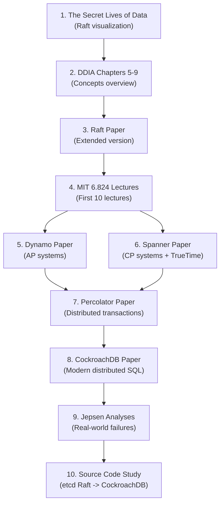

# Module 10: Distributed Databases & Consensus - Resources and References

## Essential Papers

### Consensus and Replication

| Paper | Authors | Year | Key Contribution |
|-------|---------|------|------------------|
| [In Search of an Understandable Consensus Algorithm (Raft)](https://raft.github.io/raft.pdf) | Diego Ongaro, John Ousterhout | 2014 | The Raft consensus algorithm. Read the extended version. The most important paper for this module. |
| [The Part-Time Parliament (Paxos)](https://lamport.azurewebsites.net/pubs/lamport-paxos.pdf) | Leslie Lamport | 1998 | The original Paxos paper. Historically important but notoriously difficult to read. |
| [Paxos Made Simple](https://lamport.azurewebsites.net/pubs/paxos-simple.pdf) | Leslie Lamport | 2001 | A much more accessible description of Paxos. Read this instead of the original. |
| [Viewstamped Replication Revisited](https://pmg.csail.mit.edu/papers/vr-revisited.pdf) | Barbara Liskov, James Cowling | 2012 | An alternative to Paxos for state machine replication. Influenced Raft's design. |
| [ZAB: High-performance broadcast for primary-backup systems](https://marcoserafini.github.io/papers/zab.pdf) | Flavio Junqueira et al. | 2011 | Zookeeper Atomic Broadcast, used by Apache Zookeeper. |

### Distributed Databases and Transactions

| Paper | Authors | Year | Key Contribution |
|-------|---------|------|------------------|
| [Dynamo: Amazon's Highly Available Key-value Store](https://www.allthingsdistributed.com/files/amazon-dynamo-sosp2007.pdf) | DeCandia et al. | 2007 | Leaderless replication, consistent hashing, sloppy quorums, vector clocks, hinted handoff. Foundational paper for AP systems. |
| [Spanner: Google's Globally-Distributed Database](https://static.googleusercontent.com/media/research.google.com/en//archive/spanner-osdi2012.pdf) | Corbett et al. | 2012 | TrueTime, externally consistent transactions, GPS+atomic clock synchronization. |
| [Spanner, TrueTime and the CAP Theorem](https://static.googleusercontent.com/media/research.google.com/en//pubs/archive/45855.pdf) | Eric Brewer | 2017 | Brewer (CAP theorem author) explains how Spanner navigates CAP. |
| [Large-scale Incremental Processing Using Distributed Transactions and Notifications (Percolator)](https://research.google/pubs/pub36726/) | Daniel Peng, Frank Dabek | 2010 | Distributed transactions on Bigtable. The model used by TiDB. |
| [Calvin: Fast Distributed Transactions for Partitioned Database Systems](http://cs.yale.edu/homes/thomson/publications/calvin-sigmod12.pdf) | Alexander Thomson et al. | 2012 | Deterministic database protocol that eliminates coordination during transaction execution. |
| [CockroachDB: The Resilient Geo-Distributed SQL Database](https://dl.acm.org/doi/10.1145/3318464.3386134) | Rebecca Taft et al. | 2020 | Architecture of CockroachDB. Parallel commits, follow-the-workload, and more. |
| [TiDB: A Raft-based HTAP Database](http://www.vldb.org/pvldb/vol13/p3072-huang.pdf) | Dongxu Huang et al. | 2020 | Architecture of TiDB/TiKV. Multi-Raft, Percolator transactions, TiFlash for HTAP. |

### CAP Theorem and Consistency

| Paper | Authors | Year | Key Contribution |
|-------|---------|------|------------------|
| [Brewer's Conjecture and the Feasibility of Consistent, Available, Partition-Tolerant Web Services](https://users.ece.cmu.edu/~adrian/731-sp04/readings/GL-cap.pdf) | Seth Gilbert, Nancy Lynch | 2002 | Formal proof of the CAP theorem. |
| [CAP Twelve Years Later: How the "Rules" Have Changed](https://www.infoq.com/articles/cap-twelve-years-later-how-the-rules-have-changed/) | Eric Brewer | 2012 | Brewer revisits CAP with nuance. Essential reading for understanding what CAP actually means. |
| [Consistency Tradeoffs in Modern Distributed Database System Design (PACELC)](http://cs-www.cs.yale.edu/homes/dna/papers/abadi-pacelc.pdf) | Daniel Abadi | 2012 | The PACELC extension of CAP. |
| [Linearizability: A Correctness Condition for Concurrent Objects](https://cs.brown.edu/~mph/HerlihyW90/p463-herlihy.pdf) | Maurice Herlihy, Jeannette Wing | 1990 | The formal definition of linearizability. |

### Clocks and Time

| Paper | Authors | Year | Key Contribution |
|-------|---------|------|------------------|
| [Time, Clocks, and the Ordering of Events in a Distributed System](https://lamport.azurewebsites.net/pubs/time-clocks.pdf) | Leslie Lamport | 1978 | Lamport clocks, happened-before relation, logical time. One of the most cited CS papers. |
| [Logical Physical Clocks and Consistent Snapshots in Globally Distributed Databases (HLC)](https://cse.buffalo.edu/tech-reports/2014-04.pdf) | Sandeep Kulkarni et al. | 2014 | Hybrid Logical Clocks combining physical time with logical ordering. Used by CockroachDB and YugabyteDB. |

### Failure Detection and Gossip

| Paper | Authors | Year | Key Contribution |
|-------|---------|------|------------------|
| [SWIM: Scalable Weakly-consistent Infection-style Process Group Membership Protocol](https://www.cs.cornell.edu/projects/Quicksilver/public_pdfs/SWIM.pdf) | Abhinandan Das et al. | 2002 | Efficient failure detection using gossip. Used by Consul, Memberlist. |
| [Epidemic Algorithms for Replicated Database Maintenance](https://bitsavers.org/pdf/xerox/parc/techReports/CSL-89-1_Epidemic_Algorithms_for_Replicated_Database_Maintenance.pdf) | Alan Demers et al. | 1987 | Foundational paper on gossip protocols for data synchronization. |

---

## Books

### Essential Reading

| Book | Author(s) | Why Read It |
|------|-----------|-------------|
| [Designing Data-Intensive Applications](https://dataintensive.net/) | Martin Kleppmann | **The single best resource** for understanding distributed systems concepts. Chapters 5 (Replication), 6 (Partitioning), 7 (Transactions), 8 (Distributed Systems), and 9 (Consistency and Consensus) are directly relevant. |
| [Database Internals](https://www.databass.dev/) | Alex Petrov | Excellent coverage of distributed database internals. Part II covers distributed systems: replication, consistency, consensus, and anti-entropy. |

### Deep Dives

| Book | Author(s) | Why Read It |
|------|-----------|-------------|
| [Distributed Systems (3rd Edition)](https://www.distributed-systems.net/index.php/books/ds3/) | Maarten van Steen, Andrew Tanenbaum | Comprehensive textbook. Free PDF available from the authors. |
| [Understanding Distributed Systems](https://understandingdistributed.systems/) | Roberto Vitillo | Practical, concise guide to distributed systems concepts with real-world examples. |
| [The Art of Multiprocessor Programming](https://www.elsevier.com/books/the-art-of-multiprocessor-programming/herlihy/978-0-12-415950-1) | Maurice Herlihy, Nir Shavit | Deep dive into concurrent data structures and consistency models. |

---

## Online Courses and Lectures

### University Courses

| Course | Institution | Description |
|--------|-------------|-------------|
| [MIT 6.824: Distributed Systems](https://pdos.csail.mit.edu/6.824/) | MIT | The gold standard. Lecture videos, labs (including implementing Raft in Go), and reading list. Lab 2 (Raft) and Lab 3 (KV store on Raft) are directly relevant to this module's project. |
| [CMU 15-440: Distributed Systems](https://www.synergylabs.org/courses/15-440/) | CMU | Covers fundamentals with practical projects. |
| [Princeton COS 418: Distributed Systems](https://www.cs.princeton.edu/courses/archive/fall22/cos418/) | Princeton | Strong theoretical foundation with hands-on labs. |

### Video Lectures

| Resource | Description |
|----------|-------------|
| [Raft Lecture by Diego Ongaro](https://www.youtube.com/watch?v=YbZ3zDzDnrw) | The Raft author explaining the algorithm. Best video introduction. |
| [Martin Kleppmann's Distributed Systems Lectures](https://www.youtube.com/playlist?list=PLeKd45zvjcDFUEv_ohr_HdUFe97RItdiB) | University of Cambridge lecture series. Excellent coverage of clocks, consensus, and replication. |
| [Designing Data-Intensive Applications (DDIA) Chapter Talks](https://www.youtube.com/watch?v=PdtlXdse7pw) | Martin Kleppmann presenting key DDIA concepts. |

---

## Interactive Tools and Visualizations

| Tool | URL | Description |
|------|-----|-------------|
| Raft Visualization | [https://raft.github.io/](https://raft.github.io/) | Interactive visualization of Raft leader election and log replication. Invaluable for building intuition. |
| The Secret Lives of Data | [https://thesecretlivesofdata.com/raft/](https://thesecretlivesofdata.com/raft/) | Animated, step-by-step walkthrough of Raft. Best starting point for learning Raft. |
| Raft Scope | [https://raft.github.io/raftscope/index.html](https://raft.github.io/raftscope/index.html) | Detailed simulation of a Raft cluster with message-level control. |
| Jepsen | [https://jepsen.io/](https://jepsen.io/) | Kyle Kingsbury's distributed systems testing framework. Analysis reports of real databases are essential reading. |

---

## Source Code to Study

### Raft Implementations

| Project | Language | URL | Notes |
|---------|----------|-----|-------|
| etcd Raft | Go | [github.com/etcd-io/raft](https://github.com/etcd-io/raft) | The most widely used Raft library. Clean, well-documented code. Study this first. |
| Hashicorp Raft | Go | [github.com/hashicorp/raft](https://github.com/hashicorp/raft) | Used by Consul, Nomad, Vault. More self-contained than etcd's (includes transport and storage). |
| TiKV Raft | Rust | [github.com/tikv/raft-rs](https://github.com/tikv/raft-rs) | Rust port of etcd's Raft. Used by TiKV. |
| Dragonboat | Go | [github.com/lni/dragonboat](https://github.com/lni/dragonboat) | High-performance Multi-Raft library. Interesting for production optimizations. |
| willemt/raft | C | [github.com/willemt/raft](https://github.com/willemt/raft) | Minimal C implementation. Good for understanding the core algorithm without language complexity. |

### Distributed Databases

| Project | Language | URL | What to Study |
|---------|----------|-----|---------------|
| CockroachDB | Go | [github.com/cockroachdb/cockroach](https://github.com/cockroachdb/cockroach) | Multi-Raft, distributed SQL, MVCC transactions, range-based sharding. |
| TiKV | Rust | [github.com/tikv/tikv](https://github.com/tikv/tikv) | Multi-Raft, Percolator transactions, coprocessor framework. |
| TiDB | Go | [github.com/pingcap/tidb](https://github.com/pingcap/tidb) | SQL layer on top of TiKV. Cost-based optimizer, distributed execution. |
| YugabyteDB | C++ | [github.com/yugabyte/yugabyte-db](https://github.com/yugabyte/yugabyte-db) | DocDB storage engine, Raft consensus, PostgreSQL compatibility layer. |
| etcd | Go | [github.com/etcd-io/etcd](https://github.com/etcd-io/etcd) | Complete distributed KV store built on Raft. Simpler than full databases; good for learning. |
| Consul | Go | [github.com/hashicorp/consul](https://github.com/hashicorp/consul) | Service discovery and KV store using Raft + Gossip (Serf). |

---

## Blog Posts and Articles

### Raft and Consensus

| Article | Author/Source | Description |
|---------|---------------|-------------|
| [Students' Guide to Raft](https://thesquareplanet.com/blog/students-guide-to-raft/) | Jon Gjengset | Practical advice for implementing Raft (from MIT 6.824 TA). Essential if doing the project. |
| [Implementing Raft (series)](https://eli.thegreenplace.net/2020/implementing-raft-part-0-introduction/) | Eli Bendersky | Step-by-step Raft implementation in Go with clear explanations. |
| [Raft Does Not Guarantee Liveness](https://decentralizedthoughts.github.io/2020-12-12-raft-liveness-full-omission/) | Decentralized Thoughts | Important edge case analysis of Raft. |

### CockroachDB Engineering

| Article | Source | Description |
|---------|--------|-------------|
| [How CockroachDB Does Distributed Atomic Transactions](https://www.cockroachlabs.com/blog/how-cockroachdb-distributes-atomic-transactions/) | Cockroach Labs | Parallel commits, transaction pipelining. |
| [Living Without Atomic Clocks](https://www.cockroachlabs.com/blog/living-without-atomic-clocks/) | Cockroach Labs | How CockroachDB uses HLC instead of Spanner's TrueTime. |
| [CockroachDB's Consistency Model](https://www.cockroachlabs.com/blog/consistency-model/) | Cockroach Labs | Serializable isolation in a distributed setting. |

### TiDB/TiKV Engineering

| Article | Source | Description |
|---------|--------|-------------|
| [TiKV Deep Dive](https://tikv.org/deep-dive/introduction/) | TiKV | Multi-Raft, distributed transactions, coprocessor framework. Official deep-dive documentation. |
| [How TiDB Achieves Percolator-based Transactions](https://www.pingcap.com/blog/how-tikv-reads-and-writes/) | PingCAP | Detailed walkthrough of Percolator in TiDB. |
| [TiDB Source Code Reading (Series)](https://www.pingcap.com/blog/?tag=source-code-reading) | PingCAP | Multi-part series walking through TiDB internals. |

### Distributed Systems General

| Article | Author/Source | Description |
|---------|---------------|-------------|
| [Notes on Distributed Systems for Young Bloods](https://www.somethingsimilar.com/2013/01/14/notes-on-distributed-systems-for-young-bloods/) | Jeff Hodges | Practical wisdom about building distributed systems. Short and essential. |
| [The Log: What every software engineer should know about real-time data's unifying abstraction](https://engineering.linkedin.com/distributed-systems/log-what-every-software-engineer-should-know-about-real-time-datas-unifying) | Jay Kreps | Why the commit log is the foundation of distributed data systems. |
| [Jepsen Analyses](https://jepsen.io/analyses) | Kyle Kingsbury | Real-world testing of distributed databases. Reveals bugs and design trade-offs. |
| [Aphyr's Call Me Maybe Series](https://aphyr.com/tags/Jepsen) | Kyle Kingsbury (Aphyr) | Accessible blog posts about distributed systems testing and failure modes. |

---

## Testing and Verification Tools

| Tool | URL | Description |
|------|-----|-------------|
| Jepsen | [github.com/jepsen-io/jepsen](https://github.com/jepsen-io/jepsen) | Distributed systems testing framework (Clojure). Injects faults and checks consistency. |
| Porcupine | [github.com/anishathalye/porcupine](https://github.com/anishathalye/porcupine) | Linearizability checker for Go. Use to verify your Raft KV store. |
| Knossos | [github.com/jepsen-io/knossos](https://github.com/jepsen-io/knossos) | Linearizability checker used by Jepsen (Clojure). |
| TLA+ | [lamport.azurewebsites.net/tla/tla.html](https://lamport.azurewebsites.net/tla/tla.html) | Formal specification language by Lamport. CockroachDB uses TLA+ to verify protocols. |
| Stateright | [github.com/stateright/stateright](https://github.com/stateright/stateright) | Model checker for distributed systems in Rust. |

---

## Recommended Reading Order

For someone new to distributed databases, this is the suggested order:

### Time Estimates

| Resource | Time Required | Priority |
|----------|--------------|----------|
| Raft Visualization | 30 minutes | Must |
| DDIA Chapters 5-9 | 8-10 hours | Must |
| Raft Paper | 3-4 hours | Must |
| MIT 6.824 Labs 2-3 | 40-60 hours | Highly Recommended |
| Dynamo Paper | 2-3 hours | Recommended |
| Spanner Paper | 3-4 hours | Recommended |
| CockroachDB Paper | 2-3 hours | Optional |
| Source Code Reading | Ongoing | Optional |

---

## Community and Discussion

| Resource | URL | Description |
|----------|-----|-------------|
| r/distributed | [reddit.com/r/distributed](https://www.reddit.com/r/distributed/) | Reddit community for distributed systems discussion. |
| Distributed Systems Reading Group | [dsrg.pdos.csail.mit.edu](http://dsrg.pdos.csail.mit.edu/) | MIT's distributed systems paper reading group. |
| Papers We Love | [paperswelove.org](https://paperswelove.org/) | Community for reading and discussing academic CS papers. |
| TiKV Community | [tikv.org/community](https://tikv.org/community/) | TiKV's open-source community. Good for understanding production Raft. |
| CockroachDB Community | [cockroachlabs.com/community](https://www.cockroachlabs.com/community/) | Forums, Slack channel, and meetups. |
