# Module 10: Project - Build a Replicated Key-Value Store with Raft

## Project Overview

In this project, you will build a distributed, replicated key-value store from scratch using the Raft consensus algorithm. The system will consist of multiple nodes that maintain a consistent state despite node failures and network partitions.

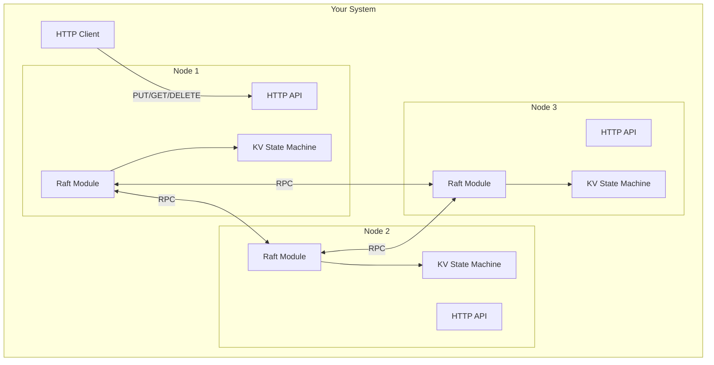

## Learning Objectives

By completing this project, you will:
1. Implement Raft leader election with randomized timeouts
2. Implement Raft log replication with consistency checks
3. Build a replicated state machine (key-value store)
4. Support linearizable reads using the ReadIndex protocol
5. Test your system under simulated network partitions
6. Understand why consensus is hard and where edge cases lurk

---

## Prerequisites

- Go 1.21+ (recommended) or Rust
- Understanding of goroutines/channels (Go) or async/tokio (Rust)
- Familiarity with RPC (gRPC or simple HTTP/JSON)

---

## Part 1: Project Structure

Create the following directory layout:

```
raft-kv/
├── main.go                 # Entry point, starts a node
├── raft/
│   ├── raft.go             # Core Raft state machine
│   ├── log.go              # Log entry management
│   ├── rpc.go              # RPC message types
│   └── raft_test.go        # Unit tests
├── kv/
│   ├── store.go            # Key-value state machine
│   └── store_test.go       # KV tests
├── transport/
│   ├── http_transport.go   # HTTP-based RPC transport
│   └── sim_transport.go    # Simulated transport for testing
├── server/
│   ├── server.go           # HTTP API server
│   └── handler.go          # Request handlers
└── test/
    ├── partition_test.go   # Network partition tests
    └── linearizability_test.go  # Linearizability tests
```

---

## Part 2: Implement Raft Leader Election

### 2.1 Define Core Types

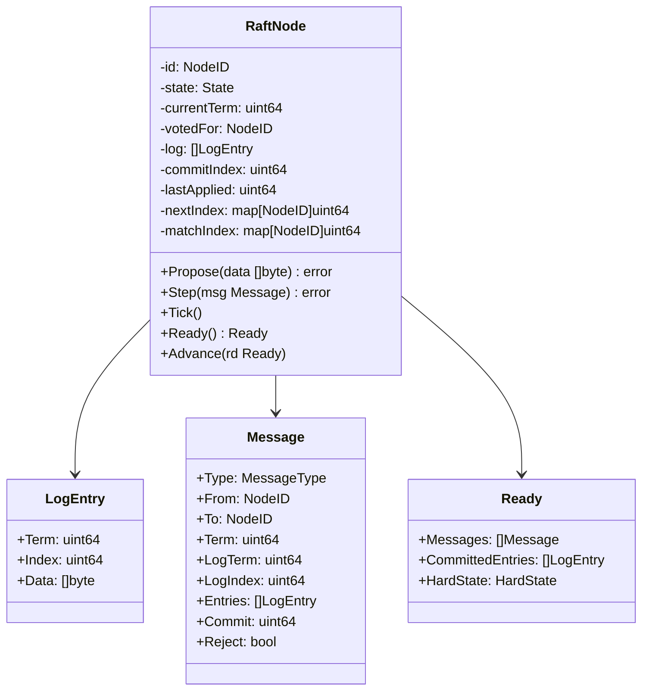

### 2.2 Implementation Tasks

**Task 1: Define the Raft state machine states.**

```go
type State int

const (
    StateFollower State = iota
    StateCandidate
    StateLeader
)

type RaftNode struct {
    mu sync.Mutex

    // Persistent state (must survive restarts)
    id          uint64
    currentTerm uint64
    votedFor    uint64
    log         []LogEntry

    // Volatile state
    state       State
    commitIndex uint64
    lastApplied uint64

    // Leader-only volatile state
    nextIndex  map[uint64]uint64
    matchIndex map[uint64]uint64

    // Configuration
    peers           []uint64
    electionTimeout int  // in ticks
    heartbeatTimeout int // in ticks

    // Internal counters
    electionElapsed  int
    heartbeatElapsed int
    randomizedElectionTimeout int

    // Votes received in current election
    votes map[uint64]bool

    // Output
    messages        []Message
    committedEntries []LogEntry
}
```

**Task 2: Implement the Tick function.**

The `Tick()` function is called at regular intervals (e.g., every 100ms). It drives election timeouts and heartbeat sending.

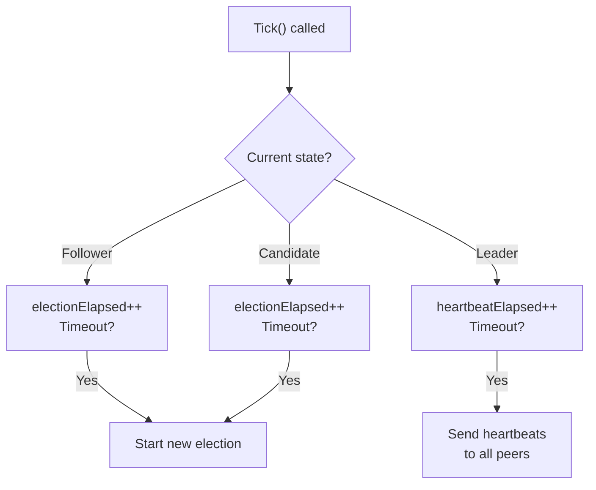

**Task 3: Implement leader election.**

When a follower's election timer expires:

1. Transition to candidate state.
2. Increment `currentTerm`.
3. Vote for self.
4. Reset election timer with a new random value.
5. Send `RequestVote` RPCs to all peers.

When processing a `RequestVote` request:

1. If the request's term > current term: update term, become follower.
2. Grant vote only if:
   - Have not voted in this term, OR already voted for this candidate.
   - Candidate's log is at least as up-to-date as own log.
3. Reset election timer if granting vote.

**Task 4: Handle vote responses.**

Track votes in the `votes` map. When a majority is reached:

1. Transition to leader state.
2. Initialize `nextIndex` for each peer to `len(log) + 1`.
3. Initialize `matchIndex` for each peer to 0.
4. Send initial empty `AppendEntries` (heartbeats) to all peers.

### 2.3 Testing Leader Election

Write tests for these scenarios:

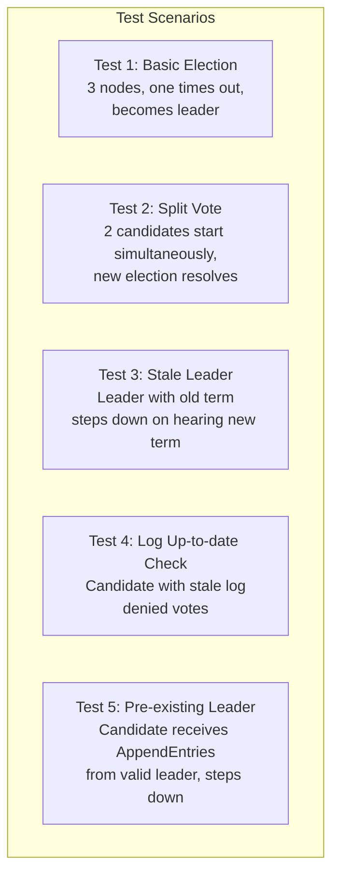

```go
func TestBasicElection(t *testing.T) {
    // Create 3 nodes
    nodes := createTestCluster(3)

    // Advance time until one node times out and starts election
    for i := 0; i < 20; i++ {
        for _, n := range nodes {
            n.Tick()
        }
        deliverMessages(nodes)
    }

    // Verify exactly one leader exists
    leaders := countLeaders(nodes)
    if leaders != 1 {
        t.Fatalf("expected 1 leader, got %d", leaders)
    }

    // Verify all nodes agree on the term
    term := nodes[0].currentTerm
    for _, n := range nodes {
        if n.currentTerm != term {
            t.Fatalf("term mismatch: %d vs %d", n.currentTerm, term)
        }
    }
}
```

---

## Part 3: Implement Log Replication

### 3.1 AppendEntries RPC

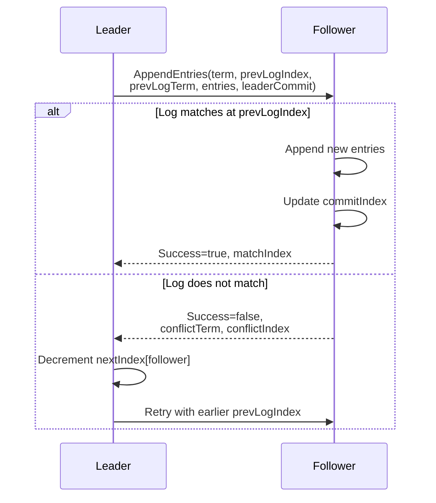

### 3.2 Implementation Tasks

**Task 5: Implement AppendEntries sending (leader side).**

For each peer, the leader:
1. Determines `prevLogIndex` and `prevLogTerm` from `nextIndex[peer]`.
2. Collects entries from `nextIndex[peer]` onward.
3. Sends an `AppendEntries` message.

**Task 6: Implement AppendEntries handling (follower side).**

1. Reject if `term < currentTerm`.
2. Reset election timer (valid leader exists).
3. Check log consistency at `prevLogIndex`.
4. If consistent: append entries, update `commitIndex`.
5. If inconsistent: reply with conflict information.

**Task 7: Implement commitment tracking.**

The leader updates `commitIndex` after receiving successful `AppendEntries` responses:

```go
func (rn *RaftNode) maybeAdvanceCommitIndex() {
    // Sort matchIndex values
    matches := make([]uint64, 0, len(rn.peers)+1)
    matches = append(matches, rn.lastLogIndex()) // leader's own match
    for _, peer := range rn.peers {
        matches = append(matches, rn.matchIndex[peer])
    }
    sort.Slice(matches, func(i, j int) bool {
        return matches[i] > matches[j]
    })

    // The median value is the highest index replicated to a majority
    majorityMatch := matches[len(matches)/2]

    // Only commit entries from the current term
    if majorityMatch > rn.commitIndex &&
        rn.log[majorityMatch-1].Term == rn.currentTerm {
        rn.commitIndex = majorityMatch
    }
}
```

**Critical rule:** The leader only advances `commitIndex` for entries from its **current term**. This prevents the commitment ambiguity described in the Raft paper (Figure 8).

---

## Part 4: Build the Key-Value State Machine

### 4.1 State Machine Interface

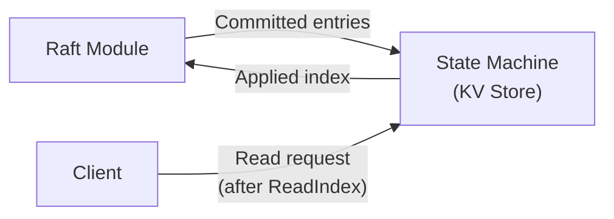

```go
type KVStore struct {
    mu   sync.RWMutex
    data map[string]string

    // Track applied index to prevent double-application
    appliedIndex uint64
}

type Command struct {
    Op    string `json:"op"`    // "put", "get", "delete"
    Key   string `json:"key"`
    Value string `json:"value"`
}

func (kv *KVStore) Apply(entry LogEntry) interface{} {
    kv.mu.Lock()
    defer kv.mu.Unlock()

    if entry.Index <= kv.appliedIndex {
        return nil // Already applied (idempotency)
    }

    var cmd Command
    json.Unmarshal(entry.Data, &cmd)

    var result interface{}
    switch cmd.Op {
    case "put":
        kv.data[cmd.Key] = cmd.Value
        result = "OK"
    case "delete":
        delete(kv.data, cmd.Key)
        result = "OK"
    case "get":
        result = kv.data[cmd.Key]
    }

    kv.appliedIndex = entry.Index
    return result
}

func (kv *KVStore) Get(key string) (string, bool) {
    kv.mu.RLock()
    defer kv.mu.RUnlock()
    v, ok := kv.data[key]
    return v, ok
}
```

### 4.2 Client-Facing API

**Task 8: Implement the HTTP API server.**

```go
// PUT /kv/:key
// Body: {"value": "..."}
func (s *Server) handlePut(w http.ResponseWriter, r *http.Request) {
    key := mux.Vars(r)["key"]
    var body struct{ Value string }
    json.NewDecoder(r.Body).Decode(&body)

    cmd := Command{Op: "put", Key: key, Value: body.Value}
    data, _ := json.Marshal(cmd)

    // Propose to Raft (only works on leader)
    resultCh, err := s.raft.Propose(data)
    if err != nil {
        if err == ErrNotLeader {
            // Redirect to leader
            http.Redirect(w, r, s.leaderURL()+r.URL.Path, http.StatusTemporaryRedirect)
            return
        }
        http.Error(w, err.Error(), http.StatusInternalServerError)
        return
    }

    // Wait for the entry to be committed and applied
    select {
    case result := <-resultCh:
        json.NewEncoder(w).Encode(result)
    case <-time.After(5 * time.Second):
        http.Error(w, "timeout", http.StatusGatewayTimeout)
    }
}
```

---

## Part 5: Support Linearizable Reads

Linearizable reads must return the most recently committed value. There are two common approaches:

### 5.1 ReadIndex Protocol

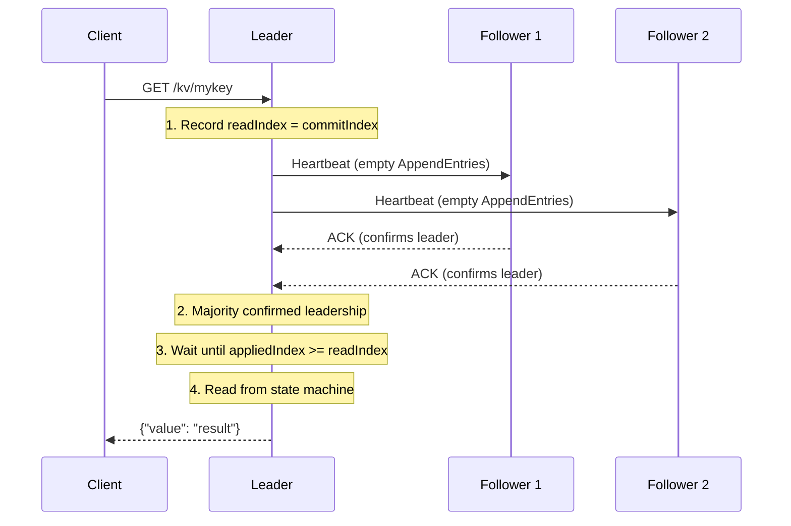

**Task 9: Implement ReadIndex.**

```go
func (rn *RaftNode) ReadIndex() (uint64, error) {
    rn.mu.Lock()
    if rn.state != StateLeader {
        rn.mu.Unlock()
        return 0, ErrNotLeader
    }

    readIndex := rn.commitIndex
    rn.mu.Unlock()

    // Send heartbeats and wait for majority ACK
    ackCh := rn.broadcastHeartbeat()

    select {
    case <-ackCh:
        return readIndex, nil
    case <-time.After(2 * time.Second):
        return 0, ErrTimeout
    }
}
```

### 5.2 Lease-Based Reads (Advanced)

The leader holds a time-based lease. As long as the lease has not expired, the leader knows no other leader exists and can serve reads directly without the heartbeat round-trip.

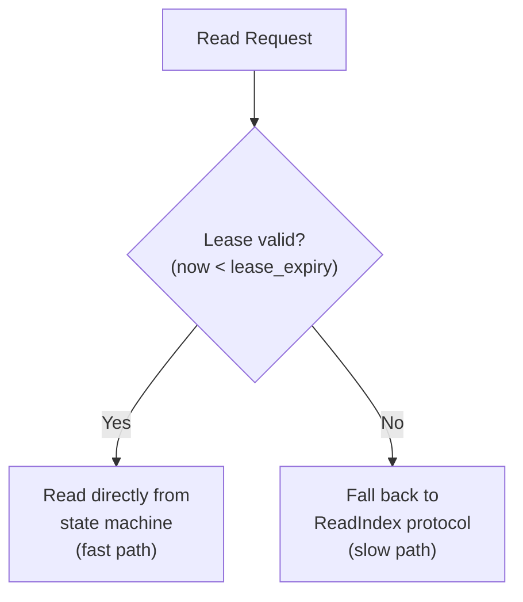

**Trade-off:** Lease-based reads are faster (no heartbeat round-trip) but depend on clock accuracy. If clocks are skewed, two leaders could have overlapping leases.

---

## Part 6: Test with Network Partitions

### 6.1 Simulated Network

**Task 10: Build a simulated transport layer.**

```go
type SimulatedTransport struct {
    mu         sync.Mutex
    nodes      map[uint64]*RaftNode
    partitions map[uint64]map[uint64]bool
    latencyMs  int
    dropRate   float64  // probability of dropping a message
}

func (st *SimulatedTransport) Send(msg Message) {
    st.mu.Lock()
    defer st.mu.Unlock()

    // Check partition
    if st.isPartitioned(msg.From, msg.To) {
        return // message dropped
    }

    // Simulate random drops
    if rand.Float64() < st.dropRate {
        return
    }

    // Deliver with simulated latency
    go func() {
        time.Sleep(time.Duration(st.latencyMs) * time.Millisecond)
        if node, ok := st.nodes[msg.To]; ok {
            node.Step(msg)
        }
    }()
}

func (st *SimulatedTransport) Partition(a, b uint64) {
    st.mu.Lock()
    defer st.mu.Unlock()
    if st.partitions[a] == nil {
        st.partitions[a] = make(map[uint64]bool)
    }
    if st.partitions[b] == nil {
        st.partitions[b] = make(map[uint64]bool)
    }
    st.partitions[a][b] = true
    st.partitions[b][a] = true
}

func (st *SimulatedTransport) Heal(a, b uint64) {
    st.mu.Lock()
    defer st.mu.Unlock()
    delete(st.partitions[a], b)
    delete(st.partitions[b], a)
}
```

### 6.2 Partition Test Scenarios

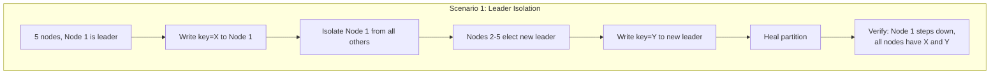

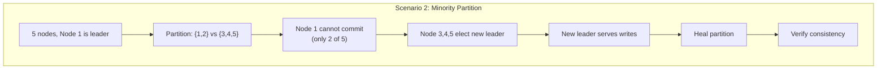

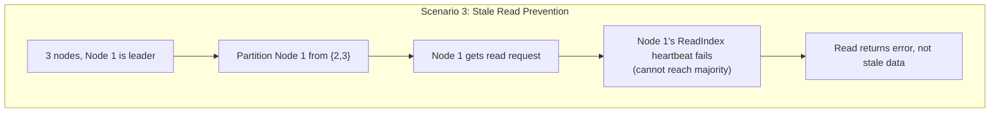

**Task 11: Implement partition tests.**

```go
func TestLeaderIsolation(t *testing.T) {
    cluster := NewTestCluster(5)
    cluster.Start()
    defer cluster.Stop()

    // Wait for leader election
    leader := cluster.WaitForLeader(t, 5*time.Second)

    // Write a value
    err := cluster.Put(leader, "key1", "value1")
    require.NoError(t, err)

    // Isolate the leader
    cluster.IsolateNode(leader)

    // Wait for new leader in the majority partition
    newLeader := cluster.WaitForNewLeader(t, leader, 5*time.Second)
    require.NotEqual(t, leader, newLeader)

    // Write through the new leader
    err = cluster.Put(newLeader, "key2", "value2")
    require.NoError(t, err)

    // Heal the partition
    cluster.HealAll()

    // Wait for convergence
    time.Sleep(2 * time.Second)

    // Verify all nodes have both values
    for _, node := range cluster.Nodes {
        v1, ok := node.KV.Get("key1")
        require.True(t, ok)
        require.Equal(t, "value1", v1)

        v2, ok := node.KV.Get("key2")
        require.True(t, ok)
        require.Equal(t, "value2", v2)
    }

    // Verify only one leader exists
    require.Equal(t, 1, cluster.CountLeaders())
}
```

---

## Part 7: Snapshotting (Bonus)

As the log grows, it must be compacted. Implement snapshotting to truncate the log.

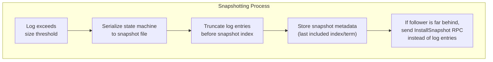

```go
type Snapshot struct {
    LastIncludedIndex uint64
    LastIncludedTerm  uint64
    Data              []byte // Serialized state machine
}

func (kv *KVStore) CreateSnapshot() Snapshot {
    kv.mu.RLock()
    defer kv.mu.RUnlock()

    data, _ := json.Marshal(kv.data)
    return Snapshot{
        LastIncludedIndex: kv.appliedIndex,
        LastIncludedTerm:  kv.appliedTerm,
        Data:              data,
    }
}

func (kv *KVStore) RestoreFromSnapshot(snap Snapshot) {
    kv.mu.Lock()
    defer kv.mu.Unlock()

    kv.data = make(map[string]string)
    json.Unmarshal(snap.Data, &kv.data)
    kv.appliedIndex = snap.LastIncludedIndex
}
```

---

## Milestones and Evaluation Criteria

### Milestone 1: Leader Election (Week 1)
- [ ] Nodes start as followers
- [ ] Election timeout triggers candidate transition
- [ ] RequestVote RPC sent and processed correctly
- [ ] Exactly one leader elected in a healthy cluster
- [ ] Split votes resolved with randomized timeouts
- [ ] Higher-term messages cause step-down

### Milestone 2: Log Replication (Week 2)
- [ ] Leader appends client proposals to log
- [ ] AppendEntries RPC replicates entries to followers
- [ ] Log consistency check works (prevLogIndex/prevLogTerm)
- [ ] Leader decrements nextIndex on rejection
- [ ] Commitment after majority replication
- [ ] Committed entries applied to state machine

### Milestone 3: KV Store + API (Week 3)
- [ ] HTTP API for PUT, GET, DELETE
- [ ] Redirect non-leader requests to leader
- [ ] Wait for commitment before responding to client
- [ ] Linearizable reads via ReadIndex

### Milestone 4: Partition Testing (Week 4)
- [ ] Simulated network transport
- [ ] Leader isolation test passes
- [ ] Minority partition test passes
- [ ] Stale read prevention test passes
- [ ] Concurrent client test under partitions

---

## Architecture Summary

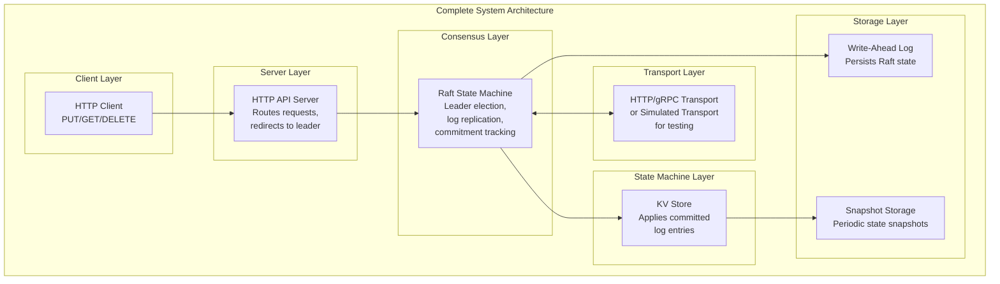

---

## Stretch Goals

1. **Cluster membership changes:** Implement AddNode/RemoveNode using Raft configuration changes.
2. **Persistent storage:** Write Raft state (term, votedFor, log) to disk so nodes can restart.
3. **Log compaction:** Implement snapshotting and InstallSnapshot RPC.
4. **Follower reads:** Allow stale reads from followers for reduced latency.
5. **Benchmarking:** Measure throughput (ops/sec) and latency (p50, p99) under various partition scenarios.
6. **Jepsen-style testing:** Use a linearizability checker to verify your system's correctness under concurrent operations.

---

## References

- [The Raft Paper (Extended Version)](https://raft.github.io/raft.pdf)
- [Raft Visualization](https://raft.github.io/)
- [etcd Raft Library Source Code](https://github.com/etcd-io/raft)
- [Students' Guide to Raft (MIT 6.824)](https://thesquareplanet.com/blog/students-guide-to-raft/)
- [Designing Data-Intensive Applications, Chapter 9](https://dataintensive.net/)
