# Module 10: Distributed Databases & Consensus - Core Teaching

## Why Distribute a Database?

A single-node database will eventually hit limits. Distributed databases exist to solve three fundamental problems:

1. **Scalability** - A single machine has finite CPU, memory, and disk. When your data or query load exceeds what one node can handle, you need multiple machines.
2. **Availability** - Hardware fails. Disks die, networks partition, data centers go offline. If your database lives on one machine, its failure means total downtime.
3. **Latency** - Users are geographically distributed. A user in Tokyo should not have to wait for a round-trip to a server in Virginia for every read.

These three goals create fundamental tensions that define the landscape of distributed database design.

---

## The CAP Theorem

Eric Brewer's CAP theorem (formalized by Gilbert and Lynch, 2002) states that a distributed system can provide at most **two out of three** guarantees simultaneously:

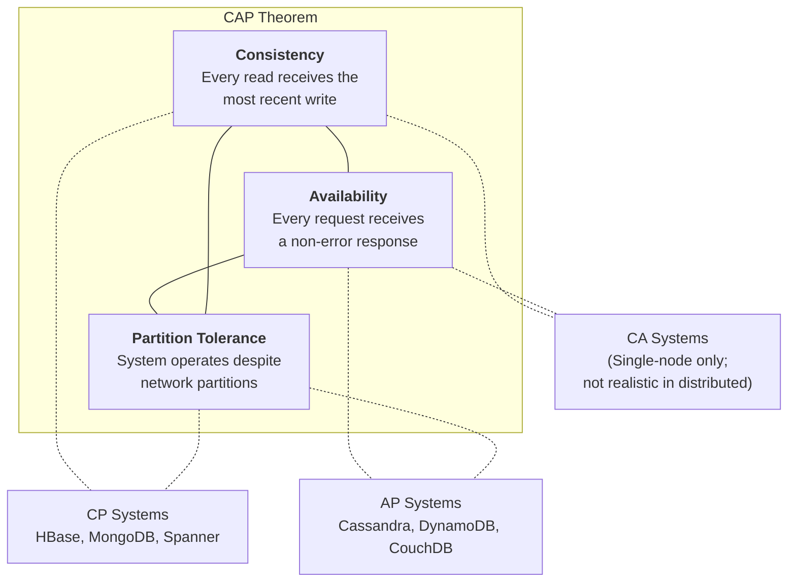
```mermaid
graph TD
    subgraph "CAP Theorem"
        C["<b>Consistency</b><br/>Every read receives the<br/>most recent write"]
        A["<b>Availability</b><br/>Every request receives<br/>a non-error response"]
        P["<b>Partition Tolerance</b><br/>System operates despite<br/>network partitions"]
    end

    C --- A
    A --- P
    P --- C

    CP["CP Systems<br/>HBase, MongoDB, Spanner"]
    AP["AP Systems<br/>Cassandra, DynamoDB, CouchDB"]
    CA["CA Systems<br/>(Single-node only;<br/>not realistic in distributed)"]

    C -.- CP
    P -.- CP
    A -.- AP
    P -.- AP
    C -.- CA
    A -.- CA
```

### Why CAP Is Nuanced

CAP is often oversimplified. Important clarifications:

- **Partition tolerance is not optional.** In any real distributed system, network partitions *will* happen. So the real choice is between CP and AP *during a partition*.
- **"Consistency" in CAP means linearizability**, not the C in ACID (which is about application invariants).
- **The choice is not binary.** Systems make different trade-offs for different operations, and the choice only matters *during* a partition. When the network is healthy, you can have all three.
- **Many systems are tunable.** Cassandra lets you choose consistency level per query (ONE, QUORUM, ALL).

### Classification of Real Systems

| System | During Partition | Normal Operation | Classification |
|--------|-----------------|------------------|----------------|
| Spanner | Chooses consistency, blocks | Strong consistency | CP |
| Cassandra | Chooses availability | Tunable consistency | AP (default) |
| MongoDB | Chooses consistency (primary) | Strong via primary | CP |
| DynamoDB | Chooses availability | Eventual by default | AP |
| CockroachDB | Chooses consistency | Serializable | CP |

---

## PACELC: Extending CAP

Daniel Abadi proposed PACELC (2012) to address CAP's blind spot: what happens when there is **no** partition?

> **If Partition (P):** choose **Availability (A)** or **Consistency (C)**
> **Else (E):** choose **Latency (L)** or **Consistency (C)**

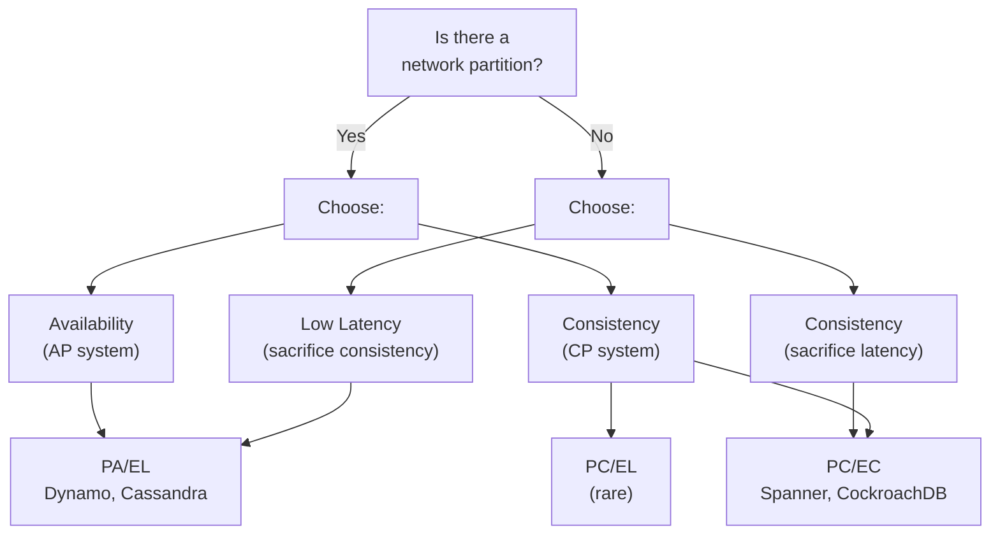
```mermaid
flowchart TD
    Start["Is there a<br/>network partition?"]
    Start -->|Yes| Partition["Choose:"]
    Start -->|No| Else["Choose:"]
    Partition --> PA["Availability<br/>(AP system)"]
    Partition --> PC["Consistency<br/>(CP system)"]
    Else --> EL["Low Latency<br/>(sacrifice consistency)"]
    Else --> EC["Consistency<br/>(sacrifice latency)"]

    PA --> PALC["PA/EL<br/>Dynamo, Cassandra"]
    PC --> PCEL["PC/EL<br/>(rare)"]
    EL --> PALC
    EC --> PCEC["PC/EC<br/>Spanner, CockroachDB"]
    PC --> PCEC
```

| System | Partition behavior | Normal behavior | PACELC |
|--------|-------------------|-----------------|--------|
| DynamoDB | PA | EL | PA/EL |
| Cassandra | PA | EL (tunable) | PA/EL |
| Spanner | PC | EC | PC/EC |
| CockroachDB | PC | EC | PC/EC |
| MongoDB | PC | EC | PC/EC |

---

## Replication Strategies

Replication keeps copies of data on multiple nodes. There are three fundamental topologies.

### 1. Single-Leader (Primary-Secondary) Replication

One node is the **leader** (primary). All writes go to the leader. The leader replicates changes to **followers** (secondaries). Reads can go to any replica.

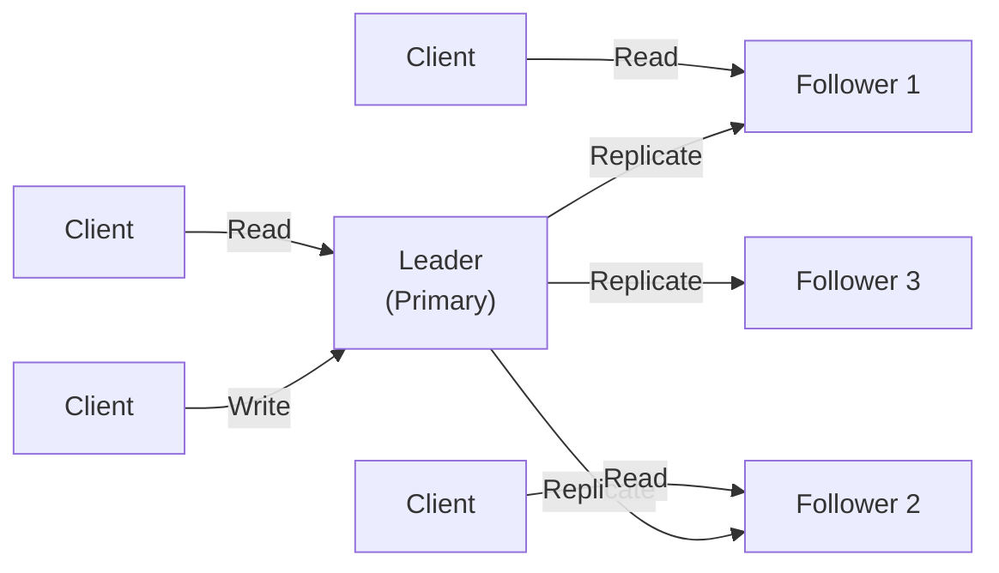
```mermaid
flowchart LR
    Client["Client"] -->|Write| Leader["Leader<br/>(Primary)"]
    Leader -->|Replicate| F1["Follower 1"]
    Leader -->|Replicate| F2["Follower 2"]
    Leader -->|Replicate| F3["Follower 3"]
    Client2["Client"] -->|Read| F1
    Client3["Client"] -->|Read| F2
    Client4["Client"] -->|Read| Leader
```

**Pros:** Simple, no write conflicts, well-understood.
**Cons:** Leader is a bottleneck and single point of failure (until failover). Write scalability limited.

**Used by:** PostgreSQL streaming replication, MySQL replication, MongoDB replica sets.

### 2. Multi-Leader Replication

Multiple nodes accept writes. Each leader replicates to the others. Common in multi-datacenter setups.

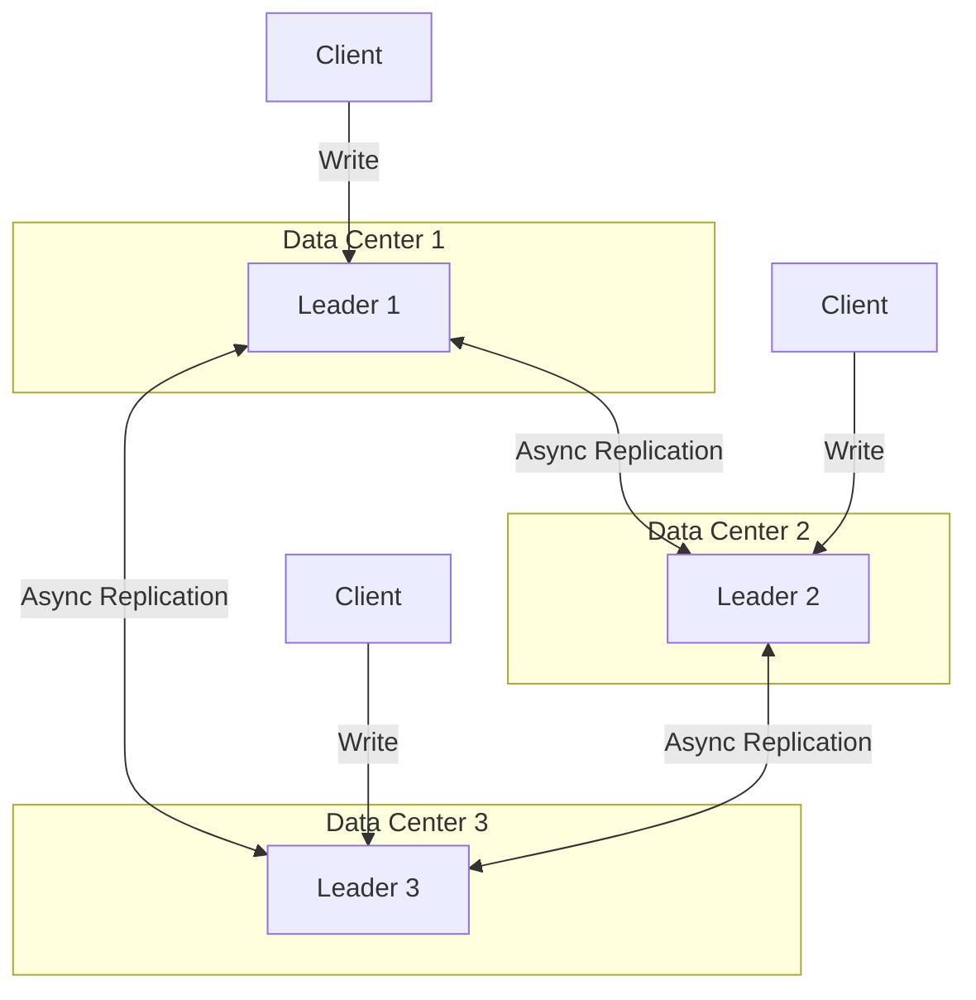
```mermaid
flowchart TB
    subgraph DC1["Data Center 1"]
        L1["Leader 1"]
    end
    subgraph DC2["Data Center 2"]
        L2["Leader 2"]
    end
    subgraph DC3["Data Center 3"]
        L3["Leader 3"]
    end

    L1 <-->|Async Replication| L2
    L2 <-->|Async Replication| L3
    L1 <-->|Async Replication| L3

    C1["Client"] -->|Write| L1
    C2["Client"] -->|Write| L2
    C3["Client"] -->|Write| L3
```

**Pros:** Better write latency (write to local DC), tolerates DC failure.
**Cons:** Write conflicts. Must resolve concurrent writes to the same key. Conflict resolution is hard.

**Conflict resolution strategies:**
- Last-Writer-Wins (LWW): use timestamps, discard older writes. Simple but loses data.
- Merge values: application-specific logic (e.g., union of sets).
- CRDTs (Conflict-free Replicated Data Types): mathematically guaranteed convergence.
- Custom conflict handlers: application callback to resolve.

### 3. Leaderless Replication

No designated leader. Any node can accept reads and writes. Uses quorum-based protocols.

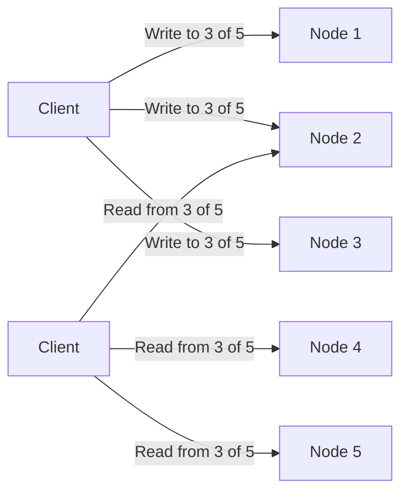
```mermaid
flowchart LR
    Client["Client"] -->|Write to 3 of 5| N1["Node 1"]
    Client -->|Write to 3 of 5| N2["Node 2"]
    Client -->|Write to 3 of 5| N3["Node 3"]

    Client2["Client"] -->|Read from 3 of 5| N2
    Client2 -->|Read from 3 of 5| N4["Node 4"]
    Client2 -->|Read from 3 of 5| N5["Node 5"]
```

**Quorum condition:** For N replicas, write to W nodes and read from R nodes where **W + R > N**.

Example: N=5, W=3, R=3. Any write overlaps with any read by at least 1 node, so the read will see the latest value.

**Used by:** Amazon Dynamo, Cassandra, Riak, Voldemort.

---

## Synchronous vs. Asynchronous Replication

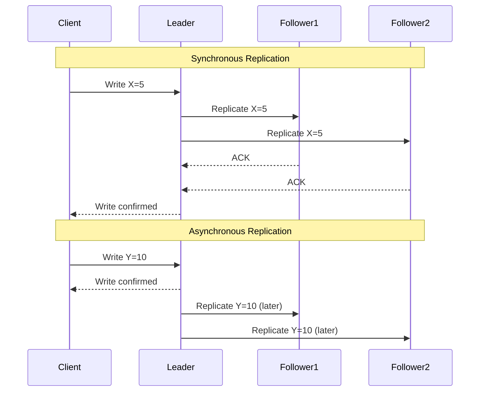
```mermaid
sequenceDiagram
    participant Client
    participant Leader
    participant Follower1
    participant Follower2

    Note over Client,Follower2: Synchronous Replication
    Client->>Leader: Write X=5
    Leader->>Follower1: Replicate X=5
    Leader->>Follower2: Replicate X=5
    Follower1-->>Leader: ACK
    Follower2-->>Leader: ACK
    Leader-->>Client: Write confirmed

    Note over Client,Follower2: Asynchronous Replication
    Client->>Leader: Write Y=10
    Leader-->>Client: Write confirmed
    Leader->>Follower1: Replicate Y=10 (later)
    Leader->>Follower2: Replicate Y=10 (later)
```

| Property | Synchronous | Asynchronous |
|----------|------------|--------------|
| Durability | Data on multiple nodes before ack | Data on leader only at ack time |
| Latency | Slow (wait for slowest replica) | Fast (leader only) |
| Availability | Lower (any replica down blocks writes) | Higher (leader alone suffices) |
| Consistency | Strong | Eventual |

**Semi-synchronous:** Replicate synchronously to ONE follower, async to the rest. Guarantees at least two copies before ack. PostgreSQL's `synchronous_commit` setting supports this.

---

## Replication Lag and Consistency Problems

With asynchronous replication, followers can be behind the leader. This creates several anomalies:

### Read-After-Write Inconsistency
A user writes a value, then reads from a stale follower and sees the old value. Their own write appears to be lost.

### Monotonic Read Violations
A user reads from replica A (which is up to date), then reads from replica B (which is behind). They see data go backward in time.

### Causal Ordering Violations
User A writes a comment, User B replies. If the reply replicates before the original, a reader sees a reply with no parent comment.

---

## Consistency Models

Consistency models define what guarantees a distributed system provides about the ordering and visibility of operations.

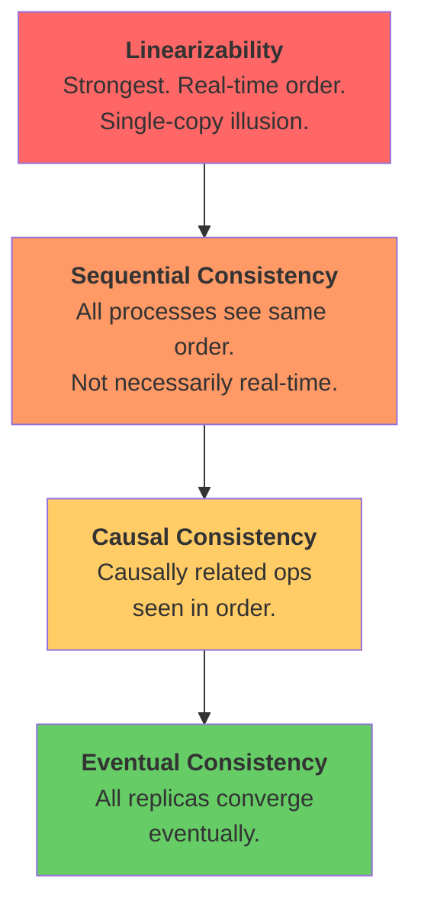
```mermaid
graph TD
    Lin["<b>Linearizability</b><br/>Strongest. Real-time order.<br/>Single-copy illusion."]
    Seq["<b>Sequential Consistency</b><br/>All processes see same order.<br/>Not necessarily real-time."]
    Causal["<b>Causal Consistency</b><br/>Causally related ops<br/>seen in order."]
    Even["<b>Eventual Consistency</b><br/>All replicas converge<br/>eventually."]

    Lin --> Seq
    Seq --> Causal
    Causal --> Even

    style Lin fill:#ff6666
    style Seq fill:#ff9966
    style Causal fill:#ffcc66
    style Even fill:#66cc66
```

### Linearizability
- The strongest guarantee. Equivalent to having a single copy of the data.
- Every operation appears to take effect atomically at some point between its invocation and response.
- If operation A completes before operation B starts, then B must see A's effect.
- **Cost:** High latency. Requires coordination across replicas for every operation.
- **Example:** Spanner uses TrueTime to achieve external consistency (equivalent to linearizability).

### Sequential Consistency
- All operations appear in some total order that is consistent with the program order of each individual process.
- But that total order does not need to match real-time ordering.
- Weaker than linearizability but still intuitive.

### Causal Consistency
- If operation A causally precedes operation B (A happened before B and B could have seen A), then all nodes must see A before B.
- Concurrent operations (neither caused the other) can be seen in any order.
- **Example:** If I post a message, then you reply, everyone must see my message before your reply. But two independent posts can appear in any order.

### Eventual Consistency
- If no new writes occur, all replicas will eventually converge to the same value.
- No ordering guarantee during convergence. Different replicas may return different values.
- **Example:** DNS, Cassandra with consistency level ONE.

---

## Partitioning / Sharding

When data does not fit on a single node, we split it across multiple nodes. Each node holds a **partition** (or **shard**).

### Hash-Based Partitioning

Apply a hash function to the key and assign ranges of hash values to nodes.

```
partition = hash(key) % num_partitions
```

**Pros:** Even distribution if hash function is good.
**Cons:** Range queries are inefficient (adjacent keys scatter across nodes). Adding/removing nodes reshuffles most keys.

### Range-Based Partitioning

Assign contiguous ranges of keys to each partition.

```
Node 1: A-F
Node 2: G-M
Node 3: N-S
Node 4: T-Z
```

**Pros:** Range queries are efficient (scan a single partition).
**Cons:** Hot spots if data or access patterns are skewed (e.g., all writes to keys starting with "A").

**Used by:** HBase, Spanner, CockroachDB.

### Directory-Based Partitioning

A lookup service (directory) maps each key to its partition. Maximum flexibility but the directory is a bottleneck and single point of failure.

---

## Consistent Hashing and Virtual Nodes

Traditional hash partitioning (`hash(key) % N`) is disruptive when N changes. Consistent hashing solves this.

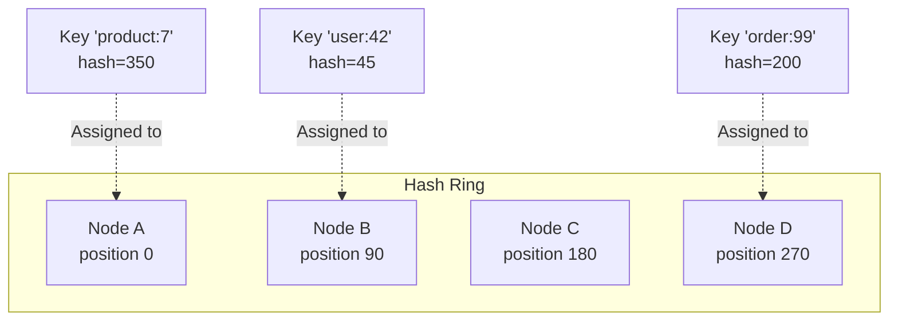
```mermaid
graph TD
    subgraph "Hash Ring"
        direction TB
        A["Node A<br/>position 0"]
        B["Node B<br/>position 90"]
        C["Node C<br/>position 180"]
        D["Node D<br/>position 270"]
    end

    K1["Key 'user:42'<br/>hash=45"] -.->|"Assigned to"| B
    K2["Key 'order:99'<br/>hash=200"] -.->|"Assigned to"| D
    K3["Key 'product:7'<br/>hash=350"] -.->|"Assigned to"| A
```

**How it works:**
1. Hash both nodes and keys onto a ring (0 to 2^32 - 1).
2. Each key is assigned to the first node clockwise from its position on the ring.
3. When a node is added, only keys between the new node and its predecessor move.
4. When a node is removed, only its keys move to the next node.

**Virtual Nodes (Vnodes):** Each physical node maps to multiple positions on the ring. This ensures even distribution even with few physical nodes. Cassandra uses 256 vnodes per node by default.

---

## Distributed Transactions: Two-Phase Commit (2PC)

2PC is the classic protocol for atomic commits across multiple nodes.

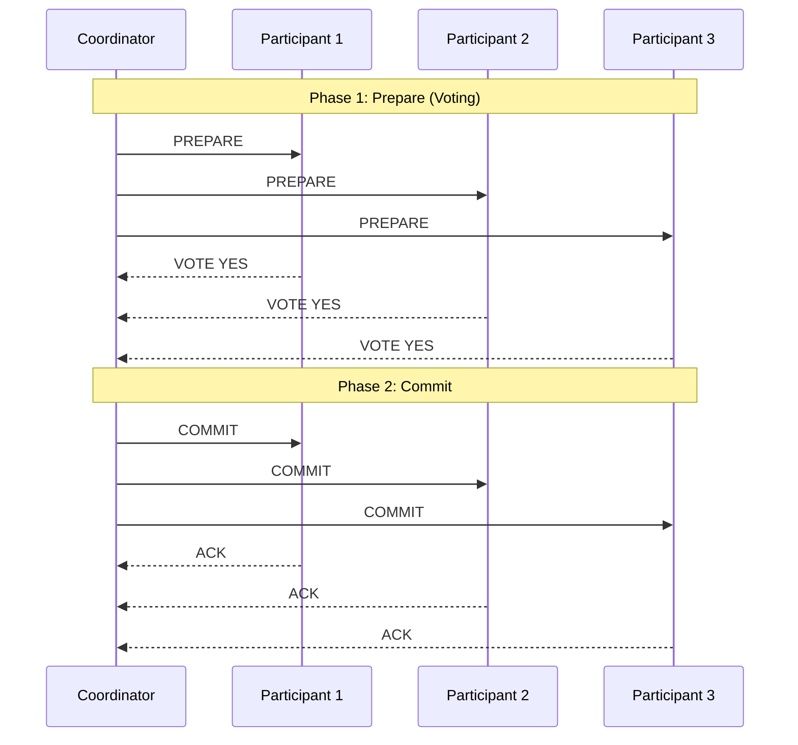
```mermaid
sequenceDiagram
    participant Coord as Coordinator
    participant P1 as Participant 1
    participant P2 as Participant 2
    participant P3 as Participant 3

    Note over Coord,P3: Phase 1: Prepare (Voting)
    Coord->>P1: PREPARE
    Coord->>P2: PREPARE
    Coord->>P3: PREPARE
    P1-->>Coord: VOTE YES
    P2-->>Coord: VOTE YES
    P3-->>Coord: VOTE YES

    Note over Coord,P3: Phase 2: Commit
    Coord->>P1: COMMIT
    Coord->>P2: COMMIT
    Coord->>P3: COMMIT
    P1-->>Coord: ACK
    P2-->>Coord: ACK
    P3-->>Coord: ACK
```

### How 2PC Works

**Phase 1 (Prepare):**
1. Coordinator sends PREPARE to all participants.
2. Each participant writes the transaction to its WAL and locks resources.
3. Each participant votes YES (can commit) or NO (must abort).

**Phase 2 (Commit/Abort):**
1. If ALL votes are YES: coordinator sends COMMIT to all.
2. If ANY vote is NO: coordinator sends ABORT to all.
3. Participants execute the decision and release locks.

### The Blocking Problem

2PC's fatal flaw: if the coordinator crashes after Phase 1 but before Phase 2, participants that voted YES are **stuck**. They cannot commit (maybe the coordinator decided to abort) and cannot abort (maybe it decided to commit). They hold locks indefinitely.

---

## Three-Phase Commit (3PC)

3PC adds a **pre-commit** phase to avoid the blocking problem.

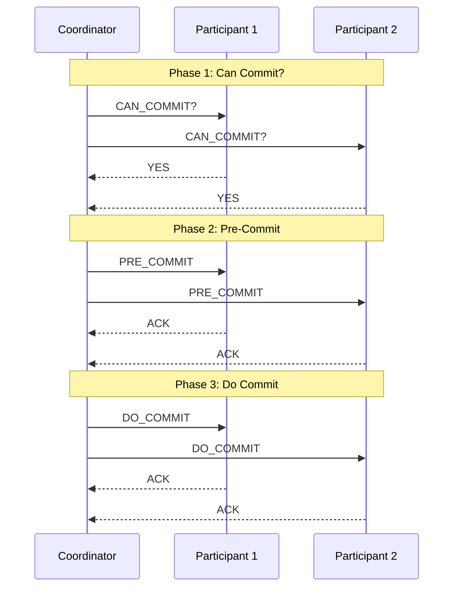
```mermaid
sequenceDiagram
    participant Coord as Coordinator
    participant P1 as Participant 1
    participant P2 as Participant 2

    Note over Coord,P2: Phase 1: Can Commit?
    Coord->>P1: CAN_COMMIT?
    Coord->>P2: CAN_COMMIT?
    P1-->>Coord: YES
    P2-->>Coord: YES

    Note over Coord,P2: Phase 2: Pre-Commit
    Coord->>P1: PRE_COMMIT
    Coord->>P2: PRE_COMMIT
    P1-->>Coord: ACK
    P2-->>Coord: ACK

    Note over Coord,P2: Phase 3: Do Commit
    Coord->>P1: DO_COMMIT
    Coord->>P2: DO_COMMIT
    P1-->>Coord: ACK
    P2-->>Coord: ACK
```

**Phase 1:** Coordinator asks "Can you commit?" Participants respond without locking.
**Phase 2:** Coordinator sends PRE_COMMIT. Participants write to WAL and lock. Now everyone knows the decision is "commit" barring failures.
**Phase 3:** Coordinator sends DO_COMMIT. Participants finalize.

**Key insight:** In Phase 2, if a participant times out waiting for Phase 3, it can safely commit because it knows everyone agreed in Phase 1. This eliminates the blocking problem.

**Limitations:** 3PC does not work correctly with network partitions. In practice, Paxos/Raft-based commit protocols have largely replaced 3PC.

---

## Consensus Algorithms

Consensus means getting multiple nodes to agree on a value. This is foundational for leader election, atomic commit, and state machine replication.

### Paxos (Overview)

Leslie Lamport's Paxos (1989) was the first practical consensus algorithm. It has three roles:

- **Proposers**: propose values
- **Acceptors**: vote on proposals
- **Learners**: learn the decided value

Paxos is notoriously difficult to understand and implement. Multi-Paxos (for a sequence of decisions) is even more complex.

### Raft (In Detail)

Diego Ongaro designed Raft (2014) specifically for understandability. It decomposes consensus into three sub-problems:

1. **Leader Election**
2. **Log Replication**
3. **Safety**

#### Raft Node States

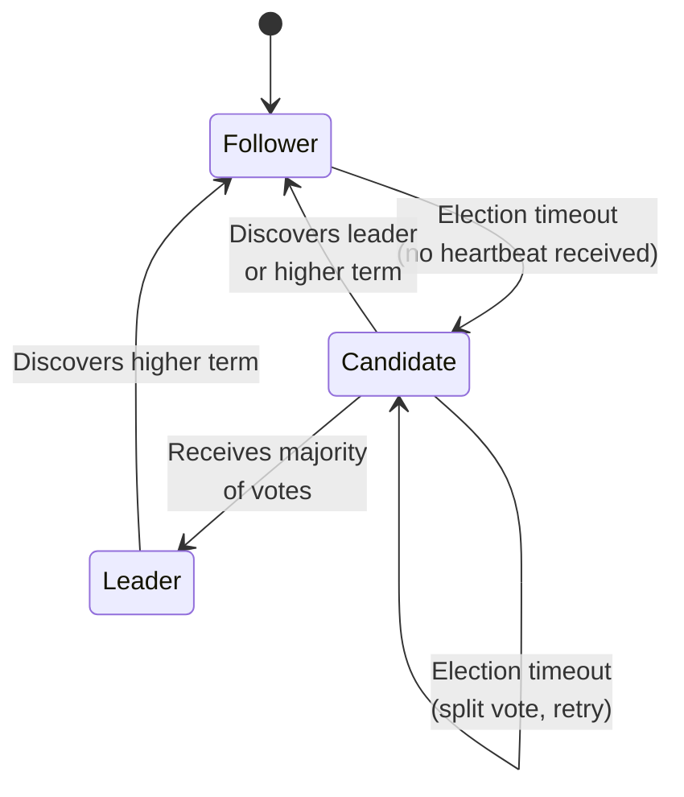
```mermaid
stateDiagram-v2
    [*] --> Follower
    Follower --> Candidate: Election timeout<br/>(no heartbeat received)
    Candidate --> Leader: Receives majority<br/>of votes
    Candidate --> Follower: Discovers leader<br/>or higher term
    Candidate --> Candidate: Election timeout<br/>(split vote, retry)
    Leader --> Follower: Discovers higher term
```

Every node starts as a **Follower**. Time is divided into **terms** (logical clocks). Each term has at most one leader.

#### Leader Election

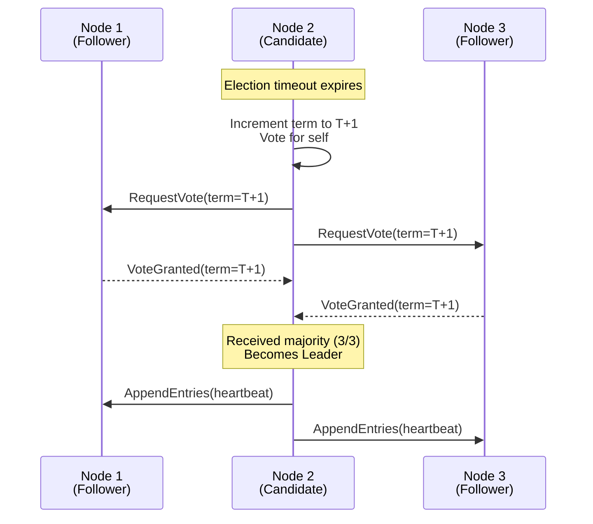
```mermaid
sequenceDiagram
    participant F1 as Node 1<br/>(Follower)
    participant C as Node 2<br/>(Candidate)
    participant F3 as Node 3<br/>(Follower)

    Note over C: Election timeout expires
    C->>C: Increment term to T+1<br/>Vote for self
    C->>F1: RequestVote(term=T+1)
    C->>F3: RequestVote(term=T+1)
    F1-->>C: VoteGranted(term=T+1)
    F3-->>C: VoteGranted(term=T+1)
    Note over C: Received majority (3/3)<br/>Becomes Leader
    C->>F1: AppendEntries(heartbeat)
    C->>F3: AppendEntries(heartbeat)
```

**Rules:**
1. Follower times out without hearing from leader: becomes Candidate.
2. Candidate increments its term, votes for itself, sends RequestVote RPCs.
3. A node votes for at most one candidate per term (first-come-first-served).
4. A node only votes for a candidate whose log is at least as up-to-date as its own.
5. If candidate receives majority of votes: becomes Leader and sends heartbeats.
6. If candidate discovers a higher term: reverts to Follower.
7. If election times out (split vote): start new election with higher term.

**Randomized timeouts** (150-300ms) reduce the chance of split votes.

#### Log Replication

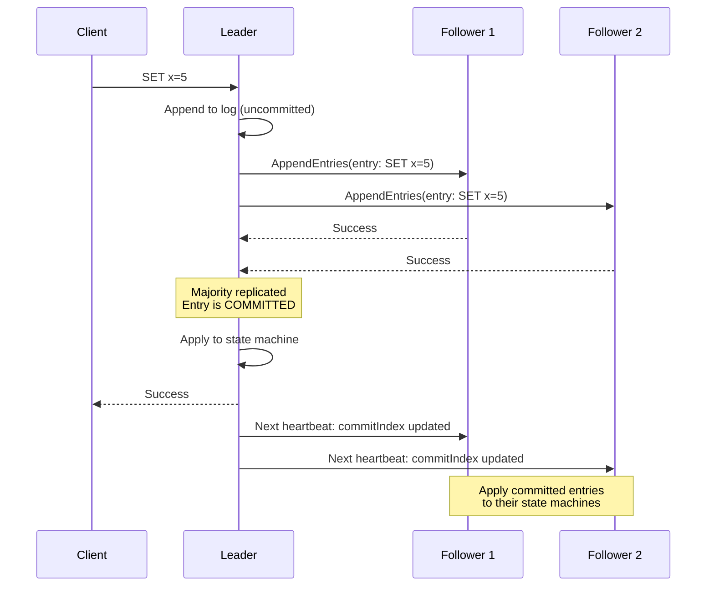
```mermaid
sequenceDiagram
    participant Client
    participant Leader
    participant F1 as Follower 1
    participant F2 as Follower 2

    Client->>Leader: SET x=5
    Leader->>Leader: Append to log (uncommitted)
    Leader->>F1: AppendEntries(entry: SET x=5)
    Leader->>F2: AppendEntries(entry: SET x=5)
    F1-->>Leader: Success
    F2-->>Leader: Success
    Note over Leader: Majority replicated<br/>Entry is COMMITTED
    Leader->>Leader: Apply to state machine
    Leader-->>Client: Success
    Leader->>F1: Next heartbeat: commitIndex updated
    Leader->>F2: Next heartbeat: commitIndex updated
    Note over F1,F2: Apply committed entries<br/>to their state machines
```

**Key concepts:**
- Leader appends client commands to its log.
- Leader sends AppendEntries RPCs to replicate entries.
- Once a majority of nodes have the entry, it is **committed**.
- Committed entries are applied to the state machine.
- Leader tracks `commitIndex` and communicates it to followers.

#### Raft Safety Properties

- **Election Safety:** At most one leader per term.
- **Leader Append-Only:** A leader never overwrites or deletes its own log entries.
- **Log Matching:** If two logs contain an entry with the same index and term, all preceding entries are identical.
- **Leader Completeness:** If an entry is committed in a given term, it will be present in the logs of all leaders of higher terms.
- **State Machine Safety:** If a server has applied a log entry at a given index, no other server will ever apply a different entry at that index.

---

## Distributed Joins and Query Processing

Distributed queries are challenging because data is spread across nodes. The query optimizer must consider network costs.

### Strategies for Distributed Joins

**Broadcast Join (Replicated Join):** Send the smaller table to all nodes holding the larger table. Each node performs a local join.

**Partitioned Join (Co-located Join):** If both tables are partitioned on the join key, each node can join its local partitions without any network transfer.

**Shuffle Join (Repartition Join):** Both tables are repartitioned on the join key, then each partition is joined locally.

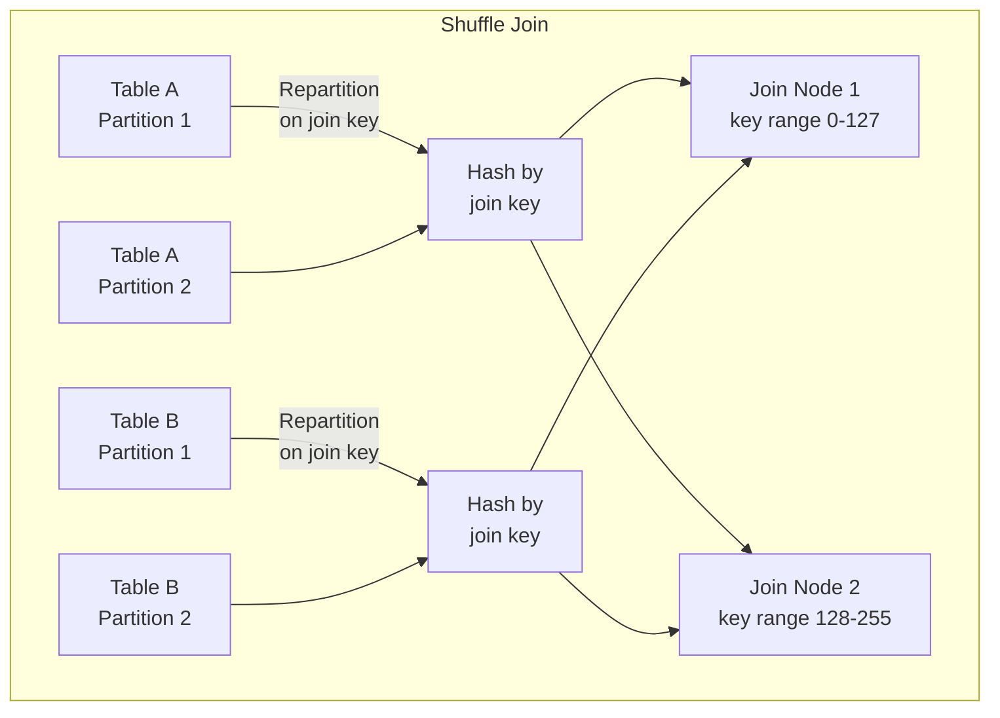
```mermaid
flowchart TD
    subgraph "Shuffle Join"
        T1P1["Table A<br/>Partition 1"] -->|"Repartition<br/>on join key"| Shuffle["Hash by<br/>join key"]
        T1P2["Table A<br/>Partition 2"] --> Shuffle
        T2P1["Table B<br/>Partition 1"] -->|"Repartition<br/>on join key"| Shuffle2["Hash by<br/>join key"]
        T2P2["Table B<br/>Partition 2"] --> Shuffle2

        Shuffle --> J1["Join Node 1<br/>key range 0-127"]
        Shuffle --> J2["Join Node 2<br/>key range 128-255"]
        Shuffle2 --> J1
        Shuffle2 --> J2
    end
```

---

## Clock Synchronization

In a distributed system, there is no single global clock. Different approaches to ordering events:

### Lamport Clocks (Logical Clocks)

Each node maintains a counter. Rules:
1. Before any event, increment the counter.
2. When sending a message, include the counter.
3. When receiving a message, set counter = max(local, received) + 1.

Lamport clocks give a **total order** but cannot distinguish concurrent events from causally ordered ones.

### Vector Clocks

Each node maintains a vector of counters (one per node). Rules:
1. Before any event, increment your own counter.
2. When sending, include the full vector.
3. When receiving, merge by taking element-wise max, then increment own counter.

Vector clocks can detect **concurrency**: if neither vector dominates the other, the events are concurrent.

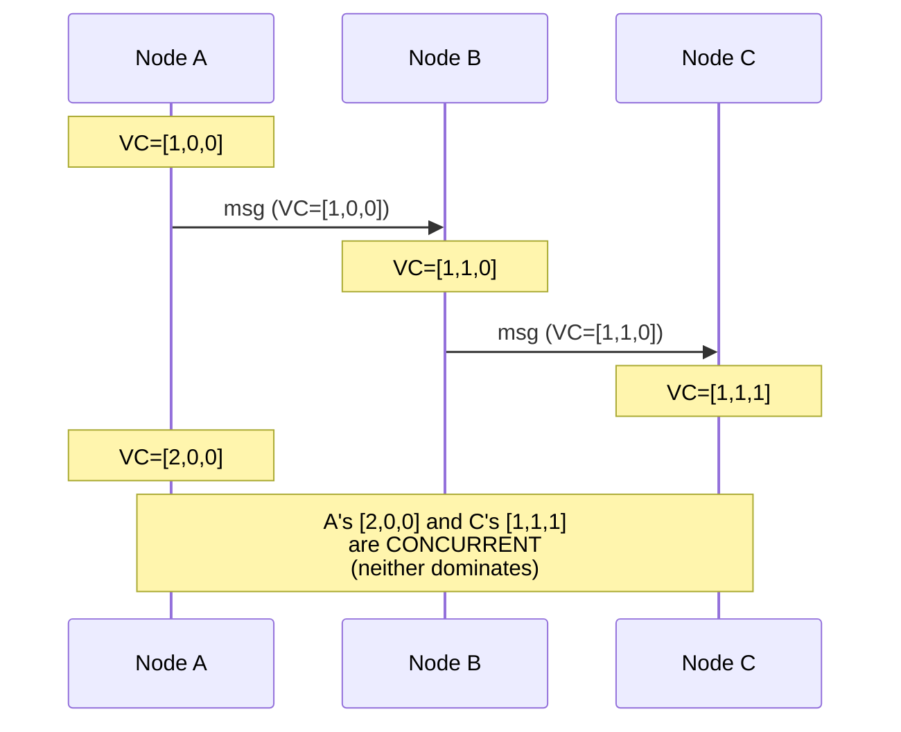
```mermaid
sequenceDiagram
    participant A as Node A
    participant B as Node B
    participant C as Node C

    Note over A: VC=[1,0,0]
    A->>B: msg (VC=[1,0,0])
    Note over B: VC=[1,1,0]
    B->>C: msg (VC=[1,1,0])
    Note over C: VC=[1,1,1]
    Note over A: VC=[2,0,0]
    Note over A,C: A's [2,0,0] and C's [1,1,1]<br/>are CONCURRENT<br/>(neither dominates)
```

### Hybrid Logical Clocks (HLC)

HLCs combine physical time with logical counters. They provide:
- Timestamps close to physical time (within clock skew bounds).
- Causal ordering guarantees of logical clocks.
- A compact representation (no vector; just physical time + logical counter).

**Used by:** CockroachDB, YugabyteDB.

### Google Spanner's TrueTime

Spanner uses custom hardware (GPS receivers + atomic clocks) to provide a **TrueTime API:**

```
TT.now() -> TTinterval [earliest, latest]
```

This returns an interval, not a point. Spanner knows the true time is within this interval. The uncertainty is typically < 7ms.

**Commit-wait:** After committing a transaction at timestamp T, Spanner waits until `TT.now().earliest > T` before reporting success. This guarantees that any future transaction will see a higher timestamp, providing **external consistency** (linearizability).

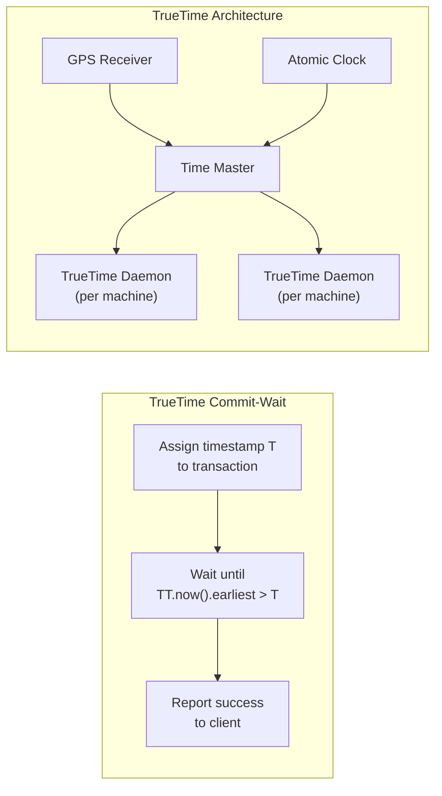
```mermaid
flowchart LR
    subgraph "TrueTime Commit-Wait"
        Commit["Assign timestamp T<br/>to transaction"] --> Wait["Wait until<br/>TT.now().earliest > T"]
        Wait --> Report["Report success<br/>to client"]
    end

    subgraph "TrueTime Architecture"
        GPS["GPS Receiver"] --> TimeServer["Time Master"]
        Atomic["Atomic Clock"] --> TimeServer
        TimeServer --> Daemon1["TrueTime Daemon<br/>(per machine)"]
        TimeServer --> Daemon2["TrueTime Daemon<br/>(per machine)"]
    end
```

---

## Summary: The Design Space

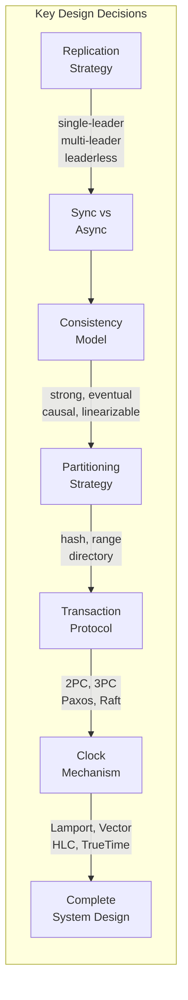
```mermaid
graph LR
    subgraph "Key Design Decisions"
        R["Replication<br/>Strategy"] --> |"single-leader<br/>multi-leader<br/>leaderless"| Sync["Sync vs<br/>Async"]
        Sync --> Cons["Consistency<br/>Model"]
        Cons --> |"strong, eventual<br/>causal, linearizable"| Part["Partitioning<br/>Strategy"]
        Part --> |"hash, range<br/>directory"| Txn["Transaction<br/>Protocol"]
        Txn --> |"2PC, 3PC<br/>Paxos, Raft"| Clock["Clock<br/>Mechanism"]
        Clock --> |"Lamport, Vector<br/>HLC, TrueTime"| System["Complete<br/>System Design"]
    end
```

Every distributed database makes specific choices in each of these dimensions. Understanding these trade-offs is the foundation for reasoning about any distributed system.

---

## Key Takeaways

1. **CAP is a starting point, not the whole story.** PACELC is more useful for understanding real system behavior.
2. **Replication topology determines the conflict model.** Single-leader avoids conflicts; leaderless embraces them.
3. **Consistency is a spectrum.** Linearizability is expensive; eventual is cheap. Choose based on your application.
4. **Consensus (Raft/Paxos) is the foundation** for fault-tolerant leader election and state machine replication.
5. **Clocks are the hardest problem.** Physical clocks drift. Logical clocks are correct but do not encode real time. HLC and TrueTime attempt to bridge the gap.
6. **2PC blocks on coordinator failure.** Modern systems use Raft-based commit protocols instead.
