# Module 11 - Design Patterns from Real Databases

## Introduction

The best way to learn how to build a database is to study how existing databases are built. This document examines the key design patterns, architectural innovations, testing strategies, and benchmarking methodologies used by production databases. Each pattern represents decades of hard-won engineering wisdom.

---

## 1. SQLite's Virtual Machine (VDBE) Approach

SQLite compiles SQL into bytecode that runs on a virtual machine called the **Virtual Database Engine (VDBE)**. This is the same approach used by programming language interpreters (Python, Lua, Java).

### How It Works

1. SQL text is tokenized and parsed into an AST
2. The code generator walks the AST and emits VDBE bytecode
3. The VDBE executes bytecode instructions one at a time
4. Each instruction operates on registers (memory cells)

### VDBE Instruction Set (Key Opcodes)

| Opcode | Description |
|--------|-------------|
| `OpenRead` | Open a cursor on a B-Tree table or index |
| `Rewind` | Move cursor to first entry |
| `Column` | Extract a column value from current row |
| `ResultRow` | Output current register values as a result row |
| `Next` | Advance cursor to next entry |
| `Halt` | Terminate the program |
| `Integer` | Store an integer constant in a register |
| `Eq` / `Lt` / `Gt` | Comparison operations |
| `If` / `IfNot` | Conditional jumps |
| `SeekGE` | Position cursor at first entry >= key |

### Example: SELECT name FROM users WHERE age > 25

```
addr  opcode       p1  p2  p3  p4
----  -----------  --  --  --  -------
0     OpenRead     0   2   0   users
1     Rewind       0   8   0
2     Column       0   1   1         ; Load age into r[1]
3     Integer      25  2   0         ; Load 25 into r[2]
4     Le           2   7   1         ; if r[1] <= r[2] goto 7
5     Column       0   0   3         ; Load name into r[3]
6     ResultRow    3   1   0         ; Output r[3]
7     Next         0   2   0         ; Advance cursor, loop to 2
8     Halt         0   0   0
```

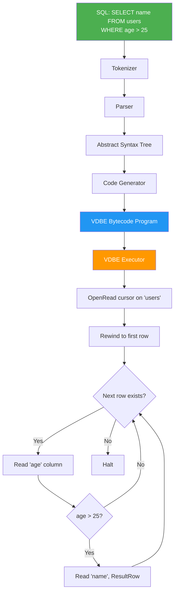

### Why This Pattern Matters

- **Debuggability:** You can dump and inspect the bytecode (`EXPLAIN` in SQLite)
- **Portability:** The VDBE is an abstraction layer above the storage engine
- **Optimization:** The code generator can apply optimizations at the bytecode level
- **Simplicity:** A switch-case loop is simpler than a tree of operator objects
- **Testing:** Individual opcodes can be unit-tested in isolation

### Trade-offs

- **Slower than compiled/vectorized:** Interpretation overhead per row
- **Not suitable for OLAP:** Row-at-a-time processing is inefficient for analytics
- **Hard to parallelize:** Sequential bytecode execution is inherently serial

---

## 2. PostgreSQL's Catalog-Driven Design

PostgreSQL stores its metadata (schemas, tables, columns, types, functions, operators) in regular tables called the **system catalog**. This is the most extreme form of "eating your own dog food."

### Key Catalog Tables

| Catalog Table | What It Stores |
|--------------|----------------|
| `pg_class` | Tables, indexes, sequences, views |
| `pg_attribute` | Columns of all tables |
| `pg_type` | All data types (built-in and user-defined) |
| `pg_proc` | Functions and procedures |
| `pg_operator` | Operators (+, -, =, etc.) |
| `pg_am` | Access methods (B-Tree, Hash, GiST, etc.) |
| `pg_index` | Index metadata |
| `pg_namespace` | Schemas |
| `pg_constraint` | Constraints (PK, FK, CHECK, UNIQUE) |

### How Extensibility Works

When you run `CREATE TYPE`, PostgreSQL inserts a row into `pg_type`. When you run `CREATE OPERATOR`, it inserts into `pg_operator`. The query planner and executor look up types and operators from these catalog tables at runtime.

This means you can add entirely new data types, operators, index methods, and aggregation functions **without modifying the PostgreSQL source code**.

```mermaid
graph TD
    subgraph "PostgreSQL Catalog-Driven Design"
        Q[Query: SELECT * FROM users<br/>WHERE location <-> point(1,2) < 5]

        Q --> PARSER[Parser]
        PARSER --> LOOKUP1[Look up 'users' in pg_class]
        LOOKUP1 --> LOOKUP2[Look up columns in pg_attribute]
        LOOKUP2 --> LOOKUP3[Look up '<->' operator in pg_operator]
        LOOKUP3 --> LOOKUP4[Look up operator's function in pg_proc]
        LOOKUP4 --> LOOKUP5[Check for GiST index in pg_index + pg_am]

        LOOKUP5 --> PLANNER[Planner uses catalog info<br/>to generate optimal plan]
        PLANNER --> EXEC[Executor calls catalog-registered<br/>functions at runtime]
    end

    subgraph "Extension: PostGIS"
        EXT[PostGIS Extension]
        EXT -->|INSERT| CAT1[pg_type: geometry, geography]
        EXT -->|INSERT| CAT2[pg_operator: &&, <->]
        EXT -->|INSERT| CAT3[pg_proc: ST_Distance, ST_Contains]
        EXT -->|INSERT| CAT4[pg_am: GiST operator class]
    end

    style Q fill:#4CAF50,color:white
    style PLANNER fill:#FF9800,color:white
    style EXT fill:#2196F3,color:white
```

### Why This Pattern Matters

- **Ultimate extensibility:** PostGIS, pgvector, TimescaleDB all work because of this
- **Self-describing:** The database can introspect itself fully
- **Uniform access:** Metadata queries use the same SQL as data queries
- **Dynamic:** No recompilation needed to add types or operators

### Trade-offs

- **Performance overhead:** Catalog lookups add latency (mitigated by caching)
- **Complexity:** The catalog has 80+ tables, making internals hard to learn
- **Bootstrap problem:** Need special bootstrap code to create initial catalog

---

## 3. MySQL's Pluggable Storage Engine Architecture

MySQL separates the SQL layer from the storage engine through a well-defined **Handler API**. This allows multiple storage engines to coexist.

### The Handler API

```
class handler {
    virtual int open(const char *name, int mode);
    virtual int close();
    virtual int rnd_init(bool scan);       // Start full table scan
    virtual int rnd_next(uchar *buf);      // Get next row
    virtual int index_init(uint idx);      // Start index scan
    virtual int index_read(uchar *buf, const uchar *key, ...);
    virtual int write_row(const uchar *buf);
    virtual int update_row(const uchar *old, const uchar *new);
    virtual int delete_row(const uchar *buf);
    virtual int external_lock(THD *thd, int lock_type);
    // ... ~150 methods total
};
```

### Storage Engines

| Engine | Type | Use Case |
|--------|------|----------|
| InnoDB | B+Tree, MVCC, transactions | Default, general purpose |
| MyISAM | B+Tree, table-level locking | Legacy, read-heavy (deprecated) |
| Memory | Hash/B-Tree in RAM | Temporary tables, caching |
| NDB | Distributed, in-memory | MySQL Cluster |
| TokuDB | Fractal Tree | Write-heavy (discontinued) |
| RocksDB (MyRocks) | LSM-Tree | Write-heavy, space-efficient |

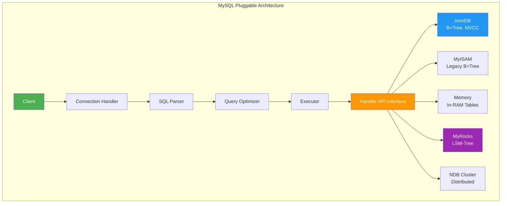

### Why This Pattern Matters

- **Flexibility:** Choose the right engine for each table
- **Innovation:** New engines can be developed independently
- **Separation of concerns:** SQL layer and storage are independent

### Trade-offs

- **Lowest common denominator:** The Handler API limits what engines can express
- **Cross-engine transactions:** Difficult to guarantee ACID across engines
- **API bloat:** The handler interface has grown to ~150 methods
- **Feature mismatch:** Some SQL features only work with specific engines

---

## 4. DuckDB's Vectorized Push-Based Execution

DuckDB uses a modern execution model that processes data in **vectors** (batches of ~2048 values) and uses a **push-based** pipeline model.

### Row-at-a-Time vs Vectorized

**Traditional (Volcano model):** Each operator pulls one row at a time from its child via `next()`. This has enormous per-row overhead from virtual function calls.

**Vectorized:** Operators process vectors of values. Tight loops over arrays amortize function call overhead and enable SIMD, cache-friendly access, and compiler auto-vectorization.

### Push vs Pull

**Pull (Volcano):** The root operator calls `next()` on its child, which calls `next()` on its child, recursively.

**Push:** Data flows from source operators through a pipeline. The source pushes vectors into the next operator, which processes and pushes to the next, and so on.

```mermaid
graph TD
    subgraph "Volcano Model (Row-at-a-Time Pull)"
        V_PROJ[Project] -->|next()| V_FILTER[Filter]
        V_FILTER -->|next()| V_SCAN[Table Scan]
        V_SCAN -->|1 row| V_FILTER
        V_FILTER -->|1 row| V_PROJ

        note1[Each next() call returns<br/>ONE row. High overhead<br/>from virtual dispatch per row.]
    end

    subgraph "Vectorized Push-Based (DuckDB)"
        D_SCAN[Scan Source] -->|push vector<br/>2048 values| D_FILTER[Filter]
        D_FILTER -->|push vector<br/>filtered| D_PROJ[Project]
        D_PROJ -->|push vector| D_SINK[Result Sink]

        note2[Each push sends a VECTOR<br/>of 2048 values. Tight loops,<br/>SIMD, cache-friendly.]
    end

    style V_PROJ fill:#f44336,color:white
    style D_SCAN fill:#4CAF50,color:white
    style D_SINK fill:#4CAF50,color:white
```

### Morsel-Driven Parallelism

DuckDB divides tables into **morsels** (~10,000 rows) and assigns them to worker threads. Each thread processes its morsel through the entire pipeline independently.

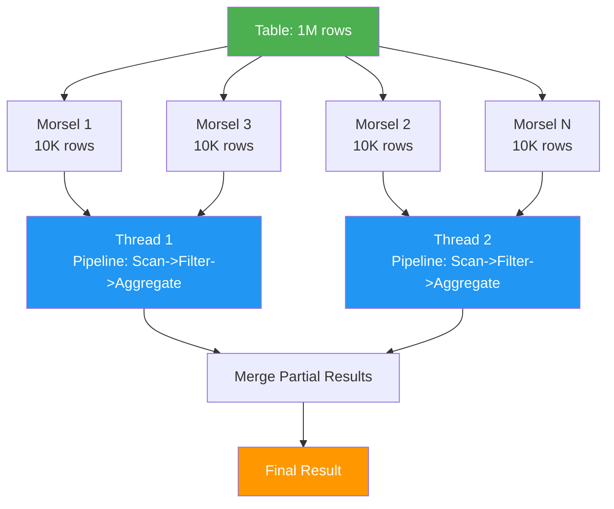

### Why This Pattern Matters

- **10-100x faster** than row-at-a-time for analytics
- **Natural parallelism** via morsel-driven execution
- **Hardware-friendly:** SIMD, prefetching, branch prediction all benefit
- **Foundation of modern OLAP engines**

---

## 5. RocksDB's Plugin Architecture

RocksDB provides extreme configurability through a plugin/factory pattern. Nearly every component can be swapped out.

### Configurable Components

| Component | Options | Default |
|-----------|---------|---------|
| MemTable | SkipList, HashSkipList, HashLinkList, Vector | SkipList |
| Table Format | BlockBasedTable, PlainTable, CuckooTable | BlockBasedTable |
| Compaction Style | Level, Universal, FIFO | Level |
| Compression | Snappy, Zstd, LZ4, Zlib, BZip2, None | Snappy (L0-L1), Zstd (rest) |
| Merge Operator | Custom user-defined | None |
| Comparator | Bytewise, ReverseBytewise, Custom | Bytewise |
| Filter Policy | Bloom filter (bits per key configurable) | None |
| Rate Limiter | GenericRateLimiter, Custom | None |
| Write Buffer Manager | Shared or per-CF | Per-CF |

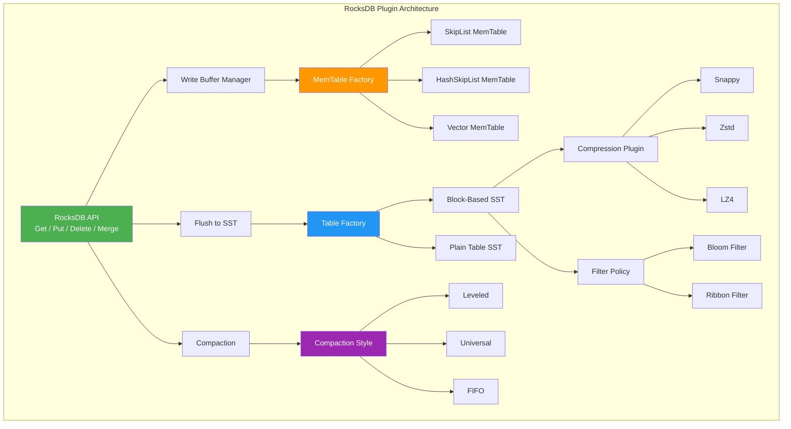

### The Merge Operator Pattern

RocksDB's `MergeOperator` is a brilliant design pattern. Instead of read-modify-write (which requires a read), you can push a "merge operand" that is lazily applied during reads or compaction.

**Use cases:** Counters (increment without reading), set append, JSON patch

### Why This Pattern Matters

- **One engine, many workloads:** Facebook uses RocksDB for dozens of different systems
- **Tuning without code changes:** Configuration-driven optimization
- **Innovation at the component level:** New compaction strategies, new table formats
- **Community contributions:** Contributors can add new plugins without touching core

---

## 6. Designing for Extensibility

### Key Patterns

1. **Interface segregation:** Define narrow interfaces for each extension point
2. **Factory pattern:** Use factories to create component instances from configuration
3. **Hook/callback system:** Allow custom code at well-defined points
4. **Catalog-driven behavior:** Store behavior definitions in tables/config, not code
5. **Plugin discovery:** Load extensions dynamically at runtime

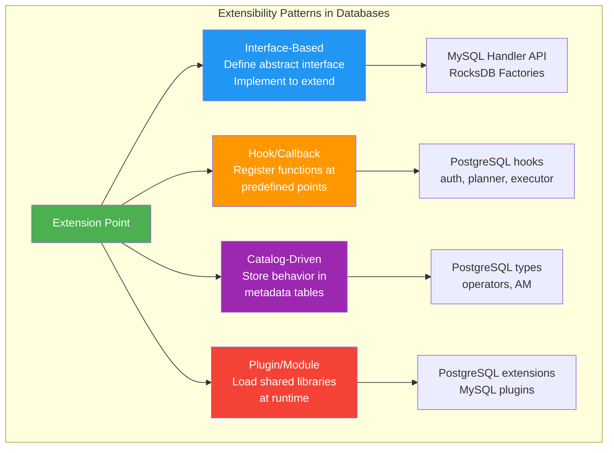

---

## 7. Testing Strategies for Databases

Database testing is uniquely challenging because correctness requirements are extreme and bugs often only manifest under specific timing, crash, or concurrency scenarios.

### Crash Testing

**Goal:** Verify that the database recovers correctly after a crash at any point.

**Techniques:**
- **Kill -9 testing:** Randomly kill the process and verify recovery
- **Filesystem injection:** Inject errors at the filesystem level (EIO, ENOSPC)
- **Power-loss simulation:** Use battery-backed test rigs to cut power
- **CrashMonkey:** Systematically test all possible crash points in a workload

**SQLite's crash testing:** SQLite uses a custom VFS layer that simulates crashes after every single write operation. It runs millions of crash-recovery cycles in its test suite.

### Fuzzing

**Goal:** Find bugs by generating random or semi-random inputs.

**SQL Fuzzing tools:**
- **SQLsmith:** Generates random but syntactically valid SQL
- **SQLancer:** Generates queries and checks results for logical bugs (TLP, NoREC, PQS)
- **AFL/LibFuzzer:** Coverage-guided fuzzing of parser and execution

**SQLancer's testing oracles:**
- **Ternary Logic Partitioning (TLP):** Split WHERE clause into TRUE/FALSE/NULL partitions, verify UNION ALL of partitions equals unfiltered result
- **Non-Optimizing Reference Engine (NoREC):** Compare optimized query result against a non-optimized version
- **Pivoted Query Synthesis (PQS):** Generate queries that must return a known pivot row

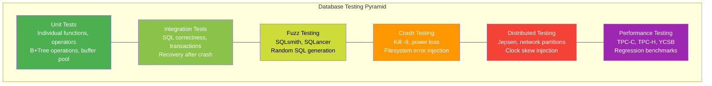

### Deterministic Simulation Testing

**Goal:** Make non-deterministic behavior (I/O, scheduling, time) deterministic and reproducible.

**How it works:**
1. Replace all sources of non-determinism with controlled abstractions
2. Run the system with a deterministic scheduler
3. On failure, replay the exact same sequence to reproduce
4. Used by FoundationDB (the gold standard) and TigerBeetle

**FoundationDB's approach:**
- All I/O goes through a simulation layer
- Custom deterministic scheduler controls thread interleaving
- Can simulate network partitions, disk failures, clock skew
- Bugs are 100% reproducible from a seed number
- "We test millions of simulated hours per day"

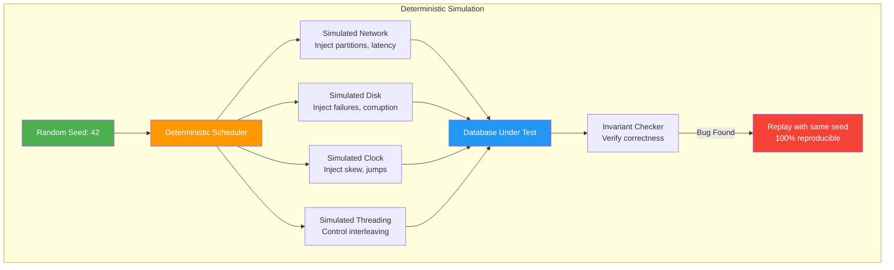

---

## 8. Jepsen Testing for Correctness

[Jepsen](https://jepsen.io/) is a framework created by Kyle Kingsbury (Aphyr) for testing distributed systems. It has found bugs in nearly every distributed database it has tested.

### How Jepsen Works

1. **Setup:** Deploy the database on a cluster of VMs
2. **Nemesis:** Inject failures (network partitions, clock skew, process kills, disk failures)
3. **Generator:** Generate a workload of reads and writes
4. **Checker:** Verify that the history of operations is consistent with the claimed isolation level

### What Jepsen Tests

| Test | What It Checks |
|------|---------------|
| Linearizability | Every read returns the most recent write (for single-object ops) |
| Serializability | Transaction history equivalent to some serial execution |
| Snapshot Isolation | No write-write conflicts, consistent snapshot reads |
| Internal Consistency | No stale reads, no lost updates, no dirty reads |

### Notable Jepsen Findings

- **CockroachDB:** Found serialization anomalies in early versions (fixed)
- **YugabyteDB:** Found data loss under network partitions (fixed)
- **MongoDB:** Found dirty reads under certain configurations
- **TiDB:** Found snapshot isolation violations (fixed)
- **PostgreSQL (with Citus):** Found consistency issues in distributed queries

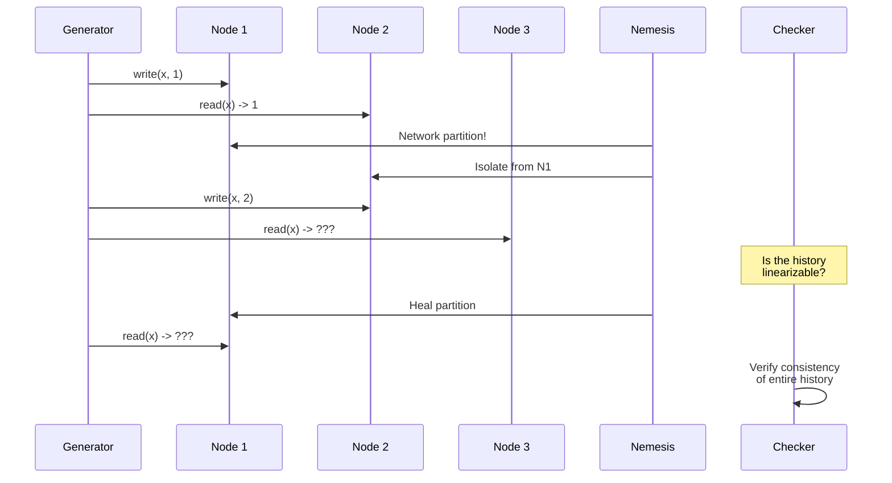

---

## 9. Performance Benchmarking

### Standard Benchmarks

#### TPC-C (OLTP)

The industry standard for OLTP benchmarking. Simulates a wholesale supplier with:
- 5 transaction types: New-Order, Payment, Order-Status, Delivery, Stock-Level
- Measures throughput in tpmC (transactions per minute, New-Order)
- Strict response time requirements
- Must run for at least 8 hours for official results

#### TPC-H (OLAP/Decision Support)

22 complex analytical queries on a schema representing a business (orders, lineitem, supplier, etc.).
- Scale factors: 1GB, 10GB, 100GB, 1TB, 10TB, 100TB
- Measures query execution time and throughput
- Tests optimizer quality, join strategies, aggregation performance

#### YCSB (Yahoo! Cloud Serving Benchmark)

Flexible benchmark for key-value and NoSQL systems.
- 6 standard workloads (A through F)
- Workload A: 50% read, 50% update (update-heavy)
- Workload B: 95% read, 5% update (read-heavy)
- Workload C: 100% read
- Workload D: 95% read, 5% insert (read-latest)
- Workload E: 95% scan, 5% insert (scan-heavy)
- Workload F: 50% read, 50% read-modify-write

#### sysbench

Popular open-source benchmark for MySQL and PostgreSQL.
- OLTP read-only, read-write, write-only workloads
- Point selects, range selects, updates, inserts
- Easy to run, widely used for MySQL comparisons

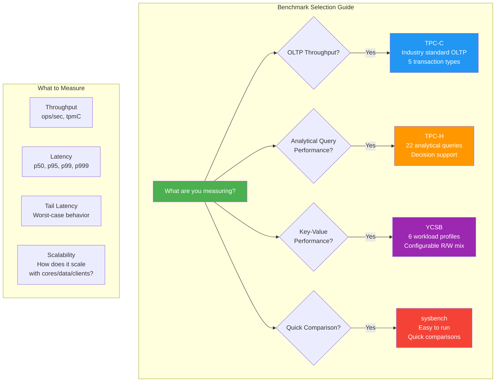

### Benchmarking Best Practices

1. **Always measure tail latency** (p99, p999), not just average or median
2. **Warm up the system** before measuring (fill caches, trigger compaction)
3. **Run long enough** to capture periodic events (checkpoints, compaction)
4. **Use realistic data sizes** (benchmarks on 1MB of data are meaningless)
5. **Report the full distribution**, not just a single number
6. **Measure under contention** (many threads, skewed access patterns)
7. **Compare apples to apples** (same hardware, same data size, same isolation level)
8. **Beware of benchmark gaming** (optimizing for the benchmark, not real workloads)

### Latency vs Throughput

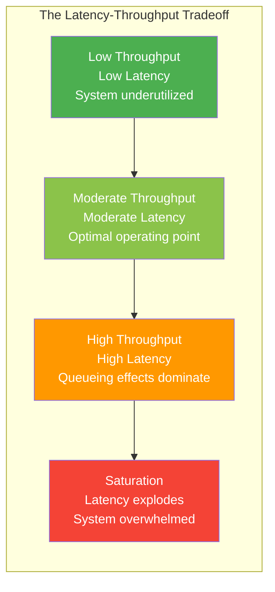

---

## 10. Putting It All Together: Patterns Summary

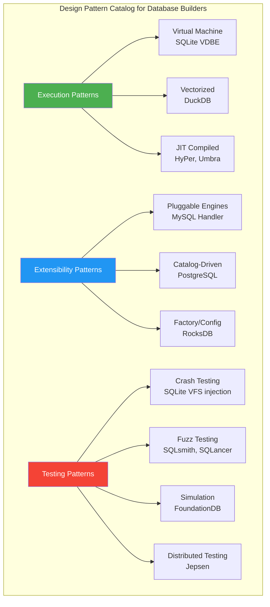

---

## Summary

The design patterns covered in this module represent the collective wisdom of decades of database engineering:

| Pattern | Database | Key Insight |
|---------|----------|-------------|
| Bytecode VM | SQLite | Compilation + interpretation = debuggable, portable |
| Catalog-driven | PostgreSQL | Metadata as data = infinite extensibility |
| Pluggable engines | MySQL | Abstraction boundary = engine flexibility |
| Vectorized execution | DuckDB | Batch processing = hardware efficiency |
| Plugin architecture | RocksDB | Configuration-driven = adaptability |
| Crash testing | SQLite | Test every possible crash point |
| Deterministic sim | FoundationDB | Control non-determinism = reproducible bugs |
| Jepsen testing | All distributed DBs | Fault injection = find real bugs |

Study these patterns, understand why they exist, and apply the relevant ones when building your own database. No single pattern is universally correct -- the art is in choosing the right combination for your constraints.
