# Module 11 - Step-by-Step Full Database Implementation Guide

## Introduction

This guide walks you through building a complete relational database from scratch in 6 phases. Each phase builds on the previous one, and at the end you will have a working database with SQL parsing, B+Tree indexing, buffer pool management, write-ahead logging, transactions with MVCC, and a client-server protocol.

The language used in examples is Go, but the concepts apply to any language. The key is to build in layers with clean interfaces between them.

---

## Overall Architecture

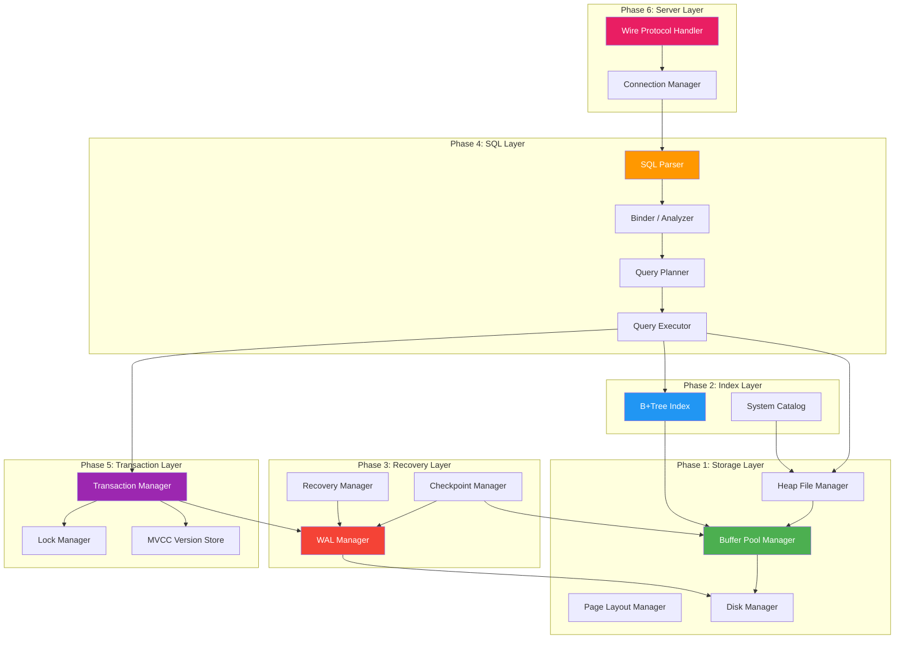

---

## Phase 1: Storage Layer

The storage layer is the foundation. It manages raw pages on disk, organizes them into heap files, and provides a buffer pool for caching.

### 1.1 Disk Manager

The disk manager handles reading and writing fixed-size pages to and from database files.

**Interface:**

```go
type DiskManager interface {
    // ReadPage reads a page from disk into the given buffer.
    ReadPage(pageID PageID, data []byte) error

    // WritePage writes the given buffer to disk at the page's location.
    WritePage(pageID PageID, data []byte) error

    // AllocatePage returns the ID of a new, empty page.
    AllocatePage() (PageID, error)

    // DeallocatePage marks a page as free for reuse.
    DeallocatePage(pageID PageID) error

    // Close flushes and closes the underlying file.
    Close() error
}

type PageID uint32

const PageSize = 4096 // 4KB pages
```

**Implementation notes:**
- Each page is at a fixed offset: `offset = PageID * PageSize`
- Use `pread`/`pwrite` for thread-safe I/O without seeking
- Maintain a free list of deallocated pages for reuse
- The first page (page 0) is a header page with metadata (page count, free list head)

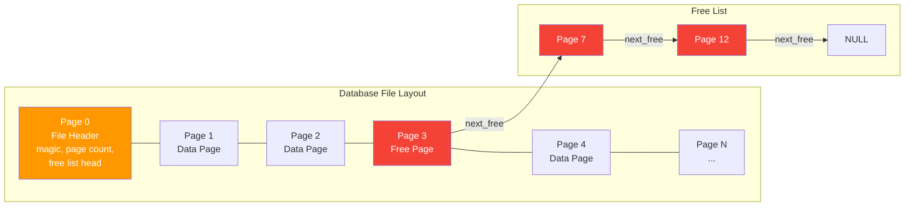

### 1.2 Page Layout

Each page has a header followed by data. For heap pages, we use a slotted page layout.

**Slotted Page Structure:**

```
+--------------------------------------------------+
| Page Header (24 bytes)                            |
|   page_id (4B) | lsn (8B) | slot_count (2B)      |
|   free_space_offset (2B) | flags (2B)             |
+--------------------------------------------------+
| Slot Directory (grows downward)                   |
|   slot[0]: offset(2B) | length(2B)               |
|   slot[1]: offset(2B) | length(2B)               |
|   ...                                             |
+--------------------------------------------------+
|                                                    |
|            Free Space                              |
|                                                    |
+--------------------------------------------------+
|   Record 1 data (variable length)                 |
|   Record 0 data (variable length)                 |
+--------------------------------------------------+
```

**Interface:**

```go
type Page struct {
    data [PageSize]byte
}

type SlottedPage struct {
    page *Page
}

func (sp *SlottedPage) InsertRecord(record []byte) (SlotID, error)
func (sp *SlottedPage) GetRecord(slotID SlotID) ([]byte, error)
func (sp *SlottedPage) DeleteRecord(slotID SlotID) error
func (sp *SlottedPage) UpdateRecord(slotID SlotID, record []byte) error
func (sp *SlottedPage) FreeSpace() int
func (sp *SlottedPage) Compact() // Defragment free space
```

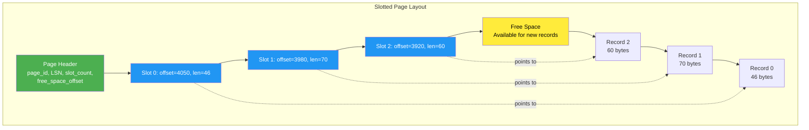

### 1.3 Heap File Manager

A heap file is an unordered collection of pages. It tracks which pages have free space for inserting new records.

**Interface:**

```go
type RecordID struct {
    PageID PageID
    SlotID SlotID
}

type HeapFile interface {
    // InsertRecord finds a page with space and inserts the record.
    InsertRecord(record []byte) (RecordID, error)

    // GetRecord retrieves a record by its RecordID.
    GetRecord(rid RecordID) ([]byte, error)

    // DeleteRecord removes a record.
    DeleteRecord(rid RecordID) error

    // UpdateRecord replaces a record's data.
    UpdateRecord(rid RecordID, record []byte) error

    // Scan returns an iterator over all records in the heap file.
    Scan() RecordIterator
}

type RecordIterator interface {
    Next() bool
    Record() []byte
    RecordID() RecordID
    Close()
}
```

**Implementation notes:**
- Maintain a **page directory** that tracks free space per page
- When inserting, find first page with enough free space
- If no page has space, allocate a new page
- The page directory itself can be stored in special header pages

### 1.4 Buffer Pool Manager

The buffer pool caches pages in memory and manages their lifecycle.

**Interface:**

```go
type BufferPoolManager interface {
    // FetchPage loads a page into the buffer pool (or returns cached copy).
    // Pins the page (prevents eviction).
    FetchPage(pageID PageID) (*Page, error)

    // UnpinPage decrements the pin count. dirty=true if page was modified.
    UnpinPage(pageID PageID, dirty bool) error

    // NewPage allocates a new page on disk and loads it into the pool.
    NewPage() (*Page, PageID, error)

    // DeletePage removes a page from the pool and deallocates on disk.
    DeletePage(pageID PageID) error

    // FlushPage writes a specific page to disk.
    FlushPage(pageID PageID) error

    // FlushAllPages writes all dirty pages to disk.
    FlushAllPages() error
}
```

**Implementation details:**

```go
type bufferPoolManager struct {
    diskManager  DiskManager
    pages        []*Page           // Frame array
    pageTable    map[PageID]int    // PageID -> frame index
    replacer     Replacer          // LRU-K or Clock replacer
    freeFrames   []int             // Frames not currently holding a page
    pinCounts    []int             // Pin count per frame
    dirtyFlags   []bool            // Dirty flag per frame
    mu           sync.Mutex
}
```

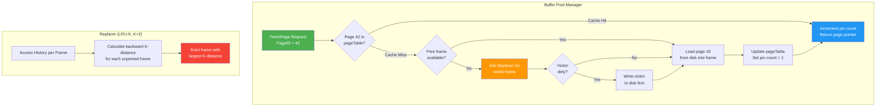

---

## Phase 2: Index Layer

### 2.1 B+Tree Index

A B+Tree provides O(log n) lookups, inserts, and deletes, plus efficient range scans.

**Interface:**

```go
type BPlusTree interface {
    // Search returns the value associated with the key.
    Search(key []byte) ([]byte, error)

    // Insert adds a key-value pair. For table indexes, value = RecordID.
    Insert(key []byte, value []byte) error

    // Delete removes a key-value pair.
    Delete(key []byte) error

    // RangeScan returns an iterator for keys in [startKey, endKey].
    RangeScan(startKey, endKey []byte) KeyValueIterator

    // PrintTree prints the tree structure (for debugging).
    PrintTree()
}
```

**Node layout on a page:**

```
Internal Node:
+-----------------------------------------------+
| Header: node_type(1B) | key_count(2B) |       |
|         parent_page(4B) | right_sibling(4B)   |
+-----------------------------------------------+
| child_0(4B) | key_0 | child_1(4B) | key_1 |  |
| child_2(4B) | key_2 | ... | child_n(4B)      |
+-----------------------------------------------+

Leaf Node:
+-----------------------------------------------+
| Header: node_type(1B) | key_count(2B) |       |
|         parent_page(4B) | next_leaf(4B)       |
+-----------------------------------------------+
| key_0 | value_0 | key_1 | value_1 | ...      |
+-----------------------------------------------+
```

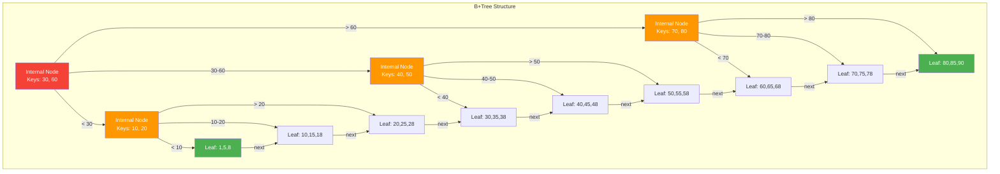

**Key operations to implement:**

1. **Search:** Start at root, follow child pointers based on key comparisons, reach leaf
2. **Insert:** Search for leaf, insert key-value. If leaf overflows, split and push middle key up. Recursively split parents if needed.
3. **Delete:** Search for leaf, remove key-value. If leaf underflows (< half full), merge with sibling or redistribute keys.
4. **Range scan:** Find start leaf, follow next-leaf pointers until end key.

### 2.2 System Catalog

The catalog stores metadata about tables, columns, and indexes.

```go
type Catalog interface {
    CreateTable(name string, schema Schema) (TableID, error)
    GetTable(name string) (*TableInfo, error)
    GetTableByID(id TableID) (*TableInfo, error)
    DropTable(name string) error
    ListTables() []*TableInfo

    CreateIndex(tableName, indexName string, columns []string, unique bool) error
    GetIndex(tableName, indexName string) (*IndexInfo, error)
    GetIndexesForTable(tableName string) []*IndexInfo
    DropIndex(tableName, indexName string) error
}

type Schema struct {
    Columns []Column
}

type Column struct {
    Name     string
    Type     DataType  // Integer, Float, Varchar(n), Boolean, etc.
    Nullable bool
    Default  interface{}
}

type TableInfo struct {
    ID     TableID
    Name   string
    Schema Schema
    Heap   HeapFile
}
```

---

## Phase 3: Recovery Layer

### 3.1 WAL Manager

The Write-Ahead Log ensures durability and crash recovery.

**Interface:**

```go
type LSN uint64

type WALManager interface {
    // AppendRecord writes a log record and returns its LSN.
    AppendRecord(record WALRecord) (LSN, error)

    // Flush ensures all log records up to the given LSN are on disk.
    Flush(lsn LSN) error

    // Scan returns an iterator over log records from the given LSN.
    Scan(startLSN LSN) WALIterator

    // GetFlushedLSN returns the LSN of the last flushed record.
    GetFlushedLSN() LSN
}

type WALRecord struct {
    LSN       LSN
    TxnID     TxnID
    Type      WALRecordType  // BEGIN, COMMIT, ABORT, INSERT, DELETE, UPDATE, CHECKPOINT
    TableID   TableID
    PageID    PageID
    SlotID    SlotID
    BeforeImage []byte  // For UNDO (old value)
    AfterImage  []byte  // For REDO (new value)
    PrevLSN   LSN       // Previous LSN for this transaction
}
```

**Implementation notes:**
- WAL is a sequential append-only file
- Buffer log records in memory, flush on commit or when buffer is full
- Each log record has a PrevLSN pointer for efficient per-transaction undo chains
- Use fdatasync/fsync for durability guarantees

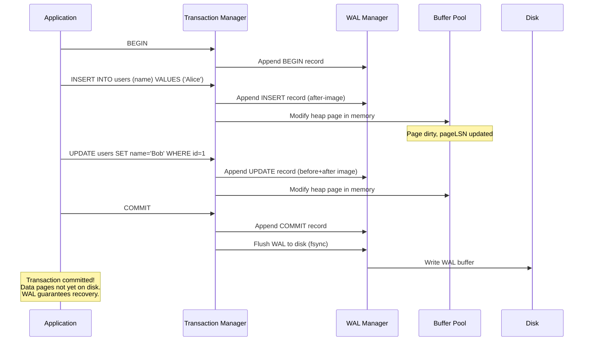

### 3.2 Recovery Manager

Implements ARIES-style crash recovery in three phases.

```go
type RecoveryManager interface {
    // Recover replays the WAL to bring the database to a consistent state.
    Recover() error
}
```

**The three phases of ARIES recovery:**

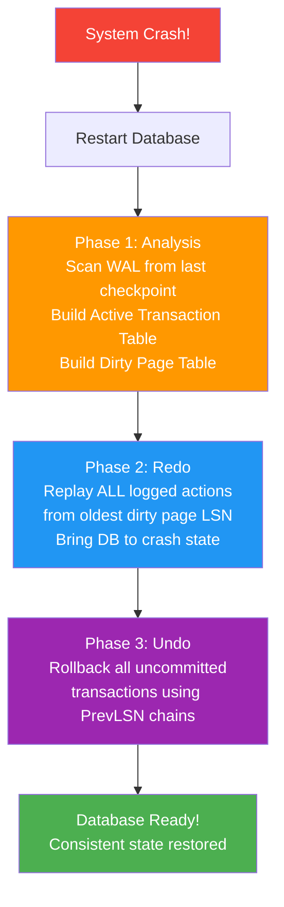

**Analysis phase:** Scan WAL forward from the last checkpoint. Build a table of active transactions (uncommitted at crash time) and dirty pages (pages that might not have been flushed).

**Redo phase:** Starting from the earliest LSN in the dirty page table, replay every logged operation. Skip operations where the page's on-disk LSN is already >= the log record's LSN (page was already flushed).

**Undo phase:** For each active (uncommitted) transaction found in analysis, follow the PrevLSN chain backward and undo each operation by applying the before-image. Write Compensation Log Records (CLRs) so undo is idempotent.

### 3.3 Checkpoint Manager

Periodic checkpoints reduce recovery time by recording the database state.

```go
type CheckpointManager interface {
    // Checkpoint writes a checkpoint record to the WAL.
    // Fuzzy checkpoint: records active transactions and dirty pages,
    // does NOT force all dirty pages to disk.
    Checkpoint() error
}
```

---

## Phase 4: SQL Layer

### 4.1 SQL Parser

Converts SQL text into an Abstract Syntax Tree (AST).

**Interface:**

```go
type Parser interface {
    Parse(sql string) (Statement, error)
}

// Statement types
type Statement interface{ statementNode() }

type SelectStatement struct {
    Columns   []Expression    // SELECT clause
    From      []TableRef      // FROM clause
    Where     Expression      // WHERE clause (optional)
    OrderBy   []OrderByItem   // ORDER BY clause (optional)
    Limit     *int            // LIMIT clause (optional)
    GroupBy   []Expression    // GROUP BY clause (optional)
    Having    Expression      // HAVING clause (optional)
}

type InsertStatement struct {
    Table   string
    Columns []string
    Values  [][]Expression
}

type UpdateStatement struct {
    Table string
    Set   []Assignment    // column = expression pairs
    Where Expression
}

type DeleteStatement struct {
    Table string
    Where Expression
}

type CreateTableStatement struct {
    Table   string
    Columns []ColumnDef
    Constraints []TableConstraint
}
```

**Supported SQL subset:**
- `SELECT ... FROM ... WHERE ... ORDER BY ... LIMIT ...`
- `INSERT INTO ... VALUES ...`
- `UPDATE ... SET ... WHERE ...`
- `DELETE FROM ... WHERE ...`
- `CREATE TABLE ...`
- `CREATE INDEX ...`
- `DROP TABLE ...`
- `BEGIN`, `COMMIT`, `ROLLBACK`

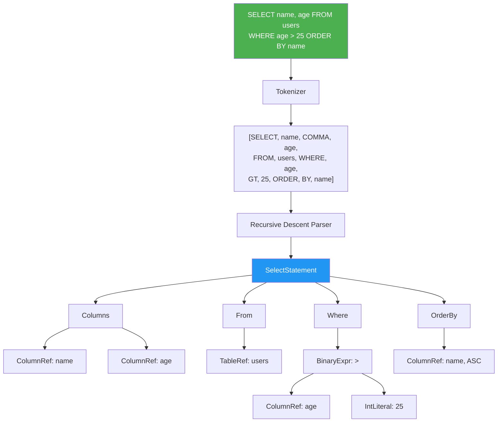

### 4.2 Binder / Semantic Analyzer

Resolves names, checks types, and validates the AST against the catalog.

```go
type Binder interface {
    Bind(stmt Statement) (BoundStatement, error)
}
```

**What the binder does:**
1. Resolve table names to TableIDs via the catalog
2. Resolve column names to column indices
3. Check that referenced tables and columns exist
4. Type-check expressions (e.g., cannot compare int to varchar)
5. Resolve ambiguous column references in JOINs
6. Validate constraints (NOT NULL columns have values in INSERT)

### 4.3 Query Planner

Converts a bound AST into a physical execution plan.

```go
type Planner interface {
    Plan(stmt BoundStatement) (Plan, error)
}

// Physical plan nodes
type Plan interface {
    planNode()
    Schema() Schema  // Output schema of this plan node
}

type SeqScanPlan struct {
    TableID TableID
    Filter  Expression
}

type IndexScanPlan struct {
    IndexID IndexID
    StartKey, EndKey []byte
}

type FilterPlan struct {
    Child     Plan
    Predicate Expression
}

type ProjectionPlan struct {
    Child   Plan
    Columns []Expression
}

type SortPlan struct {
    Child   Plan
    OrderBy []OrderByItem
}

type HashJoinPlan struct {
    Left, Right Plan
    LeftKey, RightKey Expression
}

type AggregationPlan struct {
    Child    Plan
    GroupBy  []Expression
    Aggregates []AggregateExpr  // SUM, COUNT, AVG, MIN, MAX
}
```

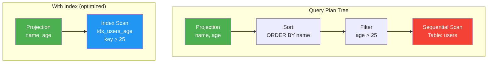

### 4.4 Query Executor

Executes the physical plan using the Volcano (iterator) model.

```go
type Executor interface {
    Init() error
    Next() (*Tuple, error)  // Returns nil when done
    Close()
}

// Each plan node becomes an executor
type SeqScanExecutor struct {
    heapFile HeapFile
    iterator RecordIterator
    filter   Expression
    schema   Schema
}

func (e *SeqScanExecutor) Next() (*Tuple, error) {
    for e.iterator.Next() {
        tuple := DeserializeTuple(e.iterator.Record(), e.schema)
        if e.filter == nil || EvalBool(e.filter, tuple) {
            return tuple, nil
        }
    }
    return nil, nil // No more tuples
}
```

---

## Phase 5: Transaction Layer

### 5.1 Transaction Manager

```go
type TxnID uint64

type TransactionManager interface {
    Begin() (*Transaction, error)
    Commit(txn *Transaction) error
    Abort(txn *Transaction) error
}

type Transaction struct {
    ID        TxnID
    State     TxnState  // RUNNING, COMMITTED, ABORTED
    StartTS   uint64    // Start timestamp for MVCC
    CommitTS  uint64    // Commit timestamp
    WriteSet  []WriteRecord  // For rollback
}
```

### 5.2 Lock Manager

Implements two-phase locking (2PL) for serializability.

```go
type LockMode int
const (
    SharedLock    LockMode = iota  // For reads
    ExclusiveLock                   // For writes
)

type LockManager interface {
    // LockRow acquires a lock on a specific row.
    LockRow(txn *Transaction, rid RecordID, mode LockMode) error

    // LockTable acquires a table-level lock.
    LockTable(txn *Transaction, tableID TableID, mode LockMode) error

    // UnlockAll releases all locks held by a transaction.
    UnlockAll(txn *Transaction)
}
```

**Deadlock detection:** Maintain a waits-for graph. Periodically check for cycles. When a cycle is found, abort the youngest transaction.

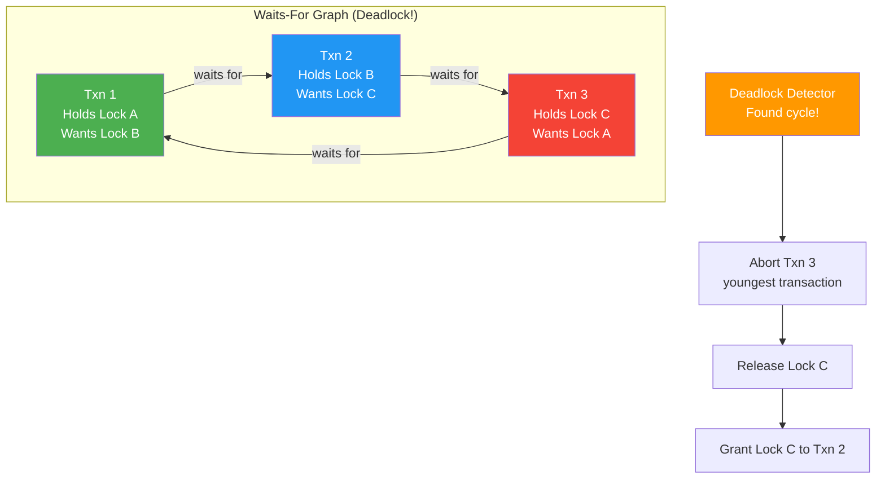

### 5.3 MVCC Version Store

Multi-Version Concurrency Control allows readers to never block writers.

```go
type VersionStore interface {
    // GetVisible returns the version of the record visible to the transaction.
    GetVisible(txn *Transaction, rid RecordID) (*Tuple, error)

    // CreateVersion creates a new version of a record.
    CreateVersion(txn *Transaction, rid RecordID, tuple *Tuple) error

    // MarkDeleted creates a delete marker for a record.
    MarkDeleted(txn *Transaction, rid RecordID) error
}
```

**MVCC implementation approaches:**

1. **Append-only (PostgreSQL style):** Old and new versions stored in the same heap. Old versions are garbage-collected by VACUUM.
2. **Delta storage:** Store the latest version in the main table, keep deltas (diffs) in a separate version chain for undo.
3. **Separate version store:** Latest version in main table, old versions in a separate undo space.

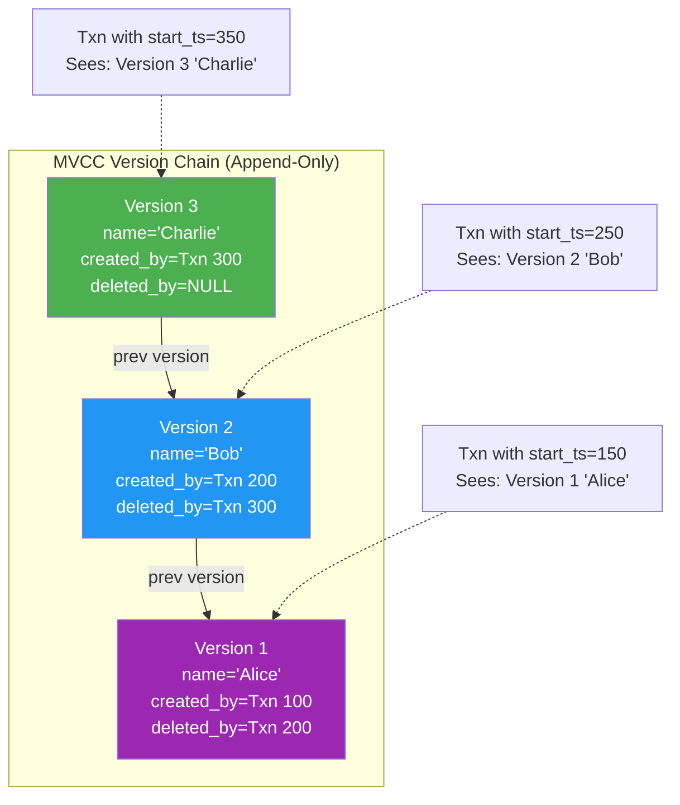

---

## Phase 6: Server Layer

### 6.1 Wire Protocol

Implement a simple text-based protocol (or a subset of the PostgreSQL wire protocol).

**Simple protocol design:**

```
Client -> Server:
  Q<length><sql_string>\0     -- Query message

Server -> Client:
  R<length><column_count>     -- Row Description
    <col_name>\0<type_oid>    -- For each column
  D<length><col_count>        -- Data Row
    <col_len><col_data>       -- For each column value
  C<length><command_tag>\0    -- Command Complete (e.g., "SELECT 3")
  E<length><error_message>\0  -- Error Response
  Z<length><status>           -- Ready for Query
```

### 6.2 Connection Manager

```go
type Server struct {
    listener net.Listener
    db       *Database
}

func (s *Server) Start(addr string) error {
    ln, err := net.Listen("tcp", addr)
    if err != nil { return err }
    s.listener = ln

    for {
        conn, err := ln.Accept()
        if err != nil { continue }
        go s.handleConnection(conn)
    }
}

func (s *Server) handleConnection(conn net.Conn) {
    defer conn.Close()
    session := NewSession(conn, s.db)

    for {
        msg, err := session.ReadMessage()
        if err != nil { return }

        result, err := session.Execute(msg.SQL)
        if err != nil {
            session.SendError(err)
        } else {
            session.SendResult(result)
        }
        session.SendReadyForQuery()
    }
}
```

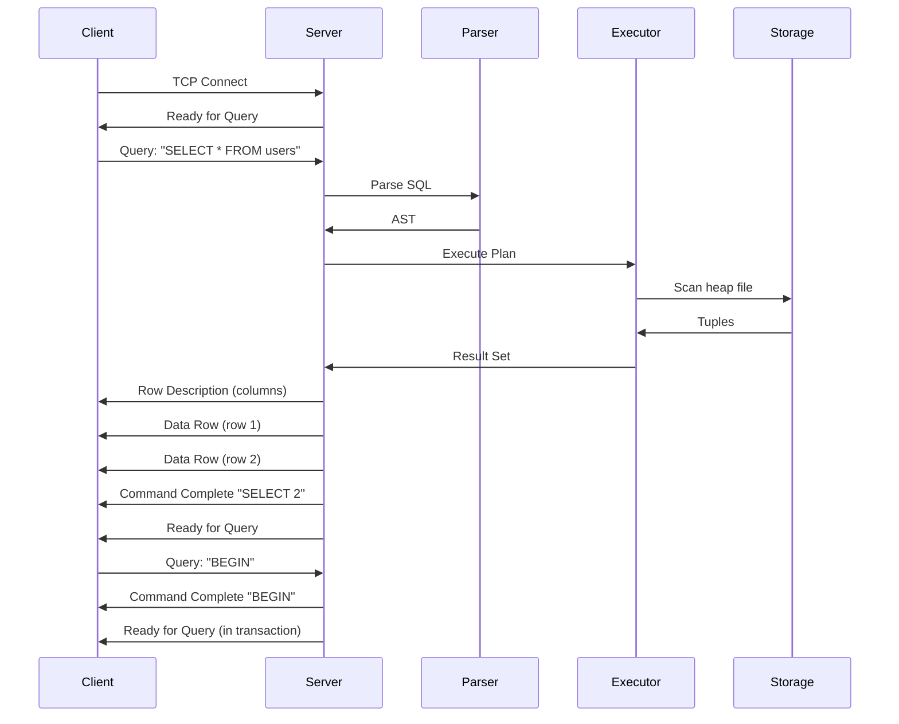

---

## Putting It All Together

### Directory Structure

```
tinydb/
  cmd/
    tinydb-server/main.go    -- Server entry point
    tinydb-cli/main.go        -- CLI client
  internal/
    storage/
      disk_manager.go
      page.go
      slotted_page.go
      heap_file.go
      buffer_pool.go
      replacer.go
    index/
      btree.go
      btree_node.go
      btree_iterator.go
    recovery/
      wal.go
      wal_record.go
      recovery_manager.go
      checkpoint.go
    sql/
      tokenizer.go
      parser.go
      ast.go
      binder.go
      planner.go
      executor.go
      types.go
    txn/
      transaction.go
      lock_manager.go
      mvcc.go
    catalog/
      catalog.go
      schema.go
    server/
      server.go
      protocol.go
      session.go
  test/
    storage_test.go
    btree_test.go
    wal_test.go
    sql_test.go
    txn_test.go
    integration_test.go
```

### Build Order and Dependencies

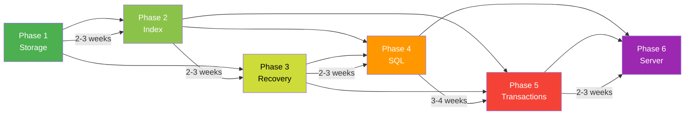

### Testing Strategy Per Phase

| Phase | Test Type | What to Test |
|-------|-----------|-------------|
| 1. Storage | Unit | Page read/write, slotted page insert/delete/compact, buffer pool eviction, pin/unpin |
| 2. Index | Unit + Property | B+Tree insert/delete/search, split/merge correctness, range scan |
| 3. Recovery | Integration | Crash at every WAL record, recovery produces correct state |
| 4. SQL | Unit + Integration | Parser outputs correct AST, executor produces correct results |
| 5. Transactions | Concurrency | Isolation levels hold under concurrent access, deadlock detection works |
| 6. Server | Integration | Protocol encoding/decoding, multi-client concurrent queries |

---

## Summary

Building a database is a marathon, not a sprint. The key insights:

1. **Build in layers** with clean interfaces between them
2. **Test each layer independently** before integrating
3. **Start with the storage layer** -- everything depends on it
4. **WAL before data** -- this invariant makes everything else work
5. **MVCC adds complexity** but enables real concurrency
6. **The SQL layer is large** -- start with a tiny subset and grow
7. **The wire protocol can be simple** -- start with a text protocol

Each phase should be fully working and tested before moving to the next. Resist the urge to build everything at once.
