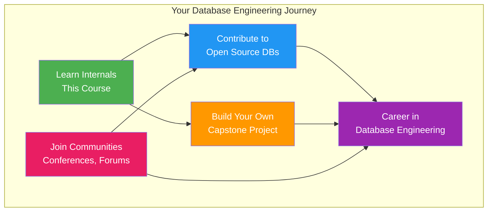
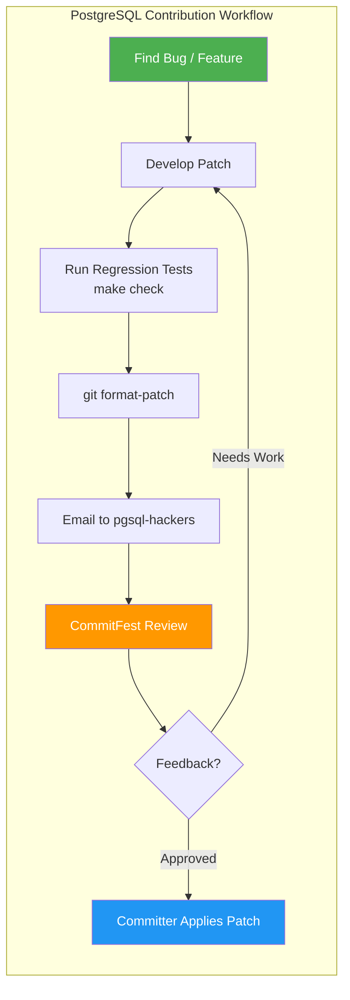
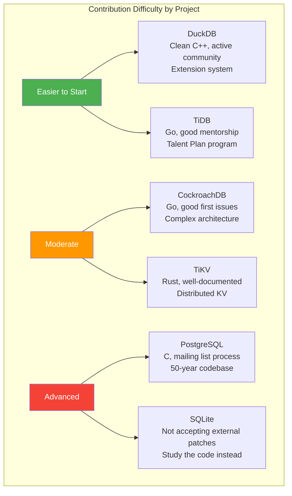
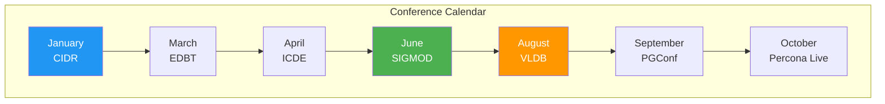
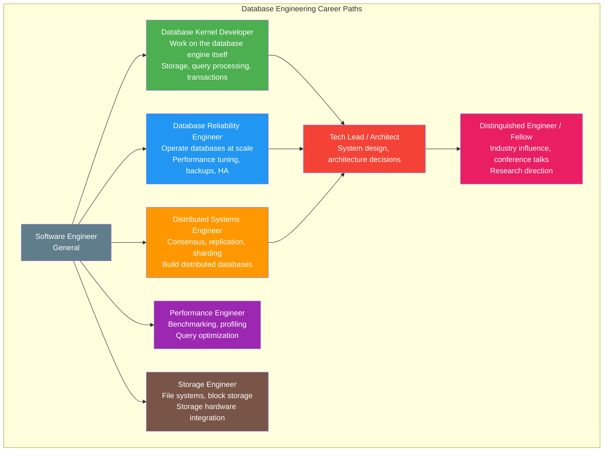

# Module 11 - Resources for Database Engineering

## Introduction

This module provides a comprehensive guide to contributing to open-source databases, attending conferences, joining communities, and building a career in database engineering. Database internals is one of the most intellectually rewarding areas of software engineering, and the community is welcoming to newcomers who are willing to learn.

---

## 1. Contributing to PostgreSQL

PostgreSQL is one of the most important open-source projects in the world. Contributing to it is a significant career achievement, but the process is traditional (mailing-list based, not GitHub PRs).

### Getting Started

- **Source code:** https://git.postgresql.org/gitweb/?p=postgresql.git
- **GitHub mirror (read-only):** https://github.com/postgres/postgres
- **Developer FAQ:** https://wiki.postgresql.org/wiki/Developer_FAQ
- **Contributor guide:** https://wiki.postgresql.org/wiki/Submitting_a_Patch

### The Patch Process

1. **Subscribe to pgsql-hackers:** https://lists.postgresql.org/listinfo/pgsql-hackers
2. **Pick a bug or TODO item:** https://wiki.postgresql.org/wiki/Todo
3. **Develop your patch** against the current `master` branch
4. **Submit patch** via email to pgsql-hackers as an attachment (use `git format-patch`)
5. **Patch is reviewed** by committers and community members during CommitFests
6. **CommitFests** happen quarterly: https://commitfest.postgresql.org/
7. **Iterate** based on review feedback
8. **A committer applies the patch** when it is ready

### Mailing Lists

| List | Purpose |
|------|---------|
| pgsql-hackers | Core development discussion |
| pgsql-bugs | Bug reports |
| pgsql-general | User questions |
| pgsql-docs | Documentation improvements |
| pgsql-novice | Beginner questions |

### Good First Contributions

- **Documentation fixes:** Typos, clarifications, missing examples
- **Code comments:** Add or improve comments in complex code
- **Compiler warnings:** Fix warnings on various platforms
- **TODO items marked "easy":** https://wiki.postgresql.org/wiki/Todo
- **Bug fixes for reported issues:** https://www.postgresql.org/list/pgsql-bugs/
- **Regression test additions:** Add tests for untested code paths
- **EXPLAIN output improvements:** Better formatting or additional information

### Key PostgreSQL Resources

- PostgreSQL Internals documentation: https://www.postgresql.org/docs/current/internals.html
- "The Internals of PostgreSQL" (online book): https://www.interdb.jp/pg/
- PostgreSQL source code walkthrough: https://wiki.postgresql.org/wiki/Pgsrcstructure
- PGConf talks (recorded): https://www.youtube.com/@PostgresTV

---

## 2. Contributing to CockroachDB

CockroachDB uses a modern GitHub-based workflow, making it more accessible for developers familiar with the PR process.

### Getting Started

- **Source code:** https://github.com/cockroachdb/cockroach
- **Contributing guide:** https://github.com/cockroachdb/cockroach/blob/master/CONTRIBUTING.md
- **Development setup:** https://wiki.crdb.io/wiki/spaces/CRDB/pages/181338446/Getting+and+Building+CockroachDB+from+Source
- **Good first issues:** https://github.com/cockroachdb/cockroach/labels/good%20first%20issue
- **Engineering blog:** https://www.cockroachlabs.com/blog/

### The PR Process

1. Fork the repository on GitHub
2. Create a feature branch
3. Make changes and write tests
4. Run `make test` and `make lint`
5. Submit a Pull Request
6. CockroachDB engineers review the PR
7. Address review feedback
8. PR is merged after approval

### Good First Issues

CockroachDB maintains a well-curated list of beginner-friendly issues:
- https://github.com/cockroachdb/cockroach/labels/good%20first%20issue
- https://github.com/cockroachdb/cockroach/labels/help%20wanted

Common areas for first contributions:
- SQL compatibility improvements (supporting new SQL syntax)
- Error message improvements
- Documentation in code
- Small bug fixes
- Test coverage improvements

### Key Resources

- Architecture overview: https://github.com/cockroachdb/cockroach/blob/master/docs/design.md
- CockroachDB University: https://university.cockroachlabs.com/
- RFC process: https://github.com/cockroachdb/cockroach/tree/master/docs/RFCS

---

## 3. Contributing to TiDB / TiKV

TiDB is a distributed SQL database written in Go, and TiKV is its distributed key-value storage layer written in Rust. Both are CNCF projects.

### Getting Started

- **TiDB source:** https://github.com/pingcap/tidb
- **TiKV source:** https://github.com/tikv/tikv
- **Contributing to TiDB:** https://github.com/pingcap/tidb/blob/master/CONTRIBUTING.md
- **Contributing to TiKV:** https://github.com/tikv/tikv/blob/master/CONTRIBUTING.md

### Good First Issues

- **TiDB:** https://github.com/pingcap/tidb/labels/good%20first%20issue
- **TiKV:** https://github.com/tikv/tikv/labels/good%20first%20issue

### Mentorship Program

PingCAP (the company behind TiDB) runs mentorship programs:
- **Talent Plan:** https://github.com/pingcap/talent-plan -- Self-paced courses on distributed systems and databases, culminating in building your own distributed KV store in Rust.

### Key Resources

- TiDB development guide: https://pingcap.github.io/tidb-dev-guide/
- TiKV deep dive: https://tikv.org/deep-dive/introduction/
- PingCAP blog: https://www.pingcap.com/blog/

---

## 4. Contributing to DuckDB

DuckDB is an embedded analytical database written in C++. Its codebase is clean, well-documented, and welcoming to contributors.

### Getting Started

- **Source code:** https://github.com/duckdb/duckdb
- **Contributing guide:** https://duckdb.org/docs/dev/building
- **Good first issues:** https://github.com/duckdb/duckdb/labels/good%20first%20issue
- **Extension development:** https://duckdb.org/docs/extensions/overview

### Areas for Contribution

- **Extensions:** DuckDB has a growing extension ecosystem. Writing an extension is a great way to contribute without touching core code.
- **SQL compatibility:** Adding support for SQL functions/syntax from other databases
- **Connectors:** Community connectors for various languages
- **Performance optimizations:** Profile and optimize query execution
- **Documentation:** Tutorials, examples, function documentation

### Key Resources

- DuckDB blog: https://duckdb.org/news/
- DuckDB internals talks by Mark Raasveldt and Hannes Muhleisen
- DuckDB Discord: https://discord.duckdb.org/

---

## 5. Contributing to SQLite

SQLite is unique: it does **not** accept external patches via GitHub or any public process. The code is maintained by a small team led by D. Richard Hipp.

### How to Engage

- **Bug reports:** https://www.sqlite.org/src/ticket
- **Forum:** https://sqlite.org/forum/forumpost/
- **Source code (Fossil):** https://www.sqlite.org/src/doc/trunk/README.md
- **GitHub mirror (read-only):** https://github.com/sqlite/sqlite

### Learning from SQLite

Even though you cannot contribute code directly, SQLite is the best codebase to study:

- **Architecture documentation:** https://www.sqlite.org/arch.html
- **How SQLite is tested:** https://www.sqlite.org/testing.html -- 100% MC/DC coverage, billions of test cases
- **SQLite file format:** https://www.sqlite.org/fileformat2.html
- **Virtual machine opcodes:** https://www.sqlite.org/opcode.html
- **Query planner:** https://www.sqlite.org/queryplanner.html
- **WAL mode:** https://www.sqlite.org/wal.html

### Key Insight

SQLite has 150K lines of source code and **90 million lines of test code**. The test-to-code ratio is 600:1. This is the gold standard for software testing.

---

## 6. Contributing to Other Notable Projects

### RocksDB

- **Source:** https://github.com/facebook/rocksdb
- **Contributing:** https://github.com/facebook/rocksdb/blob/main/CONTRIBUTING.md
- **Wiki:** https://github.com/facebook/rocksdb/wiki
- **Good areas:** Performance tuning, new compaction strategies, documentation

### etcd

- **Source:** https://github.com/etcd-io/etcd
- **Contributing:** https://github.com/etcd-io/etcd/blob/main/CONTRIBUTING.md
- **Good for:** Learning Raft consensus implementation

### FoundationDB

- **Source:** https://github.com/apple/foundationdb
- **Contributing:** https://github.com/apple/foundationdb/blob/main/CONTRIBUTING.md
- **Notable for:** Deterministic simulation testing, transaction layer design

### Neon (Serverless PostgreSQL)

- **Source:** https://github.com/neondatabase/neon
- **Contributing:** https://github.com/neondatabase/neon/blob/main/CONTRIBUTING.md
- **Good for:** Learning about storage-compute separation, page server architecture

### SurrealDB

- **Source:** https://github.com/surrealdb/surrealdb
- **Written in Rust, multi-model database**
- **Active community, welcoming to new contributors**

---

## 7. Database Conferences

### Top Academic Conferences

| Conference | Full Name | Focus | Frequency |
|-----------|-----------|-------|-----------|
| **SIGMOD** | ACM Special Interest Group on Management of Data | Broadest database conference | Annual (June) |
| **VLDB** | Very Large Databases | Large-scale data management | Annual (August) |
| **ICDE** | IEEE International Conference on Data Engineering | Data engineering, systems | Annual (April) |
| **CIDR** | Conference on Innovative Data Systems Research | Vision, new ideas | Biennial (January) |
| **EDBT** | Extending Database Technology | European database research | Annual (March) |

### Industry Conferences

| Conference | Focus | Website |
|-----------|-------|---------|
| **PGConf / PGDay** | PostgreSQL community | https://www.postgresql.org/about/events/ |
| **Percona Live** | MySQL, PostgreSQL, MongoDB | https://www.percona.com/live |
| **CMU Database Group seminars** | Academic talks (free, online) | https://db.cs.cmu.edu/seminar/ |
| **P99 CONF** | Low-latency performance | https://www.p99conf.io/ |

### Must-Watch Talks

- Andy Pavlo's CMU database course lectures: https://15445.courses.cs.cmu.edu/
- "Architecture of a Database System" (Joseph Hellerstein): https://dsf.berkeley.edu/papers/fntdb07-architecture.pdf
- CockroachDB tech talks: https://www.youtube.com/c/CockroachDB
- PingCAP TiDB talks: https://www.youtube.com/@PingCAP
- DuckDB talks by Hannes Muhleisen: Search YouTube for "DuckDB internals"

---

## 8. Communities

### Discord Servers

| Community | Link | Focus |
|-----------|------|-------|
| DuckDB Discord | https://discord.duckdb.org/ | DuckDB development and usage |
| CockroachDB Community Slack | https://cockroachdb.com/community | CockroachDB users and developers |
| PostgreSQL Slack | https://postgresteam.slack.com/ | PostgreSQL community (invite via https://pgtreats.info/slack-invite) |
| Database Internals | Search Discord for "database internals" | General database internals discussion |
| Rust Database Community | Various Rust Discord servers | Rust-based database projects |

### Reddit Communities

| Subreddit | Focus |
|-----------|-------|
| r/programming | General programming (database posts do well) |
| r/PostgreSQL | PostgreSQL-specific discussion |
| r/mysql | MySQL-specific discussion |
| r/database | General database discussion |
| r/distributed | Distributed systems |

### Hacker News

Hacker News (https://news.ycombinator.com/) is one of the best places to discuss database internals. Topics that do well:
- New database release announcements
- Blog posts about database internals
- "How X database does Y" deep dives
- Performance benchmark comparisons
- Conference paper summaries

### Blogs to Follow

| Blog | Author/Org | Focus |
|------|-----------|-------|
| https://www.citusdata.com/blog/ | Citus / Microsoft | PostgreSQL, distributed queries |
| https://jepsen.io/ | Kyle Kingsbury | Distributed systems correctness |
| https://erthalion.info/ | Dmitry Dolgov | PostgreSQL internals |
| https://blog.acolyer.org/ | Adrian Colyer | CS paper summaries (archived) |
| https://muratbuffalo.blogspot.com/ | Murat Demirbas | Distributed systems papers |
| https://www.scylladb.com/blog/ | ScyllaDB | High-performance databases |
| https://www.cockroachlabs.com/blog/ | CockroachDB | Distributed SQL internals |
| https://tikv.org/blog/ | TiKV | Distributed KV internals |

---

## 9. Career Paths in Database Engineering

### Roles in Database Engineering

### Companies Hiring Database Engineers

| Company | Database | Location |
|---------|----------|----------|
| Cockroach Labs | CockroachDB | NYC, Remote |
| PingCAP | TiDB / TiKV | San Jose, Beijing, Remote |
| DuckDB Labs | DuckDB | Amsterdam, Remote |
| Neon | Neon (Serverless PG) | San Francisco, Remote |
| SingleStore | SingleStoreDB | San Francisco, Remote |
| ClickHouse | ClickHouse | San Francisco, Amsterdam, Remote |
| ScyllaDB | ScyllaDB | Herzliya, Remote |
| Timescale | TimescaleDB | NYC, Stockholm, Remote |
| Yugabyte | YugabyteDB | Sunnyvale, Remote |
| Apple | FoundationDB | Cupertino |
| Meta | RocksDB, MySQL | Menlo Park |
| Google | Spanner, Bigtable | Multiple |
| Amazon | Aurora, DynamoDB, Redshift | Multiple |
| Microsoft | Azure SQL, Cosmos DB | Redmond, Remote |
| Snowflake | Snowflake | San Mateo, Remote |
| Databricks | Delta Lake, Photon | San Francisco, Amsterdam |
| Supabase | PostgreSQL ecosystem | Remote |
| Turso | libSQL (SQLite fork) | Remote |

### Skills That Stand Out

1. **Systems programming:** C, C++, Rust, Go -- understanding memory management, concurrency primitives, and OS interfaces
2. **Understanding of hardware:** CPU caches, SIMD, NVMe, RDMA
3. **Distributed systems fundamentals:** Consensus (Raft/Paxos), replication, consistency models
4. **Query optimization:** Cost models, join enumeration, cardinality estimation
5. **Benchmarking rigor:** Ability to design, run, and interpret benchmarks correctly
6. **Academic paper reading:** Ability to read and implement ideas from SIGMOD/VLDB papers
7. **Open-source contributions:** Visible, documented contributions to database projects

### Building Your Portfolio

1. **Complete this course's capstone project** (TinyDB)
2. **Contribute to an open-source database** (start with good first issues)
3. **Write blog posts** about what you learn (e.g., "How I implemented MVCC in my toy database")
4. **Read and summarize papers** from SIGMOD/VLDB
5. **Build specialized storage engines** (time-series, graph, vector similarity search)
6. **Participate in the community** (answer questions, review PRs, attend conferences)

---

## 10. Essential Reading List

### Books

| Book | Author | What You'll Learn |
|------|--------|-------------------|
| "Database Internals" | Alex Petrov | Storage engines, distributed systems |
| "Designing Data-Intensive Applications" | Martin Kleppmann | System design with databases at the center |
| "Transaction Processing: Concepts and Techniques" | Gray & Reuter | Transaction theory (the bible) |
| "Architecture of a Database System" | Hellerstein, Stonebraker, Hamilton | How all the pieces fit together |
| "Readings in Database Systems" (Red Book) | Bailis, Hellerstein, Stonebraker | Classic papers with commentary |
| "The Art of PostgreSQL" | Dimitri Fontaine | Advanced PostgreSQL usage |

### Foundational Papers

| Paper | Year | Why It Matters |
|-------|------|---------------|
| "A Relational Model of Data for Large Shared Data Banks" (Codd) | 1970 | Invented the relational model |
| "Access Path Selection in a Relational Database" (Selinger et al.) | 1979 | Foundation of query optimization |
| "ARIES: A Transaction Recovery Method" (Mohan et al.) | 1992 | The WAL recovery algorithm used everywhere |
| "The Log-Structured Merge-Tree" (O'Neil et al.) | 1996 | Foundation of modern write-optimized stores |
| "Architecture of a Database System" (Hellerstein et al.) | 2007 | Best architectural overview |
| "Spanner: Google's Globally-Distributed Database" | 2012 | TrueTime, distributed transactions |
| "Amazon Aurora: Design Considerations" | 2017 | Storage-compute separation |
| "Socrates: The New SQL Server in the Cloud" | 2019 | Disaggregated storage architecture |
| "LeanStore: In-Memory Data Management Beyond Main Memory" | 2018 | Modern buffer management |
| "Are You Sure You Want to Use MMAP?" (Crotty et al.) | 2022 | Why databases should manage their own memory |

### Online Courses

| Course | Platform | Content |
|--------|----------|---------|
| CMU 15-445: Database Systems | YouTube | Buffer pools, indexes, transactions, recovery |
| CMU 15-721: Advanced Database Systems | YouTube | Query execution, optimization, modern techniques |
| MIT 6.830: Database Systems | MIT OCW | Relational algebra, query processing |
| PingCAP Talent Plan | GitHub | Build a distributed KV store in Rust |

---

## Summary

```mermaid
graph TD
    subgraph "Your Action Plan"
        STEP1[Step 1: Finish this course<br/>Complete all modules]
        STEP2[Step 2: Build TinyDB<br/>Capstone project]
        STEP3[Step 3: Study a real database<br/>Read SQLite or PostgreSQL source]
        STEP4[Step 4: Join a community<br/>Discord, mailing list, conferences]
        STEP5[Step 5: Make your first contribution<br/>Good first issue in DuckDB/CockroachDB/TiDB]
        STEP6[Step 6: Go deeper<br/>Read papers, write blog posts]
        STEP7[Step 7: Build something new<br/>Specialized storage engine, extension, or tool]

        STEP1 --> STEP2 --> STEP3 --> STEP4 --> STEP5 --> STEP6 --> STEP7
    end

    style STEP1 fill:#4CAF50,color:white
    style STEP2 fill:#8BC34A,color:white
    style STEP3 fill:#CDDC39,color:black
    style STEP4 fill:#FF9800,color:white
    style STEP5 fill:#f44336,color:white
    style STEP6 fill:#9C27B0,color:white
    style STEP7 fill:#2196F3,color:white
```

The database field is experiencing a renaissance. New databases are being built for new hardware (NVMe, persistent memory, CXL), new workloads (AI/ML vector search, streaming), and new deployment models (serverless, edge). There has never been a better time to enter this field. The foundations you have built in this course -- storage, indexing, recovery, transactions, query processing, and distributed systems -- are the same foundations that every database, new and old, is built upon.

Welcome to the community. Start building.
