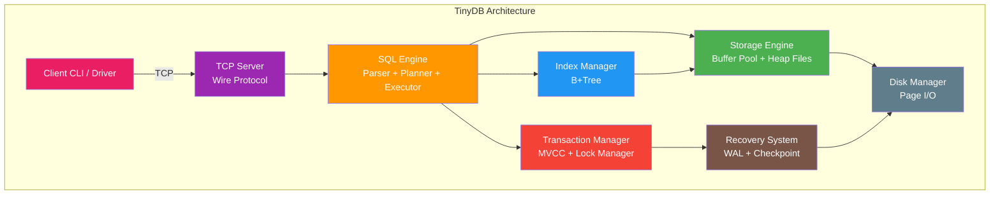
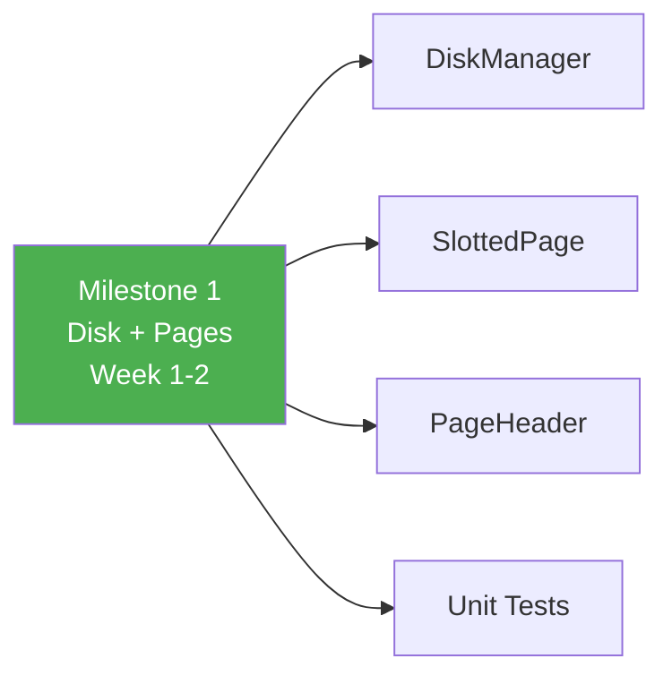
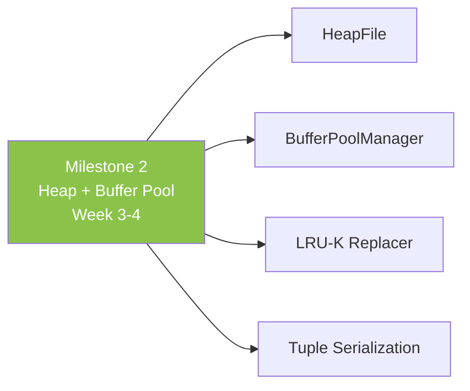
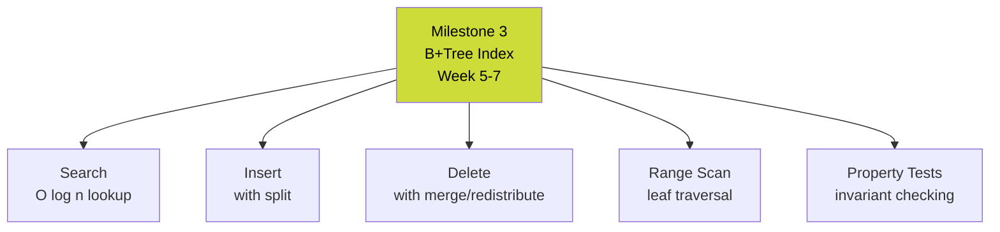
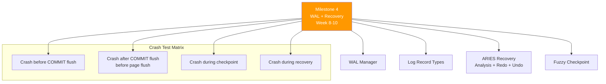
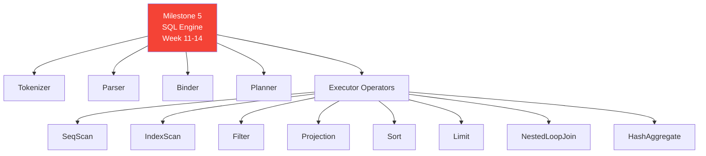
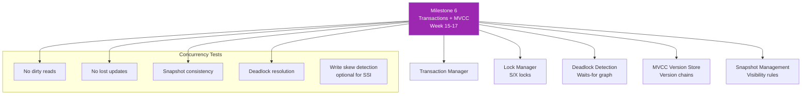
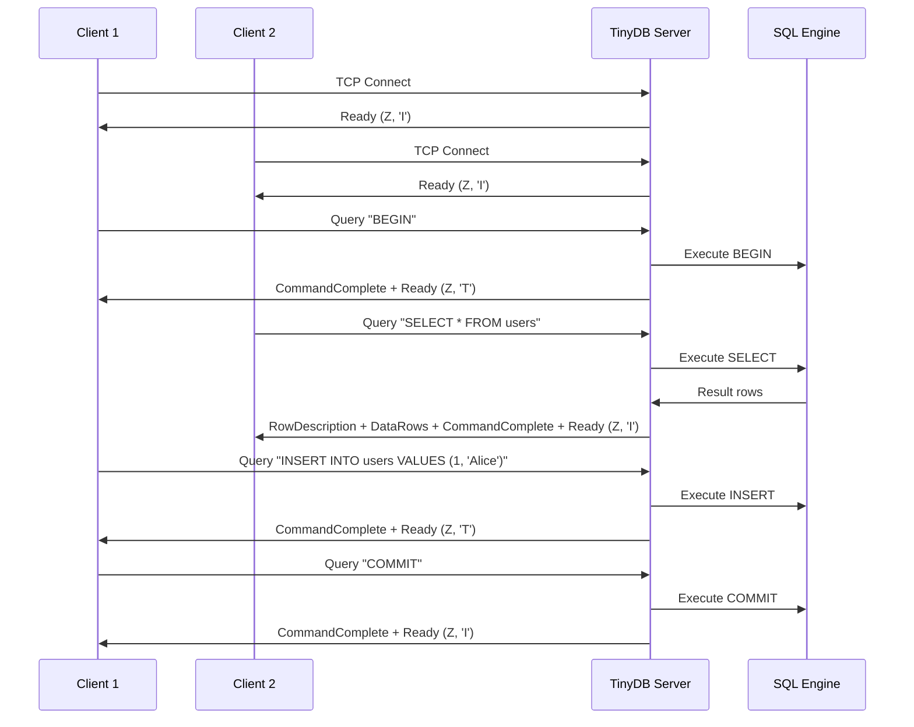
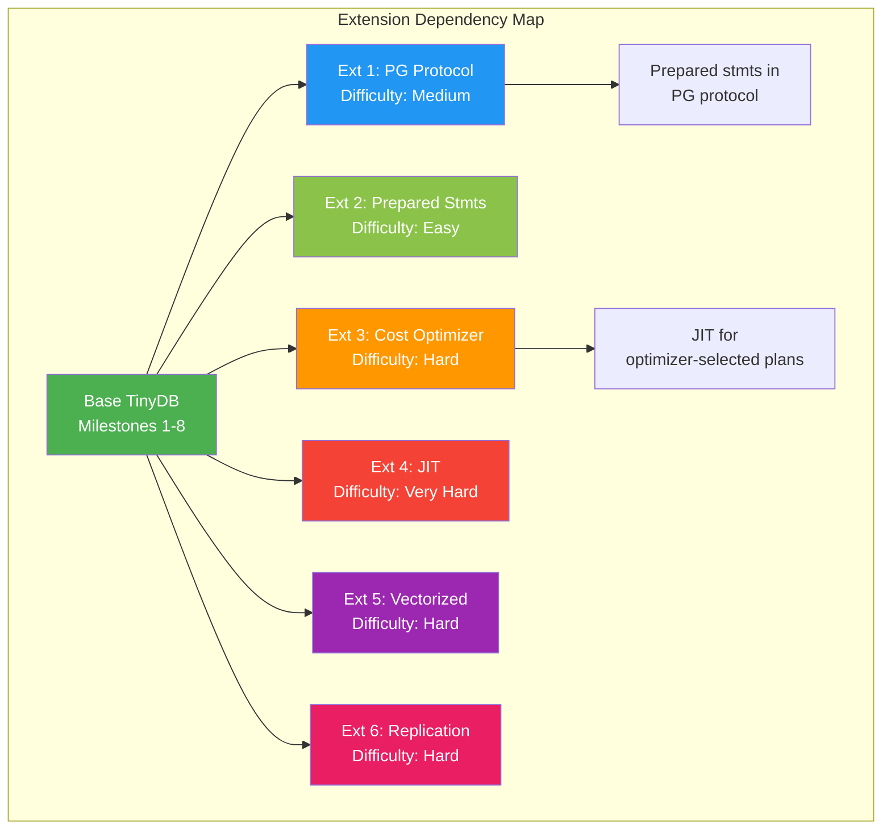

# Module 11 - Capstone Project: Build TinyDB

## Overview

**TinyDB** is a fully-featured miniature relational database that you will build from scratch. It supports a subset of SQL, uses a B+Tree index, manages a buffer pool, writes a WAL for crash recovery, supports multi-version concurrency control (MVCC), and accepts client connections over a simple wire protocol.

This capstone project ties together everything from all 11 modules into a single working system.



---

## Requirements

### Functional Requirements

| ID | Requirement | Priority |
|----|-------------|----------|
| F1 | Parse and execute SELECT, INSERT, UPDATE, DELETE | Must Have |
| F2 | CREATE TABLE with typed columns (INT, VARCHAR, BOOL, FLOAT) | Must Have |
| F3 | CREATE INDEX (B+Tree) on any column | Must Have |
| F4 | WHERE clause with comparisons (=, <, >, <=, >=, !=) and AND/OR | Must Have |
| F5 | ORDER BY, LIMIT | Must Have |
| F6 | Primary key constraint | Must Have |
| F7 | Buffer pool with configurable size and LRU-K replacement | Must Have |
| F8 | Write-ahead logging with crash recovery | Must Have |
| F9 | BEGIN/COMMIT/ROLLBACK transactions | Must Have |
| F10 | MVCC with snapshot isolation | Must Have |
| F11 | TCP server accepting multiple concurrent clients | Must Have |
| F12 | JOIN (inner join, at least nested loop) | Should Have |
| F13 | Aggregations: COUNT, SUM, AVG, MIN, MAX with GROUP BY | Should Have |
| F14 | UNIQUE and NOT NULL constraints | Should Have |
| F15 | EXPLAIN showing query plan | Nice to Have |

### Non-Functional Requirements

| ID | Requirement | Target |
|----|-------------|--------|
| NF1 | Single-table point query latency | < 1ms (cached) |
| NF2 | Bulk insert throughput | > 10,000 rows/sec |
| NF3 | Recovery time after crash | < 5 seconds for 1GB database |
| NF4 | Concurrent client support | >= 10 simultaneous clients |
| NF5 | Maximum database size | >= 1GB |
| NF6 | Buffer pool efficiency | > 95% hit rate for OLTP workload |

---

## Milestone-Based Development Plan

### Milestone 1: Disk Manager and Page Layout (Week 1-2)

**Deliverables:**
- DiskManager that reads/writes 4KB pages to a file
- Slotted page implementation with insert/get/delete/update
- Page header with LSN, slot count, free space tracking
- Free page list for page reuse
- Unit tests for all page operations

**Tests:**
- Write and read back 1000 pages
- Insert, read, update, delete records on a single page
- Verify free space tracking after operations
- Verify page compaction after deletes



### Milestone 2: Heap File and Buffer Pool (Week 3-4)

**Deliverables:**
- HeapFile with insert/get/delete/scan operations
- BufferPoolManager with configurable pool size
- LRU-K replacement policy (K=2)
- Pin/Unpin with dirty page tracking
- Record serialization/deserialization for typed tuples

**Tests:**
- Insert 100,000 records into a heap file, scan them all back
- Buffer pool eviction under memory pressure
- Verify LRU-K evicts scan pages before frequently-accessed pages
- Concurrent access to buffer pool (thread safety)



### Milestone 3: B+Tree Index (Week 5-7)

**Deliverables:**
- B+Tree with search, insert, delete operations
- Leaf node splitting and merging
- Internal node splitting and merging
- Range scan via leaf-level linked list
- Duplicate key support (for non-unique indexes)
- Iterator interface for index scans

**Tests:**
- Insert 1M random keys, verify all are findable
- Delete half the keys, verify remaining are findable
- Range scan correctness
- Verify tree structure invariants after every operation (balanced, sorted, correct pointers)
- Property-based testing: random insert/delete sequences maintain invariants



### Milestone 4: WAL and Crash Recovery (Week 8-10)

**Deliverables:**
- WAL manager with append, flush, scan operations
- Log record types: BEGIN, COMMIT, ABORT, INSERT, UPDATE, DELETE, CHECKPOINT
- Before/after images in log records
- ARIES-style recovery: Analysis, Redo, Undo phases
- Fuzzy checkpointing
- Integration with buffer pool (force WAL before page flush)

**Tests:**
- Write 10,000 transactions to WAL, crash, recover, verify all committed data present
- Verify uncommitted transactions are rolled back after recovery
- Crash at every possible point during a transaction and verify recovery
- Checkpoint reduces recovery time
- Verify WAL-before-page invariant is maintained



### Milestone 5: SQL Parser and Executor (Week 11-14)

**Deliverables:**
- Tokenizer/Lexer for SQL
- Recursive descent parser producing AST
- Binder that resolves names against the catalog
- System catalog (stored in TinyDB's own tables)
- Query planner (simple rule-based, not cost-based)
- Volcano-model executor with operators: SeqScan, IndexScan, Filter, Projection, Sort, Limit, NestedLoopJoin, HashAggregate
- Type system: INTEGER, FLOAT, VARCHAR(n), BOOLEAN

**SQL subset to support:**
```sql
CREATE TABLE t (col1 INTEGER PRIMARY KEY, col2 VARCHAR(255), col3 FLOAT);
CREATE INDEX idx ON t (col2);
DROP TABLE t;
INSERT INTO t (col1, col2) VALUES (1, 'hello');
SELECT col1, col2 FROM t WHERE col1 > 5 AND col2 = 'hello' ORDER BY col1 LIMIT 10;
UPDATE t SET col2 = 'world' WHERE col1 = 1;
DELETE FROM t WHERE col1 = 1;
SELECT t1.col1, t2.col2 FROM t1 JOIN t2 ON t1.id = t2.t1_id WHERE t1.col1 > 5;
SELECT col2, COUNT(*), SUM(col3) FROM t GROUP BY col2;
```

**Tests:**
- Parser tests for every SQL construct
- End-to-end SQL correctness tests (query -> result)
- Use sqllogictest format for automated testing
- Edge cases: empty tables, NULL handling, type coercion



### Milestone 6: Transactions and MVCC (Week 15-17)

**Deliverables:**
- Transaction manager (BEGIN/COMMIT/ROLLBACK)
- Lock manager with shared/exclusive row-level locks
- Deadlock detection (waits-for graph cycle detection)
- MVCC version chain (append-only or undo-log based)
- Snapshot isolation: each transaction sees a consistent snapshot
- Integration with WAL (transaction abort writes undo records)

**Tests:**
- Concurrent read/write transactions do not interfere
- Dirty reads are impossible
- Non-repeatable reads are impossible under snapshot isolation
- Deadlock is detected and one transaction is aborted
- Long-running read does not block writes
- Stress test: 10 threads, 10,000 transactions each, verify consistency



### Milestone 7: TCP Server and Wire Protocol (Week 18-19)

**Deliverables:**
- TCP server accepting connections on a configurable port
- Simple text-based wire protocol (or subset of PostgreSQL protocol)
- Connection handler: one goroutine/thread per connection
- Session state: current transaction, authenticated user
- Command-line client that connects and sends queries
- Graceful shutdown

**Protocol specification:**

```
CLIENT -> SERVER:
  "Q" + length(4 bytes) + sql_string + '\0'

SERVER -> CLIENT:
  "T" + length + column_count(2 bytes) + [col_name + '\0' + type_oid(4 bytes)]*
  "D" + length + column_count(2 bytes) + [col_len(4 bytes) + col_data]*  (per row)
  "C" + length + command_tag + '\0'   (e.g., "SELECT 5", "INSERT 0 1")
  "E" + length + error_message + '\0'
  "Z" + length + status(1 byte)       ('I' idle, 'T' in transaction, 'E' error)
```

**Tests:**
- Connect, send query, receive results
- Multiple concurrent clients
- Transaction state across multiple queries in one connection
- Error handling (invalid SQL, constraint violations)
- Connection cleanup on client disconnect



### Milestone 8: Integration, Testing, and Benchmarking (Week 20-22)

**Deliverables:**
- End-to-end integration tests
- Crash recovery integration tests
- Concurrent transaction stress tests
- Performance benchmarks
- Documentation: architecture doc, API reference, getting started guide

**Benchmark suite:**

```
Benchmark 1: Point lookups
  - 1M rows, primary key lookups
  - Target: > 50,000 ops/sec (cached)

Benchmark 2: Range scans
  - 1M rows, scan 100 rows per query
  - Target: > 10,000 queries/sec

Benchmark 3: Inserts
  - Insert 1M rows
  - Target: > 10,000 rows/sec

Benchmark 4: Mixed OLTP
  - 80% reads, 20% writes
  - 10 concurrent clients
  - Target: > 5,000 ops/sec total

Benchmark 5: Recovery
  - 1GB database, crash after 10,000 transactions
  - Target: Recovery in < 5 seconds
```


---

## API Specification

### Embedded API (Library Mode)

```go
// Open or create a database
db, err := tinydb.Open("/path/to/db", tinydb.Options{
    BufferPoolSize: 1024,  // Number of pages in buffer pool
    PageSize:       4096,  // Page size in bytes
    WALDir:         "/path/to/wal",
})
defer db.Close()

// Execute a query
result, err := db.Execute("SELECT * FROM users WHERE age > 25")
for result.Next() {
    row := result.Row()
    name := row.GetString("name")
    age := row.GetInt("age")
}
result.Close()

// Transactions
txn, err := db.Begin()
txn.Execute("INSERT INTO users (name, age) VALUES ('Alice', 30)")
txn.Execute("UPDATE accounts SET balance = balance - 100 WHERE user = 'Alice'")
err = txn.Commit()  // or txn.Rollback()
```

### Server Mode

```bash
# Start server
tinydb-server --port 5433 --data-dir /path/to/db --buffer-pool-size 1024

# CLI client
tinydb-cli --host localhost --port 5433
tinydb> CREATE TABLE users (id INTEGER PRIMARY KEY, name VARCHAR(100), age INTEGER);
tinydb> INSERT INTO users VALUES (1, 'Alice', 30);
tinydb> SELECT * FROM users;
+----+-------+-----+
| id | name  | age |
+----+-------+-----+
|  1 | Alice |  30 |
+----+-------+-----+
1 row(s) returned
```

---

## Test Suite Requirements

### Unit Test Coverage

| Component | Minimum Tests | Coverage Target |
|-----------|--------------|----------------|
| Disk Manager | 10 | 90% |
| Slotted Page | 15 | 95% |
| Heap File | 15 | 90% |
| Buffer Pool | 20 | 95% |
| LRU-K Replacer | 10 | 95% |
| B+Tree | 30 | 90% |
| WAL Manager | 15 | 90% |
| Recovery Manager | 10 | 85% |
| SQL Parser | 25 | 90% |
| Binder | 10 | 85% |
| Executor | 20 | 85% |
| Transaction Manager | 15 | 85% |
| Lock Manager | 15 | 90% |
| MVCC | 15 | 85% |
| Wire Protocol | 10 | 80% |

### Integration Test Scenarios

1. Create table, insert 10,000 rows, query with various WHERE clauses
2. Create index, verify index scan is used for selective queries
3. Begin transaction, make changes, rollback, verify changes are undone
4. Two concurrent transactions: verify isolation
5. Kill process during transaction, restart, verify recovery
6. Fill buffer pool, verify eviction policy works correctly
7. 10 concurrent clients executing mixed workload for 60 seconds

### sqllogictest Compatibility

Use the [sqllogictest](https://www.sqlite.org/sqllogictest/doc/trunk/about.wiki) format for SQL correctness testing:

```
statement ok
CREATE TABLE t1 (a INTEGER, b VARCHAR(50))

statement ok
INSERT INTO t1 VALUES (1, 'hello')

statement ok
INSERT INTO t1 VALUES (2, 'world')

query IT rowsort
SELECT * FROM t1
----
1 hello
2 world

query I
SELECT COUNT(*) FROM t1
----
2
```

---

## Extensions (Extra Credit)

### Extension 1: PostgreSQL Wire Protocol Compatibility

Implement enough of the PostgreSQL wire protocol that `psql` can connect to TinyDB.

- Startup message handling (SSL negotiation, authentication)
- Simple query protocol
- Error response format (SQLSTATE codes)
- Goal: `psql -h localhost -p 5433` can run basic queries

### Extension 2: Prepared Statements

```sql
PREPARE get_user AS SELECT * FROM users WHERE id = $1;
EXECUTE get_user(42);
```

- Parse once, execute many times with different parameters
- Cache parsed plans
- Avoid SQL injection by separating code from data

### Extension 3: Cost-Based Query Optimizer

Replace the rule-based planner with a cost-based optimizer:
- Maintain statistics: row count, distinct values, histograms
- Cost model: estimate I/O and CPU cost for each plan
- Consider multiple join orders for multi-table queries
- Implement dynamic programming for join enumeration (for up to 5-6 tables)

### Extension 4: JIT Compilation

Compile hot query operators into native code:
- Use LLVM or a lightweight JIT (e.g., copy-and-patch)
- Compile filter expressions into native predicates
- Compile hash functions for hash joins
- Expected speedup: 2-5x for CPU-bound queries

### Extension 5: Vectorized Execution

Replace the Volcano row-at-a-time executor with vectorized execution:
- Process vectors of 1024-2048 values at a time
- Columnar in-memory format for intermediate results
- SIMD-accelerated comparison and aggregation operators
- Expected speedup: 5-20x for analytical queries

### Extension 6: Replication

Add primary-replica replication:
- Ship WAL records from primary to replica
- Replica replays WAL to stay in sync
- Read-only queries can be served from replicas
- Handle failover when primary dies



---

## Grading Rubric

| Component | Weight | Criteria |
|-----------|--------|----------|
| Storage Layer (M1-M2) | 15% | Correct page layout, buffer pool with eviction policy |
| B+Tree Index (M3) | 15% | Insert/delete/search/range scan with split/merge |
| WAL + Recovery (M4) | 20% | Crash recovery works correctly in all scenarios |
| SQL Engine (M5) | 20% | Parses and executes all required SQL statements correctly |
| Transactions (M6) | 15% | MVCC snapshot isolation, deadlock detection |
| Server (M7) | 5% | Accepts multiple concurrent clients |
| Testing + Benchmarks (M8) | 10% | Comprehensive test suite, benchmark results documented |
| **Extensions** | **Bonus** | Up to 20% extra credit |

---

## Recommended Resources

| Resource | What It Covers |
|----------|---------------|
| CMU 15-445 (Andy Pavlo) | Buffer pool, B+Tree, transactions, recovery |
| SQLite source code | Complete, readable database in ~150K lines of C |
| "Database Internals" (Alex Petrov) | Storage engines, distributed systems |
| "Architecture of a Database System" (Hellerstein) | High-level architecture guide |
| Let's Build a Simple Database (cstack.github.io) | Step-by-step SQLite clone tutorial |
| BusTub (CMU) | Reference implementation for educational database |

---

## Final Checklist

Before submitting, verify:

- [ ] All unit tests pass
- [ ] Integration tests pass
- [ ] Crash recovery works (kill -9 during transactions, verify recovery)
- [ ] 10 concurrent clients can operate simultaneously
- [ ] Benchmark results are documented
- [ ] Code is clean, well-commented, and has clear module boundaries
- [ ] README explains how to build, run, and test
- [ ] No data corruption after stress testing
