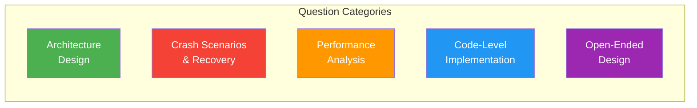
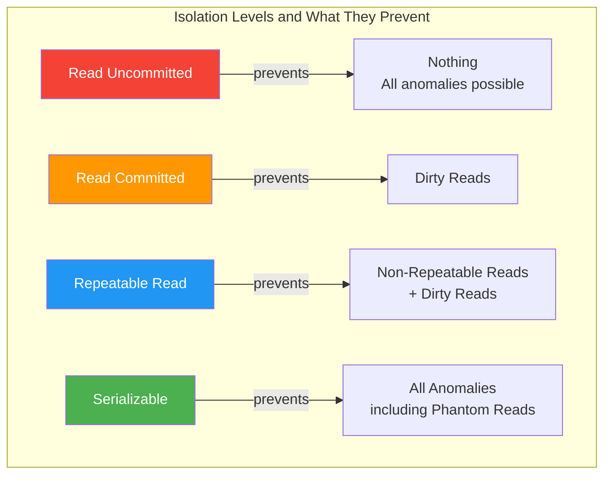
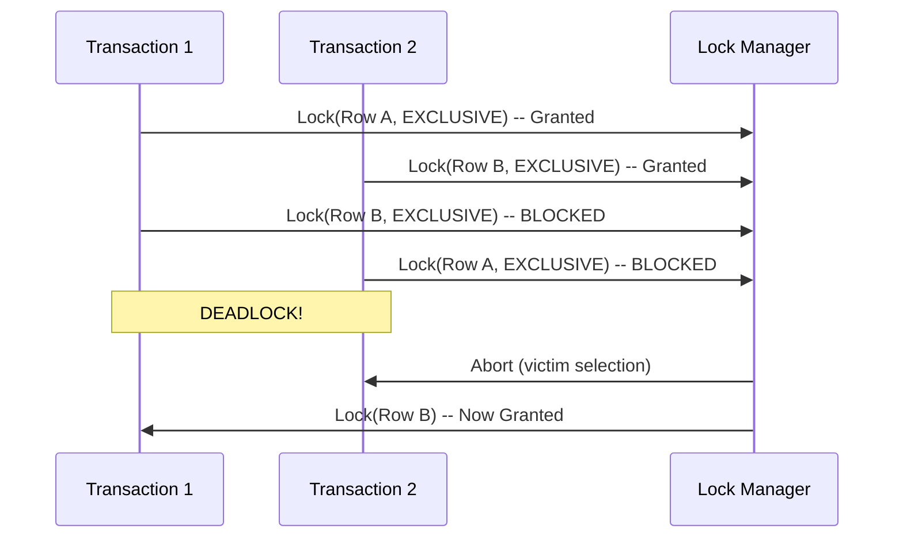

# Module 11 - Final Comprehensive Assessment

## Introduction

This assessment covers all 11 modules of the database internals course. Questions range from foundational concepts to advanced design problems. Each question includes a detailed answer in a collapsible section.



---

## Section 1: Storage and Disk I/O (Modules 1-2)

### Question 1: Page Layout Trade-offs

Explain the difference between slotted pages and log-structured pages. When would you choose each?

<details>
<summary>Answer</summary>

**Slotted pages** use a page header with a slot directory pointing to variable-length records within the page. Records grow from the end of the page toward the slot directory.

- **Advantages:** In-place updates, direct access to any record via slot ID, good for OLTP workloads with frequent updates
- **Disadvantages:** Fragmentation after deletes/updates, requires compaction

**Log-structured pages** (used in LSM-trees) append records sequentially. Deleted records are marked with tombstones and cleaned during compaction.

- **Advantages:** Sequential writes, no fragmentation, better write performance
- **Disadvantages:** Reads must check multiple locations, background compaction needed

**Choose slotted pages** for OLTP with mixed read/write workloads (PostgreSQL, MySQL). **Choose log-structured** for write-heavy workloads (RocksDB, Cassandra).
</details>

### Question 2: Buffer Pool Replacement Policies

Why is LRU a poor replacement policy for database buffer pools? What alternatives exist and why are they better?

<details>
<summary>Answer</summary>

LRU is poor for databases because of **sequential flooding**: a full table scan loads many pages that are only accessed once, evicting frequently-used pages (like index root nodes).

**Better alternatives:**

1. **LRU-K (K=2):** Tracks the last K accesses to each page. Evicts the page whose K-th most recent access is oldest. Pages accessed only once have infinite backward K-distance and are evicted first. Used by SQL Server.

2. **Clock (Second-Chance):** Approximates LRU with lower overhead. Each page has a reference bit. On eviction, sweep clockwise: if ref bit is set, clear it and move on. If clear, evict. Used by PostgreSQL.

3. **2Q:** Maintains two queues -- a FIFO queue for pages seen only once, and an LRU queue for pages seen multiple times. Sequential scan victims stay in the FIFO queue and are evicted quickly. Used by some research systems.

4. **ARC (Adaptive Replacement Cache):** Balances between recency and frequency adaptively. Self-tuning. Patented by IBM, used by ZFS.

The key insight is that a database workload has a mix of one-time accesses (scans) and repeated accesses (index lookups), and the replacement policy must distinguish between them.
</details>

### Question 3: Why Not Use mmap?

The paper "Are You Sure You Want to Use MMAP in Your Database Management System?" argues against mmap. Summarize the key arguments.

<details>
<summary>Answer</summary>

The key arguments against mmap for databases:

1. **No control over eviction:** The OS page replacement policy does not understand database access patterns. It may evict a hot index page to keep a cold scan page.

2. **No control over flush ordering:** For crash recovery, the WAL protocol requires that log records are flushed before data pages. With mmap, the OS can flush data pages at any time, breaking the WAL invariant.

3. **TLB shootdowns:** On multi-core systems, when one thread unmaps a page, all other cores must invalidate their TLB entries. This is a costly inter-processor interrupt.

4. **Error handling:** I/O errors during page faults result in SIGBUS signals, which are difficult to handle gracefully in application code.

5. **No async I/O:** Page faults block the thread synchronously. With a buffer pool, you can use io_uring or AIO for async reads.

6. **No prefetching control:** The OS readahead heuristics may not match the database's access pattern (e.g., B-tree traversal).

Databases that use mmap successfully (LMDB, early SQLite) work around these issues by using copy-on-write semantics or by operating in read-mostly modes. Most production databases use their own buffer pool.
</details>

### Question 4: Disk I/O Patterns

A database performs 10,000 random 4KB reads per second on an SSD with 100 microsecond latency. What is the I/O bandwidth consumed? How would this differ on an HDD with 10ms seek time?

<details>
<summary>Answer</summary>

**SSD calculation:**
- 10,000 reads/sec * 4KB = 40 MB/sec bandwidth
- Each read takes ~100 us, so a single thread can do 10,000 reads/sec
- SSDs can handle 100K-500K IOPS, so we are well within capacity
- This is easily achievable with a single thread

**HDD calculation:**
- 10,000 random reads/sec * 10ms per read = 100 seconds of seek time per second
- This is **impossible** with a single disk (a single disk can do ~100-200 random IOPS)
- You would need ~50-100 HDDs in parallel to achieve this rate
- On HDD, the bottleneck is seek time, not bandwidth

This is why SSDs transformed database performance. The random I/O patterns of B-trees and buffer pools, which were catastrophic on HDDs, are handled efficiently by SSDs. It also explains why LSM-trees (sequential writes) were more important in the HDD era.
</details>

---

## Section 2: Index Structures (Modules 3-4)

### Question 5: B+Tree vs B-Tree

What is the difference between a B-Tree and a B+Tree? Why do databases use B+Trees?

<details>
<summary>Answer</summary>

**B-Tree:** Stores key-value pairs in both internal nodes and leaf nodes. An internal node contains keys and their associated values/pointers.

**B+Tree:** Stores values ONLY in leaf nodes. Internal nodes contain only keys and child pointers (routing information). Leaf nodes are linked together in a doubly-linked list.

**Why B+Trees are preferred for databases:**

1. **Higher fanout:** Internal nodes without values can fit more keys per page, reducing tree height. A B+Tree with 4KB pages might fit 500 keys per internal node vs. 250 for a B-Tree.

2. **Efficient range scans:** Leaf-level linked list allows sequential scan without going back to internal nodes.

3. **Predictable performance:** Every lookup traverses to a leaf, so all lookups have the same cost (tree height).

4. **Better cache utilization:** Internal nodes are pure routing data and cache well. Values in internal nodes (B-Tree) would waste cache space.

5. **Simpler concurrency:** Only leaf nodes are modified during inserts/deletes (in most cases), simplifying latch protocols.
</details>

### Question 6: B+Tree Concurrency

Explain the latch crabbing protocol for concurrent B+Tree operations. What is its limitation, and how does optimistic latch coupling improve it?

<details>
<summary>Answer</summary>

**Latch crabbing (pessimistic):**

1. Start at root, acquire latch on root
2. Acquire latch on child
3. If child is "safe" (will not split/merge), release latch on parent
4. A node is "safe" if: for insert, it is not full; for delete, it is more than half full
5. Continue down the tree

**Limitation:** For writes, if you cannot determine safety, you hold latches all the way from root. Root latch contention becomes a bottleneck because every operation starts there.

**Optimistic latch coupling:**

1. Assume the operation will not cause a split/merge (optimistic)
2. Take only read latches while traversing down (shared latches)
3. Take a write latch only on the leaf node
4. If the leaf is safe, done!
5. If the leaf is NOT safe (split/merge needed), restart with pessimistic crabbing

**Why this helps:** In practice, >99% of operations do not cause splits or merges, so the optimistic path succeeds almost always. Root contention is eliminated because we only hold shared latches during traversal.

```
Pessimistic:  Root(W) -> Internal(W) -> Leaf(W)  [holds 3 write latches]
Optimistic:   Root(R) -> Internal(R) -> Leaf(W)  [holds 1 write latch]
              (restart with pessimistic if leaf splits)
```
</details>

### Question 7: Hash Index vs B+Tree

When would you choose a hash index over a B+Tree index? What are the trade-offs?

<details>
<summary>Answer</summary>

**Choose hash index when:**
- Only equality lookups are needed (no range scans)
- Key distribution is relatively uniform
- You want O(1) average-case lookups

**Choose B+Tree when:**
- Range scans are needed (WHERE age BETWEEN 20 AND 30)
- ORDER BY on the indexed column
- Prefix searches (LIKE 'abc%')
- Min/Max queries

**Trade-offs:**

| Factor | Hash Index | B+Tree |
|--------|-----------|--------|
| Point lookup | O(1) average | O(log n) |
| Range scan | Not supported | O(log n + k) |
| ORDER BY | Not supported | Free (sorted) |
| Space | May waste space (load factor) | ~50-70% fill factor |
| Resize | Expensive (rehash) | Incremental (split/merge) |
| Concurrency | Complex (extendible hashing) | Well-understood (crabbing) |

In practice, B+Trees are almost always preferred because they support all query types, while hash indexes only support equality. PostgreSQL supports hash indexes but recommends B-Trees for most cases. MySQL/InnoDB does not support standalone hash indexes (only adaptive hash index internally).
</details>

---

## Section 3: Recovery and Transactions (Modules 5-7)

### Question 8: Crash During Checkpoint

What happens if the system crashes in the middle of writing a checkpoint? Does the database become corrupt?

<details>
<summary>Answer</summary>

**No, the database does not become corrupt.** This is by design.

With ARIES-style fuzzy checkpoints:

1. The checkpoint record is written to the WAL as a regular log record
2. The checkpoint contains the Active Transaction Table (ATT) and Dirty Page Table (DPT) at that point in time
3. The checkpoint is written atomically (single log record)
4. After the checkpoint record is successfully flushed, the master record (a fixed location on disk) is updated to point to the new checkpoint

**If crash occurs before checkpoint record is flushed:** The checkpoint never happened. Recovery uses the previous checkpoint.

**If crash occurs after checkpoint record is flushed but before master record is updated:** The checkpoint exists in the WAL but the master record still points to the old checkpoint. Recovery uses the old checkpoint, which is safe (just slower recovery because more WAL to replay).

**If crash occurs after master record is updated:** The new checkpoint is used. Everything is consistent.

The key insight is that the master record update is atomic (a single write to a known disk location), and recovery can always fall back to the previous checkpoint.
</details>

### Question 9: WAL Protocol Invariant

Explain the Write-Ahead Logging protocol. What happens if you write a dirty page to disk BEFORE writing the corresponding WAL record?

<details>
<summary>Answer</summary>

**The WAL protocol:** Before a modified (dirty) page can be written to disk, ALL log records describing changes to that page must be flushed to the WAL on disk first.

Formally: `pageLSN <= flushedLSN` must hold before a page can be written to disk.

**What happens if you violate this:**

Scenario: Transaction T1 updates page P, but page P is flushed to disk before the WAL record.

1. T1 begins, modifies page P (inserts a row)
2. Page P is flushed to disk (VIOLATION -- WAL not flushed yet)
3. System crashes before WAL is flushed
4. On recovery, the WAL has no record of T1's modification
5. But the disk has the modified page P
6. Recovery cannot undo T1's change (no log record exists)
7. If T1 was uncommitted, the database now contains uncommitted data -- **corruption**

Even worse: if another transaction T2 was committed and its changes to page P were overwritten by T1's modifications, we cannot redo T2's changes either.

This is why the WAL invariant is the most critical correctness property in a database.
</details>

### Question 10: MVCC Garbage Collection

In PostgreSQL's MVCC, old row versions accumulate over time. Explain why VACUUM is necessary and what happens if it does not run.

<details>
<summary>Answer</summary>

**Why VACUUM is necessary:**

PostgreSQL uses an append-only MVCC scheme. When a row is updated, the old version is not deleted -- it is kept so that concurrent transactions with older snapshots can still read it. When a row is deleted, it is marked with a "deleted" flag but not physically removed.

Over time, old versions that are no longer visible to ANY active transaction become "dead tuples." VACUUM reclaims space from these dead tuples.

**What happens without VACUUM:**

1. **Table bloat:** Tables grow continuously. A 1GB table with frequent updates might grow to 10GB or more. Scans must read through dead tuples.

2. **Index bloat:** Indexes point to dead tuples, wasting space and slowing down index scans.

3. **Transaction ID wraparound:** PostgreSQL uses 32-bit transaction IDs. After ~2 billion transactions, the counter wraps around. VACUUM freezes old tuples to prevent the database from thinking very old committed data is actually "in the future" (uncommitted). Without VACUUM, PostgreSQL will **shut down** to prevent data loss when approaching wraparound.

4. **Performance degradation:** Queries become slower because they must skip dead tuples. Index lookups may visit pages full of dead data.

This is a fundamental trade-off of PostgreSQL's MVCC design. Systems like MySQL/InnoDB use undo logs instead, which have their own cleanup mechanism (purge thread) but do not cause table bloat.
</details>

### Question 11: Isolation Level Anomalies



Give a concrete example of a phantom read. At which isolation levels can it occur?

<details>
<summary>Answer</summary>

**Phantom read example:**

```
Transaction T1:                    Transaction T2:
SELECT COUNT(*) FROM employees
  WHERE dept = 'Eng';
  -- Returns 5
                                   INSERT INTO employees
                                     (name, dept) VALUES
                                     ('Alice', 'Eng');
                                   COMMIT;
SELECT COUNT(*) FROM employees
  WHERE dept = 'Eng';
  -- Returns 6  <-- PHANTOM!
```

T1 executes the same query twice within the same transaction and gets different results because T2 inserted a new row that matches T1's predicate. The new row is a "phantom."

**At which isolation levels:**
- **Read Uncommitted:** Yes (all anomalies possible)
- **Read Committed:** Yes (each statement sees committed data, but different statements see different snapshots)
- **Repeatable Read:** Depends on implementation. In PostgreSQL (MVCC snapshot isolation), no -- the snapshot is taken at transaction start. In MySQL/InnoDB, technically yes according to SQL standard, but InnoDB's gap locking prevents most phantom scenarios.
- **Serializable:** No (by definition)

**How databases prevent phantoms:**
- **PostgreSQL SSI:** Detects serialization anomalies at commit time and aborts conflicting transactions
- **MySQL/InnoDB:** Uses next-key locking (lock the gap between index records) to prevent inserts into the scanned range
- **CockroachDB:** Serializable SI with read/write conflict tracking
</details>

---

## Section 4: Query Processing (Modules 8-9)

### Question 12: Join Algorithms

Compare nested loop join, sort-merge join, and hash join. When is each optimal?

<details>
<summary>Answer</summary>

**Nested Loop Join:**
- For each row in outer table, scan entire inner table
- Cost: O(M * N) where M and N are table sizes
- **Optimal when:** Inner table is very small or has an index (index nested loop join), or when only a few rows from outer table match

**Sort-Merge Join:**
- Sort both tables on join key, then merge
- Cost: O(M log M + N log N + M + N)
- **Optimal when:** Both inputs are already sorted (e.g., index scan), or when the result will be consumed in sorted order, or for non-equality joins (range conditions)

**Hash Join:**
- Build a hash table on the smaller table, probe with the larger table
- Cost: O(M + N) if hash table fits in memory
- **Optimal when:** No useful index exists, joining on equality, one table fits in memory
- Requires equality join condition (cannot hash on < or >)

**Decision matrix:**

| Scenario | Best Join |
|----------|-----------|
| Small inner, index exists | Index Nested Loop |
| Both sorted on join key | Sort-Merge |
| Large tables, equality join | Hash Join |
| Non-equality join (theta join) | Nested Loop or Sort-Merge |
| Very small tables (< 100 rows) | Nested Loop (simplest) |
| Result needs sorted output | Sort-Merge |
</details>

### Question 13: Query Optimization

A query optimizer must choose between a sequential scan and an index scan for: `SELECT * FROM orders WHERE status = 'shipped'`. 80% of orders have status 'shipped'. Which access path should the optimizer choose and why?

<details>
<summary>Answer</summary>

The optimizer should choose a **sequential scan**, not an index scan.

**Why:** When a predicate matches 80% of the table, an index scan is actually SLOWER than a sequential scan because:

1. **Index scan does random I/O:** Each index entry points to a different page in the heap. Reading 80% of rows via index means randomly accessing ~80% of all pages, likely touching each page multiple times.

2. **Sequential scan does sequential I/O:** Reads every page in order. Even though it reads pages with non-matching rows, sequential I/O is much faster than random I/O (10-100x on HDD, 2-4x on SSD).

3. **Cost comparison:**
   - Index scan: Read index pages + random read ~80% of heap pages = potentially reading each page multiple times
   - Sequential scan: Read 100% of heap pages sequentially = read each page exactly once

**Rule of thumb:** Index scans are only beneficial when selectivity is low (typically < 5-15% of rows). Above that threshold, sequential scans win.

This is why query optimizers maintain statistics (histograms, distinct counts) about data distribution. Without knowing that 80% of orders are 'shipped', the optimizer might make the wrong choice.
</details>

### Question 14: Volcano vs Vectorized Execution

Explain why vectorized execution is faster than the Volcano (row-at-a-time) model for analytical queries.

<details>
<summary>Answer</summary>

**Volcano model overhead per row:**
1. Virtual function call to `next()` (branch misprediction)
2. Function call overhead (stack frame, register save/restore)
3. Type checking/dispatching for each value
4. Poor cache utilization (row data is scattered)
5. No SIMD opportunity (processing one value at a time)

**Vectorized model amortizes these costs:**
1. One virtual function call per vector (~2048 rows) instead of per row
2. Tight inner loops over arrays of same-type values
3. Compiler can auto-vectorize these loops (SIMD)
4. Columnar data layout in vectors is cache-friendly
5. Branch prediction works well on tight loops
6. Prefetching works because access pattern is sequential

**Quantitative impact:**
- Volcano: ~10-50 ns overhead per row per operator
- Vectorized: ~1-5 ns overhead per row per operator (amortized)
- For a query touching 100M rows with 5 operators: Volcano spends 25-125 seconds just on interpretation overhead. Vectorized spends 2.5-12.5 seconds.

This is why DuckDB, ClickHouse, Velox, and other modern OLAP engines all use vectorized execution.
</details>

---

## Section 5: Concurrency Control (Module 7)

### Question 15: Two-Phase Locking Deadlock



How does a database detect and resolve this deadlock? What are the alternatives to deadlock detection?

<details>
<summary>Answer</summary>

**Deadlock detection:**
1. Maintain a waits-for graph: directed graph where edge T1->T2 means T1 is waiting for a lock held by T2
2. Periodically (or on every wait) check for cycles in the graph
3. When a cycle is found, select a victim transaction to abort
4. Victim selection criteria: youngest transaction, least work done, fewest locks held

**Deadlock prevention (alternatives to detection):**

1. **Wait-Die (older waits, younger dies):** If T1 is older than T2, T1 waits. If T1 is younger, T1 aborts (dies). Older transactions are never aborted.

2. **Wound-Wait (older wounds, younger waits):** If T1 is older than T2, T1 "wounds" T2 (forces T2 to abort). If T1 is younger, T1 waits.

3. **Timeout:** If a transaction waits for a lock longer than a threshold, abort it. Simple but can abort transactions unnecessarily.

4. **No-wait:** If a lock cannot be immediately granted, abort the requesting transaction. Avoids deadlocks entirely but causes many unnecessary aborts.

**In practice:**
- PostgreSQL uses deadlock detection with a 1-second timeout before checking
- MySQL/InnoDB uses immediate deadlock detection (waits-for graph)
- CockroachDB uses a distributed deadlock detection mechanism
</details>

### Question 16: Serializable Snapshot Isolation

Explain how PostgreSQL's Serializable Snapshot Isolation (SSI) works. How does it differ from strict two-phase locking?

<details>
<summary>Answer</summary>

**SSI in PostgreSQL:**

SSI builds on Snapshot Isolation (SI) by detecting "dangerous structures" that could lead to serialization anomalies.

1. Every transaction gets a snapshot (like regular SI)
2. Reads never block writes, writes never block reads (like SI)
3. PostgreSQL tracks **rw-conflicts** (read-write dependencies): when T1 reads a version that T2 later modifies, or T2 writes a version that conflicts with T1's read
4. A "dangerous structure" is when two consecutive rw-conflict edges form: T1 --rw--> T2 --rw--> T3, and T3 committed before T1
5. When a dangerous structure is detected, one transaction is aborted

**How it differs from S2PL:**

| Aspect | S2PL | SSI |
|--------|------|-----|
| Reads block writes? | Yes (shared locks) | No |
| Writes block reads? | Yes (exclusive locks) | No |
| Deadlocks possible? | Yes | No (no locks) |
| False aborts? | No | Yes (conservative detection) |
| Concurrency | Lower | Higher |
| Mechanism | Lock-based prevention | Detection at commit |

**SSI trade-off:** Higher concurrency and no deadlocks, but some transactions may be aborted unnecessarily (false positives in anomaly detection). Applications must be prepared to retry aborted transactions.
</details>

---

## Section 6: Distributed Databases (Module 10)

### Question 17: Two-Phase Commit Failure

In a two-phase commit across 3 nodes, the coordinator crashes after sending PREPARE but before sending COMMIT/ABORT. What happens?

<details>
<summary>Answer</summary>

This is the **blocking problem** of 2PC -- the most significant drawback.

**State at crash:**
- Coordinator sent PREPARE to all 3 participants
- Some/all participants voted YES and are now in the PREPARED state
- Coordinator crashes before deciding COMMIT or ABORT

**What happens to participants:**
- Participants in PREPARED state cannot unilaterally commit (they do not know if all others voted YES)
- Participants cannot unilaterally abort (the coordinator might have decided to commit)
- Participants **must hold their locks and wait** for the coordinator to recover
- Resources are blocked indefinitely until coordinator comes back

**Recovery when coordinator restarts:**
1. Coordinator reads its WAL to find the in-progress transaction
2. If it logged a COMMIT decision before crashing: send COMMIT to all participants
3. If it logged no decision: it can safely ABORT (participants only voted, nothing committed)
4. If it logged PREPARE but no decision: it must re-run the voting phase

**Solutions to the blocking problem:**
- **3PC (Three-Phase Commit):** Adds a PRE-COMMIT phase to avoid blocking, but is expensive and still fails under network partitions
- **Paxos Commit / Raft-based commit:** Replace the coordinator with a replicated state machine that cannot "crash" (majority survives). Used by Spanner, CockroachDB.
- **Saga pattern:** Break distributed transactions into compensatable local transactions. Used in microservices.
</details>

### Question 18: Raft Leader Election

In a 5-node Raft cluster, the leader dies. Describe the leader election process. What is the minimum number of nodes needed to elect a new leader?

<details>
<summary>Answer</summary>

**Leader election process:**

1. Followers have a randomized election timeout (e.g., 150-300ms)
2. When a follower's timeout expires without hearing from the leader, it becomes a **candidate**
3. The candidate increments its term number and votes for itself
4. The candidate sends RequestVote RPCs to all other nodes
5. A node grants its vote if: (a) it has not voted in this term yet, AND (b) the candidate's log is at least as up-to-date as the voter's log
6. If the candidate receives votes from a **majority** (>= 3 out of 5), it becomes the new leader
7. The new leader sends heartbeats to all followers to establish authority

**Minimum nodes to elect a leader:** 3 out of 5 (a majority).

- With 5 nodes and 1 dead leader, 4 nodes remain
- A candidate needs 3 votes (including its own) to win
- So 3 functioning nodes are sufficient to elect a leader
- If 3 nodes die (only 2 remain), no leader can be elected (cannot form a majority of 3)

**Split-brain prevention:** The majority requirement ensures at most ONE leader per term. Two candidates cannot both get 3 votes from a 5-node cluster (they would need 6 votes total, but only 5 nodes exist).

**Log up-to-dateness check:** This ensures the new leader has all committed entries. A candidate with a stale log will not get votes from nodes with more complete logs.
</details>

### Question 19: CAP Theorem

Explain the CAP theorem. Give a concrete example of how CockroachDB and Cassandra make different CAP trade-offs.

<details>
<summary>Answer</summary>

**CAP Theorem:** In a distributed system experiencing a network partition, you can guarantee either Consistency (all nodes see the same data) or Availability (every request gets a response), but not both.

- **CP system:** Sacrifices availability during partitions to maintain consistency
- **AP system:** Sacrifices consistency during partitions to maintain availability
- **CA:** Not meaningful in practice (network partitions are unavoidable)

**CockroachDB (CP):**
- Uses Raft consensus for replication
- During a partition, if a Raft group cannot form a majority, it becomes unavailable
- Example: 3-node cluster, partition isolates 1 node. The 2-node partition (majority) continues operating. The isolated node rejects reads and writes.
- Trade-off: Some ranges may be unavailable, but data is ALWAYS consistent

**Cassandra (AP with tunable consistency):**
- Uses eventual consistency by default
- During a partition, all nodes continue accepting reads and writes
- Conflicting writes are resolved using "last write wins" (timestamps)
- Example: During a partition, client A writes x=1 to node 1, client B writes x=2 to node 2. Both succeed. After partition heals, one value wins based on timestamp.
- Trade-off: Always available, but clients may read stale data

**Important nuance:** CAP is a spectrum, not a binary choice. CockroachDB is CP but provides very high availability through multi-region replication. Cassandra is AP but supports tunable consistency (QUORUM reads/writes provide stronger guarantees at the cost of some availability).
</details>

---

## Section 7: Architecture and Design (Module 11)

### Question 20: SQLite vs PostgreSQL Architecture

You are building a new application. Compare when you would choose SQLite vs PostgreSQL. Cover at least 5 factors.

<details>
<summary>Answer</summary>

| Factor | Choose SQLite | Choose PostgreSQL |
|--------|--------------|-------------------|
| **Concurrent users** | Single user or few concurrent readers | Many concurrent readers and writers |
| **Deployment** | Embedded in application, no ops overhead | Separate server, needs administration |
| **Data volume** | Up to ~1TB (practical limit) | Multi-TB, horizontally scalable with extensions |
| **Write concurrency** | Mostly reads, single writer at a time | High write concurrency (MVCC) |
| **Network access** | Local access only, same machine | Network-accessible, multiple client apps |
| **Features needed** | Basic SQL, simple types | JSON, arrays, full-text search, extensions, stored procedures |
| **Reliability requirements** | Good (extensively tested) | Excellent (MVCC, WAL, point-in-time recovery, replication) |
| **Use case examples** | Mobile apps, desktop apps, IoT, test databases, small websites | Web applications, microservices, data warehousing, GIS |

**SQLite wins for:** Mobile apps (every Android/iOS phone uses it), configuration files, test databases, embedded systems, edge computing, small-to-medium websites, application file formats.

**PostgreSQL wins for:** Multi-user web applications, microservices with shared databases, complex queries with advanced types, systems requiring replication, applications needing network access from multiple services.
</details>

### Question 21: Design a Time-Series Database

Design the architecture for a time-series database optimized for IoT sensor data (millions of sensors, billions of data points per day). What storage engine, data model, and compression strategy would you use?

<details>
<summary>Answer</summary>

**Requirements analysis:**
- Write-heavy (millions of inserts/sec)
- Mostly append-only (sensor readings are immutable)
- Queries are time-range scans with aggregations
- Data has high compressibility (similar values from same sensor)
- Old data can be downsampled or deleted

**Architecture decisions:**

**Storage engine: LSM-Tree with columnar storage**
- LSM for high write throughput (sequential writes)
- Columnar layout within SSTables for scan/aggregation performance
- Time-based partitioning (one partition per hour/day)

**Data model:**
- Metric name + tags (labels) + timestamp + value
- Schema: `(metric_name, tag_set, timestamp) -> value`
- Tag-based indexing for filtering (e.g., sensor_id, region)

**Compression strategy:**
- Delta encoding for timestamps (timestamps are mostly evenly spaced)
- Delta-of-delta for highly regular intervals
- Gorilla compression for floating-point values (XOR with previous value)
- Dictionary encoding for tag values
- Typically achieves 10-20x compression ratio

**Retention and downsampling:**
- Automatic deletion of old partitions (TTL)
- Background downsampling: raw data (1 second) -> 1 minute averages -> 1 hour averages
- Keep high-resolution data for 7 days, downsampled for years

**Query optimization:**
- Time-range pruning (skip partitions outside query range)
- Pre-computed aggregates for common time windows
- Vectorized aggregation engine

**Examples of this architecture:** InfluxDB, TimescaleDB (PostgreSQL extension), QuestDB, ClickHouse (for time-series workloads).
</details>

### Question 22: Pluggable Storage Engine Design

Design the interface for a pluggable storage engine API (similar to MySQL's Handler API). What methods are essential? What trade-offs exist in the interface design?

<details>
<summary>Answer</summary>

**Essential interface methods:**

```
interface StorageEngine:
    // Lifecycle
    open(table_name) -> TableHandle
    close(handle)
    create_table(name, schema)
    drop_table(name)

    // Point operations
    read_row(handle, primary_key) -> Row
    insert_row(handle, row) -> RowID
    update_row(handle, primary_key, new_row)
    delete_row(handle, primary_key)

    // Scan operations
    full_scan(handle) -> Iterator<Row>
    index_scan(handle, index, start_key, end_key) -> Iterator<Row>

    // Index management
    create_index(handle, columns, type)
    drop_index(handle, index_name)

    // Transaction integration
    begin_transaction() -> TxnHandle
    commit(txn)
    rollback(txn)

    // Statistics (for query optimizer)
    row_count(handle) -> int
    cardinality(handle, column) -> int
    data_size(handle) -> int
```

**Trade-offs in interface design:**

1. **Too narrow (few methods):** Limits what engines can express. Cannot push predicates down, cannot express vectorized operations, cannot support engine-specific features.

2. **Too wide (many methods):** Hard to implement new engines. MySQL's Handler API has ~150 methods, which is a barrier to new engine development.

3. **Row vs columnar:** A row-oriented API (like MySQL's) makes it hard to plug in a columnar engine efficiently. You need either a separate interface or a vectorized batch API.

4. **Transaction coupling:** If transactions are part of the engine API, each engine must implement its own transaction management. If transactions are above the engine, engines cannot optimize for their specific concurrency model.

5. **Statistics granularity:** Simple statistics (row count, cardinality) may not be enough for the optimizer. Histograms, most-common-values, and correlation statistics help but are harder to standardize.
</details>

---

## Section 8: Crash Scenarios

### Question 23: Crash During B+Tree Split

A B+Tree leaf node is full and an insert causes a split. The system crashes after the new leaf page is written but before the parent is updated. What happens during recovery?

<details>
<summary>Answer</summary>

**With WAL-based recovery:**

The B+Tree split is logged as a series of WAL records:
1. Log: Allocate new page for split
2. Log: Write half the entries to new page
3. Log: Update original page (remove moved entries)
4. Log: Update parent to add pointer to new page
5. Log: Update sibling pointers

**If crash after step 2 (new page written, parent not updated):**

During recovery:
- If the transaction was NOT committed: UNDO all operations. Deallocate the new page, restore original page to pre-split state. The tree is back to its pre-split state.
- If the transaction WAS committed (the insert was committed): REDO all operations from step 1 to completion. The parent update (step 4) will be replayed, making the tree consistent.

**Key insight:** WAL records for structural modifications (splits, merges) are logged as a sequence of physical operations. Recovery replays or undoes the ENTIRE sequence, ensuring the tree is never left in a half-split state.

**Without WAL (e.g., using shadow paging):** The original page is never modified -- a new copy is made. If the crash occurs before the root pointer is atomically swapped, the old tree is intact.

Some databases (like LMDB) use copy-on-write B-Trees specifically to avoid this complexity.
</details>

### Question 24: Crash During Transaction Commit

A transaction has modified 100 pages. The system crashes after the COMMIT WAL record is written but before any dirty pages are flushed. Is the transaction committed? Is data lost?

<details>
<summary>Answer</summary>

**Yes, the transaction IS committed. No data is lost.**

This is the fundamental guarantee of WAL:

1. The COMMIT record is in the WAL, and the WAL was flushed to disk (fsync) before acknowledging the commit to the client
2. The dirty pages in the buffer pool were lost when the system crashed
3. During recovery, the REDO phase replays all WAL records for committed transactions
4. All 100 page modifications are reconstructed from the WAL records (using the after-images)
5. After recovery, the database state reflects all committed transactions

**This is exactly what WAL is designed for.** The WAL is the source of truth for committed data. Dirty pages in the buffer pool are merely a performance optimization (cache), not the source of truth.

**Recovery cost:** The system must replay WAL records from the last checkpoint. If the checkpoint was recent, recovery is fast. If checkpoints are infrequent, recovery requires replaying more WAL records, which takes longer but still produces a correct result.

**This is also why fsync on the WAL is critical.** If the WAL is in an OS buffer and not fsynced when the commit is acknowledged, a power loss could lose the WAL records, and then the committed transaction truly IS lost. This has caused data loss in real systems (e.g., the ext4/fsync controversy with PostgreSQL).
</details>

---

## Section 9: Performance Analysis

### Question 25: Slow Query Diagnosis

A SELECT query that used to take 100ms now takes 30 seconds. The table has grown from 1M to 10M rows. Diagnose possible causes and how to investigate each.

<details>
<summary>Answer</summary>

**Possible causes and investigation:**

1. **Missing index / plan change:**
   - Run EXPLAIN ANALYZE on the query
   - Check if the planner switched from index scan to sequential scan
   - With 10M rows, the planner may now think a sequential scan is faster (statistics changed)
   - Fix: Update statistics (ANALYZE), add/adjust index, force index hint

2. **Buffer pool thrashing:**
   - 10x data means pages may not fit in buffer pool anymore
   - Check buffer pool hit rate (pg_stat_bgwriter, SHOW status in MySQL)
   - Fix: Increase buffer pool size, add index to reduce pages touched

3. **Table bloat (PostgreSQL):**
   - Dead tuples from updates/deletes bloat the table
   - A table with 10M live rows might have 50M dead rows on disk
   - Check: pg_stat_user_tables.n_dead_tup
   - Fix: Run VACUUM FULL or pg_repack

4. **Lock contention:**
   - Increased concurrency with more data
   - Query may be waiting for locks held by other transactions
   - Check: pg_stat_activity, pg_locks
   - Fix: Reduce transaction duration, optimize conflicting queries

5. **Index bloat:**
   - B+Tree index has grown and may be fragmented
   - Check: pgstattuple extension
   - Fix: REINDEX

6. **Inefficient join:**
   - With 10M rows, a nested loop join that was fine with 1M rows becomes quadratic
   - Check: EXPLAIN ANALYZE join method
   - Fix: Ensure join columns are indexed, increase work_mem for hash joins

7. **System resource contention:**
   - Disk I/O saturation, CPU contention, memory pressure
   - Check: iostat, vmstat, top
   - Fix: Hardware upgrade, query optimization, caching
</details>

### Question 26: Write Amplification Analysis

Compare the write amplification of a B+Tree (with WAL) vs an LSM-Tree for a workload of 1 million random 1KB inserts.

<details>
<summary>Answer</summary>

**B+Tree with WAL:**

For each insert:
1. WAL record: ~50-100 bytes (key + value + metadata) -> 1 write
2. Dirty page flush: The page containing the insert will eventually be flushed. One page (4KB) holds ~4 records, so roughly 1/4 of a page write per insert on average, but the full page is written.
3. Write amplification = (WAL write + full page write) / logical write = (100B + 4KB) / 1KB ~ **4-5x**

But with larger pages (8KB or 16KB), the amplification increases because you write a full page even for a small change.

**LSM-Tree:**

For each insert:
1. WAL record: ~50-100 bytes -> 1 write
2. MemTable flush (L0): Write entire sorted run. Each key is written once at this level.
3. Compaction L0 -> L1: Read and rewrite ~10x the data (size ratio)
4. Compaction L1 -> L2: Read and rewrite ~10x again
5. With default level compaction (10 size ratio, ~5-7 levels for 1M records):
   - Each key is rewritten once per level = ~5-7 compaction rewrites
   - Plus WAL + initial flush
   - Write amplification = **10-30x** (depending on config)

**Summary:**
- B+Tree: ~4-5x write amplification (lower, but random I/O)
- LSM-Tree: ~10-30x write amplification (higher, but sequential I/O)
- LSM-Tree has higher write amplification but higher throughput because sequential writes are faster than random writes

The trade-off: LSM writes more total bytes but writes them sequentially, which is more efficient on both HDDs (no seek time) and SSDs (aligned writes, reduced wear leveling).
</details>

---

## Section 10: Open-Ended Design Questions

### Question 27: Design a Database for a Chat Application

Design the storage and indexing strategy for a chat application with 100M users and 10B messages. Key queries: get recent messages in a conversation, search messages by keyword, get unread count.

<details>
<summary>Answer</summary>

**Data model:**
```sql
conversations (conversation_id PK, participants[], created_at)
messages (message_id PK, conversation_id, sender_id, body, created_at, is_read)
user_conversations (user_id, conversation_id, last_read_at, PK(user_id, conversation_id))
```

**Storage strategy:**
- Messages table: Clustered by (conversation_id, created_at) so messages in the same conversation are physically co-located. This makes "get recent messages in a conversation" a sequential scan of a small region.
- Use an LSM-Tree for the messages table (write-heavy workload -- millions of messages per second)
- Use a B+Tree for user_conversations (read-heavy, frequent updates to last_read_at)

**Indexing:**
1. Primary: (conversation_id, created_at DESC) -- for recent messages in a conversation
2. Secondary: (user_id, created_at DESC) -- for "my recent messages" view
3. Full-text: Inverted index on message body -- for keyword search
4. Derived: unread count materialized as a counter per user_conversation

**Unread count optimization:**
- Do NOT count unread messages per query (scanning billions of messages)
- Maintain a counter: increment on new message, reset on read
- Store in user_conversations.unread_count
- Use RocksDB-style merge operator for atomic counter updates

**Scaling strategy:**
- Partition by conversation_id (messages in same conversation on same node)
- Replicate for read scaling
- Full-text search: separate Elasticsearch/Tantivy index, async-updated

**Why this works:** The key insight is that chat workloads are highly partitioned by conversation. Co-locating messages by conversation turns random I/O into sequential I/O for the most common query pattern.
</details>

### Question 28: Design a Multi-Model Database

How would you design a database that supports both relational (SQL) and document (JSON) data models? What are the architectural challenges?

<details>
<summary>Answer</summary>

**Approach 1: Native JSON in relational engine (PostgreSQL approach)**
- Store JSON as a column type (jsonb in PostgreSQL)
- Support JSON operators in SQL (->>, @>, etc.)
- GIN index on JSON fields for containment/existence queries
- Advantages: Single system, SQL for everything, ACID transactions
- Disadvantages: JSON operations may be slower than native document store

**Approach 2: Document layer over key-value (FerretDB/MongoDB approach)**
- Store each document as a key-value pair (document_id -> BSON)
- Build secondary indexes on document fields
- Translate document queries into KV operations
- Advantages: Full document model flexibility
- Disadvantages: Joins are difficult, limited query optimization

**Approach 3: Unified storage with dual query interfaces**
- Storage layer: row-oriented pages with schema-on-read capability
- Relational queries go through standard SQL planner/executor
- Document queries go through a document query parser that compiles to the same execution engine
- Both interfaces share indexes and transactions

**Architectural challenges:**
1. **Schema management:** Relational requires fixed schema, documents are schema-less. Solution: store a "meta-schema" that can represent both rigid and flexible columns.
2. **Index design:** B+Tree works for relational. Documents need inverted indexes (GIN), path indexes. Must support both.
3. **Query optimization:** SQL optimizer needs cardinality estimates. JSON fields have unknown structure. Solution: collect statistics on common JSON paths.
4. **Transaction semantics:** Both models should participate in the same transactions. This requires a unified MVCC/lock manager.
5. **Storage efficiency:** Embedding large JSON documents in relational rows wastes space for queries that only access relational columns. Solution: TOAST-like external storage for large JSON values.
</details>

### Question 29: Design a Database Testing Framework

Design a comprehensive testing framework for a new database. What types of tests would you include, and how would you automate them?

<details>
<summary>Answer</summary>

**Testing layers (from fastest to slowest):**

1. **Unit tests (thousands, run in seconds):**
   - B+Tree operations: insert, delete, split, merge, range scan
   - Buffer pool: eviction, pin/unpin, dirty page tracking
   - WAL: record serialization/deserialization, flush, scan
   - SQL parser: each SQL construct
   - Executor: each operator in isolation

2. **Integration tests (hundreds, run in minutes):**
   - SQL correctness: run queries and compare results against expected
   - Use sqllogictest framework (from SQLite)
   - Transaction isolation: verify isolation levels with concurrent transactions
   - Recovery: crash and verify database state after recovery

3. **Crash recovery tests (dozens, run in minutes):**
   - Inject crashes at every WAL record boundary
   - Verify database is consistent after recovery
   - Verify no committed data is lost
   - Verify no uncommitted data is present
   - Use fault injection in the disk I/O layer

4. **Fuzz tests (continuous, run for hours/days):**
   - SQLsmith/SQLancer for random SQL generation
   - AFL/LibFuzzer for parser fuzzing
   - Random transaction workloads with crash injection

5. **Performance regression tests (daily):**
   - Fixed benchmark suite (sysbench, custom workloads)
   - Track latency distributions over time
   - Alert on > 10% regression

6. **Distributed tests (if applicable):**
   - Jepsen for consistency under failures
   - Network partition simulation
   - Clock skew injection

**Automation:**
- CI pipeline runs unit + integration + basic crash tests on every PR
- Nightly runs fuzz tests and performance benchmarks
- Weekly runs extended crash tests and Jepsen
- All tests produce machine-readable output for trend analysis
</details>

### Question 30: Explain the Trade-offs of MVCC

MVCC allows readers to not block writers. What are the downsides? When might lock-based concurrency be better?

<details>
<summary>Answer</summary>

**Downsides of MVCC:**

1. **Storage overhead:** Multiple versions of each row consume space. PostgreSQL can suffer severe table bloat without regular VACUUM.

2. **Garbage collection complexity:** Old versions must be cleaned up. PostgreSQL's VACUUM, MySQL's purge thread, and similar mechanisms add operational complexity and can cause performance issues.

3. **Write-write conflict detection:** MVCC does not prevent write-write conflicts for free. You still need some mechanism (first-updater-wins, or write locks) to handle concurrent updates to the same row.

4. **Long-running transactions:** A long-running transaction prevents garbage collection of all versions created after its snapshot. One forgotten open transaction can cause massive bloat.

5. **Snapshot overhead:** Creating and managing snapshots has overhead. Each transaction must maintain a list of active transactions at its start time.

6. **Serialization anomalies:** Snapshot Isolation (the most common MVCC isolation level) allows write skew anomalies that do not occur under strict 2PL. Achieving serializability with MVCC (SSI) requires additional tracking.

**When lock-based might be better:**
- Very short transactions where lock overhead is minimal
- Workloads that require strict serializability without retry logic
- Systems where storage is extremely limited (no room for multiple versions)
- Write-heavy workloads where version management overhead exceeds lock overhead
- Real-time systems where VACUUM pauses are unacceptable

**In practice:** MVCC is preferred for most OLTP workloads because the concurrency benefits (readers never blocking writers) outweigh the storage and complexity costs. But understanding the trade-offs is essential for proper database administration.
</details>

### Question 31: Design a Column Store

How would you add columnar storage to an existing row-oriented database? What components need to change?

<details>
<summary>Answer</summary>

**Components that need to change:**

1. **Page format:** Instead of storing complete rows, store arrays of values from a single column. Each column gets its own set of pages. A "column group" maps a table's columns to their respective page chains.

2. **Compression:** Columnar data is highly compressible because adjacent values are same-type:
   - Run-length encoding (RLE) for repeated values
   - Dictionary encoding for low-cardinality columns
   - Delta encoding for sorted/sequential values
   - Bit-packing for small integers

3. **Buffer pool:** May need to handle larger reads (scanning an entire column) vs. small page reads. Consider prefetching for sequential column scans.

4. **Executor:** Switch from row-at-a-time to vectorized execution. Operators process arrays of column values instead of individual rows.

5. **Materialization strategy:**
   - **Late materialization:** Keep data in columnar form as long as possible, only construct full rows at the very end. Better for aggregation queries.
   - **Early materialization:** Construct rows as soon as needed. Simpler but loses columnar benefits.

6. **Index structure:** Traditional B+Trees index row IDs. For columnar storage, you might use:
   - Zone maps (min/max per column chunk) for range pruning
   - Bitmap indexes for low-cardinality columns
   - Bloom filters for membership testing

7. **Insert path:** Inserts go to a row-oriented delta store (small buffer). Periodically, the delta store is merged into the columnar main store. This avoids random writes to column pages.

8. **Query optimizer:** Must understand columnar costs. Sequential scan of a column is much cheaper than random access. Predicate pushdown into the scan operator is critical.
</details>

### Question 32: Compare Database Architectures

Compare the architectures of SQLite, PostgreSQL, and DuckDB. For each, identify the single most important architectural decision and explain why.

<details>
<summary>Answer</summary>

**SQLite -- Most important decision: Embedded library architecture**

By running as a library within the application process (no separate server), SQLite achieved:
- Zero deployment complexity (no installation, no configuration, no DBA)
- Zero network overhead
- Billions of deployments (every smartphone, every browser, every OS)
- The trade-off (single-writer, no network access) is acceptable for its target use cases

If SQLite were a client-server database, it would be just another small database. The embedded decision made it the most widely deployed database engine in history.

**PostgreSQL -- Most important decision: Catalog-driven extensibility**

By storing all metadata (types, operators, functions, index methods) in regular tables, PostgreSQL enabled:
- PostGIS (spatial), pgvector (ML), TimescaleDB (time-series), Citus (distributed)
- Users can add new types, operators, and index methods without modifying source
- An ecosystem of 1000+ extensions
- The trade-off (complexity, catalog lookup overhead) is worth it for the resulting flexibility

If PostgreSQL had hardcoded its type system, it would not have the rich extension ecosystem that makes it dominant today.

**DuckDB -- Most important decision: Vectorized columnar execution in an embedded library**

By combining columnar storage with vectorized execution in an embeddable library:
- 100x faster than SQLite for analytical queries
- No server to manage (like SQLite)
- Efficient in-process analytics (pandas replacement for many use cases)
- The trade-off (not optimized for OLTP, single-writer) is acceptable for analytics

DuckDB proved that the "SQLite for analytics" niche was huge and underserved.
</details>

---

## Scoring Guide

| Score | Level |
|-------|-------|
| 0-10 correct | Beginner -- review fundamentals (Modules 1-4) |
| 11-18 correct | Intermediate -- solid foundation, strengthen advanced topics |
| 19-26 correct | Advanced -- strong understanding, focus on design and trade-offs |
| 27-32 correct | Expert -- ready to build or contribute to a production database |


