# Module 11 - Capstone: Architecture Decisions for Building Your Own Database

## Introduction

Building a database from scratch requires making dozens of architectural decisions, each with far-reaching consequences. This module examines how real-world databases make these decisions, why they chose the paths they did, and how you should reason about these trade-offs when building your own.

Every database is a unique combination of choices across storage, data model, process model, memory management, concurrency, and recovery. There is no single "best" architecture -- only architectures that are better suited for specific workloads.

---

## 1. Choosing Your Storage Engine: B+Tree vs LSM-Tree

The storage engine is the heart of any database. The two dominant paradigms are B+Trees and LSM-Trees, and the choice between them shapes nearly everything else.

### B+Tree Storage Engines

B+Trees are the classic choice. They maintain sorted data in a balanced tree structure where all values live in leaf nodes connected by sibling pointers.

**Strengths:**
- Excellent read performance (O(log n) point lookups)
- Predictable latency -- no background compaction storms
- Range scans are efficient via leaf-level linked lists
- In-place updates avoid write amplification from compaction
- Mature, well-understood, battle-tested for 40+ years

**Weaknesses:**
- Random I/O for writes (each insert may touch a different page)
- Write amplification from page splits
- Space amplification from partially-filled pages (typically 50-70% fill factor)
- Fragmentation over time requires periodic reorganization

**Used by:** PostgreSQL, MySQL/InnoDB, SQLite, Oracle, SQL Server

### LSM-Tree Storage Engines

Log-Structured Merge Trees buffer writes in memory (memtable) and flush sorted runs to disk, merging them in the background through compaction.

**Strengths:**
- Sequential write I/O (append-only)
- Excellent write throughput
- Better space utilization (compressed sorted runs)
- Tunable trade-offs via compaction strategies

**Weaknesses:**
- Read amplification (must check multiple levels)
- Write amplification from compaction
- Space amplification from temporary duplicate keys
- Compaction can cause latency spikes
- More complex implementation

**Used by:** RocksDB, LevelDB, Cassandra, HBase, CockroachDB (via RocksDB/Pebble)

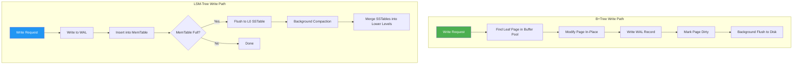

### Decision Matrix

| Factor | B+Tree | LSM-Tree |
|--------|--------|----------|
| Read latency | Low, predictable | Higher, variable |
| Write throughput | Moderate | High |
| Space efficiency | Moderate (fragmentation) | Good (after compaction) |
| Write amplification | Low-moderate | High (compaction) |
| Read amplification | Low (1 tree) | High (multiple levels) |
| Implementation complexity | Moderate | High |
| Latency predictability | High | Lower (compaction spikes) |

---

## 2. Choosing Your Data Model

### Relational Model

Tables with rows and columns, enforced schemas, SQL interface, ACID transactions.

**When to choose:** General-purpose applications, complex queries with joins, strong consistency requirements, well-defined schemas.

**Examples:** PostgreSQL, MySQL, SQLite, CockroachDB

### Key-Value Model

Simple get/put/delete interface on opaque byte strings.

**When to choose:** Caching, session storage, simple lookups, building blocks for higher-level systems.

**Examples:** RocksDB, LevelDB, Redis, etcd

### Document Model

JSON/BSON documents with flexible schemas, nested data.

**When to choose:** Rapid prototyping, semi-structured data, content management, catalogs with varied attributes.

**Examples:** MongoDB, CouchDB, FerretDB

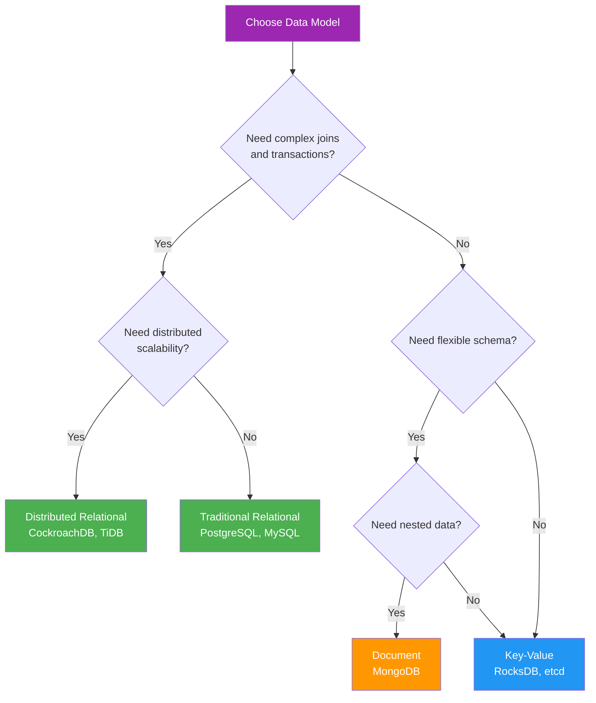

---

## 3. Process Model: Embedded vs Client-Server

### Embedded Database

The database runs inside the application process. No separate server, no IPC overhead, no network latency.

**Advantages:**
- Zero deployment complexity
- No network overhead
- Simpler operations (no separate process to manage)
- Lower total resource usage for single-application use

**Disadvantages:**
- Single-process access (or complex locking for multi-process)
- No concurrent access from multiple applications
- Application crash kills the database process
- Limited by single-machine resources

**Examples:** SQLite, DuckDB, LevelDB, RocksDB (library), LMDB

### Client-Server Database

A standalone server process that accepts connections from multiple clients over a network protocol.

**Advantages:**
- Multiple concurrent clients
- Independent lifecycle from applications
- Resource isolation
- Network-accessible

**Disadvantages:**
- Deployment complexity
- Network overhead for every query
- Connection management overhead
- More moving parts to monitor and debug

**Examples:** PostgreSQL, MySQL, MongoDB, CockroachDB

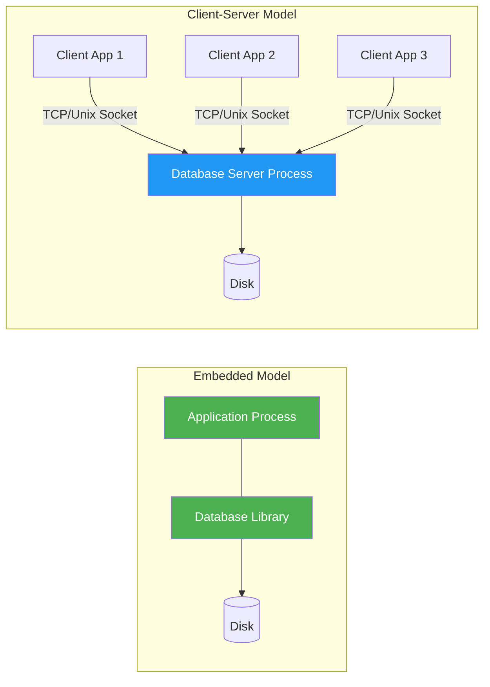

---

## 4. Memory Management Strategy

### Buffer Pool (Page-Oriented)

The database manages its own memory, maintaining a fixed-size pool of pages loaded from disk.

**How it works:**
1. Allocate a fixed-size buffer pool at startup
2. Pages are loaded from disk into buffer pool frames
3. Replacement policy (LRU, Clock, LRU-K) evicts cold pages
4. Dirty pages are flushed to disk on eviction or checkpoint
5. Pin counts prevent eviction of actively-used pages

**Advantages:** Full control over eviction policy, predictable memory usage, can optimize for database access patterns, avoids double-buffering with OS page cache.

**Used by:** PostgreSQL, MySQL/InnoDB, Oracle, SQL Server

### Memory-Mapped I/O (mmap)

Let the operating system handle page management via virtual memory.

**How it works:**
1. Map database file into virtual address space with mmap()
2. OS handles page faults -- loads pages on demand
3. OS handles eviction via its page replacement algorithm
4. Writes go through OS page cache

**Advantages:** Simpler implementation, OS handles complex page management, can exceed physical memory via virtual memory.

**Disadvantages:** No control over eviction policy, no control over flush ordering (critical for crash recovery), TLB shootdowns on multi-core, no async I/O control, SIGBUS on I/O errors.

**Used by:** SQLite (optional), LMDB, early MongoDB (abandoned it), WiredTiger (partial)

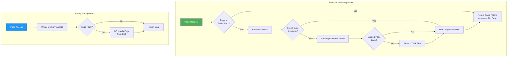

---

## 5. Concurrency Model

### Process-Per-Connection (PostgreSQL Model)

Each client connection gets its own OS process via fork().

**Advantages:** Strong isolation, crash of one connection does not affect others, simple programming model.

**Disadvantages:** High memory overhead per connection, expensive context switches, limited to thousands of connections.

### Thread-Per-Connection (MySQL Model)

Each client connection gets its own OS thread within a single process.

**Advantages:** Lower overhead than processes, shared memory space, faster context switches.

**Disadvantages:** Thread safety complexity, shared memory bugs can crash entire server, still limited scalability.

### Event-Driven / Async I/O

A small number of threads handle many connections using non-blocking I/O and event loops.

**Advantages:** Handles tens of thousands of connections, low memory overhead, efficient CPU usage.

**Disadvantages:** Complex programming model (callback hell or coroutines), harder to debug, CPU-bound work can block event loop.

**Examples:** Redis (single-threaded event loop), modern PostgreSQL connection poolers (PgBouncer)

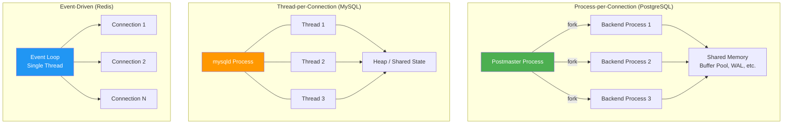

---

## 6. Recovery Strategy

### Write-Ahead Logging (WAL) with ARIES

The dominant recovery strategy. Every modification is first recorded in a sequential log before modifying data pages.

**Key principles:**
1. **Write-Ahead:** Log record must be flushed before data page is written
2. **Redo:** Log contains enough information to redo any committed operation
3. **Undo:** Log contains enough information to undo any uncommitted operation
4. **Checkpointing:** Periodic snapshots reduce recovery time

**Used by:** PostgreSQL, MySQL/InnoDB, SQLite (in WAL mode), SQL Server, Oracle

### Shadow Paging

Instead of logging, maintain two copies of the database. Modifications go to a shadow copy; on commit, atomically swap the shadow and current copies.

**Advantages:** No WAL overhead, simpler recovery (just discard the shadow).

**Disadvantages:** High write amplification (entire pages copied), random I/O, not practical for large databases.

**Used by:** Early SQLite (rollback journal mode), System R (historical)

### Log-Structured Recovery

In LSM-tree systems, the WAL and the memtable together provide recovery. On crash, replay the WAL to reconstruct the memtable.

**Used by:** RocksDB, LevelDB, Cassandra

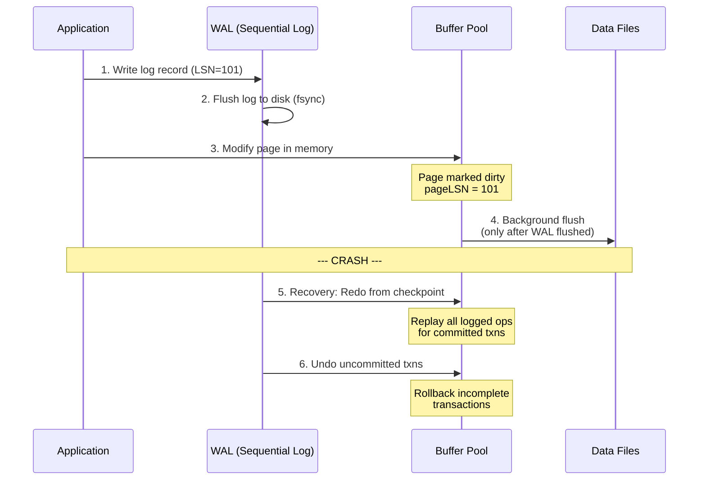

---

## 7. How Real Databases Make These Decisions

### SQLite: The Embedded Powerhouse

SQLite makes a unique set of choices optimized for simplicity, reliability, and embedded use.

| Decision | SQLite's Choice | Why |
|----------|----------------|-----|
| Storage Engine | B+Tree | Predictable reads, simpler implementation |
| Data Model | Relational (with dynamic typing) | SQL compatibility with flexibility |
| Process Model | Embedded library | Zero configuration, zero deployment |
| Memory Management | mmap (optional) + own page cache | Simplicity, works without tuning |
| Concurrency | File-level locking (WAL mode: readers+1 writer) | Simplicity, no server process |
| Recovery | Rollback journal OR WAL | Both options for different use cases |

**Key insight:** SQLite optimizes for simplicity and reliability over raw performance. It is the most widely deployed database in the world (billions of instances) because it just works.

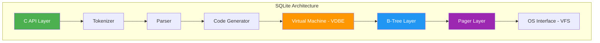

### PostgreSQL: The Enterprise Workhorse

PostgreSQL makes choices that prioritize correctness, extensibility, and standards compliance.

| Decision | PostgreSQL's Choice | Why |
|----------|-------------------|-----|
| Storage Engine | Heap files + B+Tree indexes | Flexibility, multiple index types |
| Data Model | Relational (strongly typed) | SQL standard compliance |
| Process Model | Process-per-connection | Isolation, crash safety |
| Memory Management | Shared buffer pool | Control over eviction, no double-buffering |
| Concurrency | MVCC with snapshot isolation | High concurrency without read locks |
| Recovery | WAL with ARIES-style recovery | Industry standard, proven reliable |

**Key insight:** PostgreSQL prioritizes correctness and extensibility. Its catalog-driven design means nearly everything is a table, and new types, operators, and index methods can be added without modifying the core.

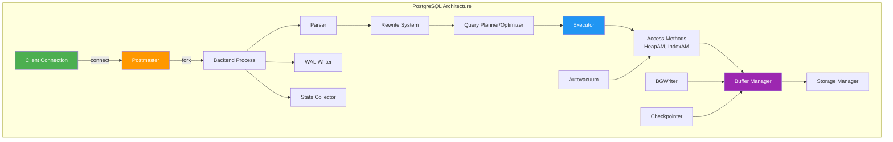

### CockroachDB: Distributed SQL

CockroachDB layers a SQL database on top of a distributed key-value store.

| Decision | CockroachDB's Choice | Why |
|----------|---------------------|-----|
| Storage Engine | LSM-Tree (Pebble, a Go RocksDB clone) | High write throughput for replication |
| Data Model | Relational (SQL) over KV | Familiar SQL interface with distribution |
| Process Model | Single process, goroutines | Go's concurrency model |
| Memory Management | Go runtime + RocksDB block cache | Leverages Go GC + manual for hot data |
| Concurrency | Serializable SI (MVCC + clock skew) | Strongest isolation in distributed setting |
| Recovery | Raft consensus + WAL | Replicated state machine for consistency |

**Key insight:** CockroachDB shows that you can build a distributed SQL database by layering abstractions. SQL -> DistSQL -> KV -> Raft -> Pebble (LSM).

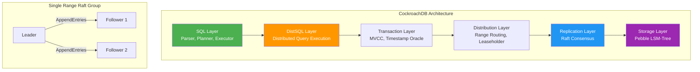

---

## 8. Architecture of Notable Databases

### MySQL/InnoDB

MySQL separates the SQL layer from the storage engine, allowing pluggable engines. InnoDB is the default.

**Key architectural decisions:**
- Thread-per-connection model
- Pluggable storage engine API (InnoDB, MyISAM, etc.)
- InnoDB uses clustered B+Tree (primary key IS the table)
- Adaptive hash index for frequently accessed pages
- Double-write buffer for torn page protection
- Change buffer for deferred secondary index updates

### DuckDB: The Analytical Embedded Database

DuckDB is "SQLite for analytics" -- an embedded columnar database optimized for OLAP.

**Key architectural decisions:**
- Columnar storage (great for aggregations, scans)
- Vectorized push-based execution (processes vectors of ~2048 values)
- No buffer pool -- relies on OS virtual memory via mmap
- Parallel intra-query execution
- Morsel-driven parallelism

### RocksDB: The Storage Engine Building Block

RocksDB is not a full database -- it is a storage engine library used to build databases.

**Key architectural decisions:**
- LSM-Tree with tiered/leveled compaction
- Pluggable memtable formats (skiplist, hash-skiplist, vector)
- Pluggable compaction strategies
- Column families for logical separation
- Comprehensive statistics and tuning knobs
- Used as foundation by: CockroachDB, TiKV, YugabyteDB

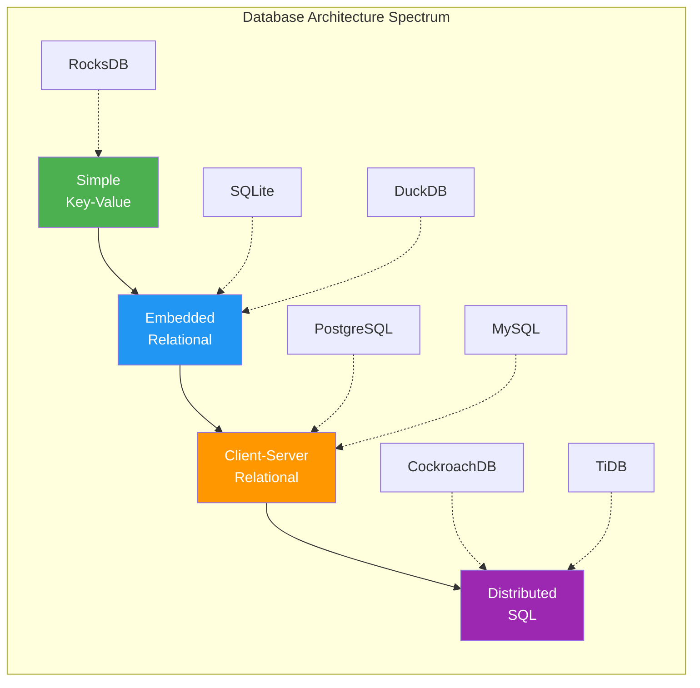

---

## 9. Trade-Off Analysis: A Systematic Framework

When building your own database, use this framework to evaluate each decision:

### The Three Amplification Factors

Every storage engine trade-off can be analyzed in terms of three amplification factors:

1. **Read Amplification:** How many I/Os per read? B+Trees: O(log n). LSM: O(L * log n) where L is number of levels.
2. **Write Amplification:** How many I/Os per write? B+Trees: ~2 (WAL + page). LSM: ~10-30x (compaction).
3. **Space Amplification:** How much extra space? B+Trees: ~1.5x (fragmentation). LSM: ~1.1-1.3x (temporary duplicates).

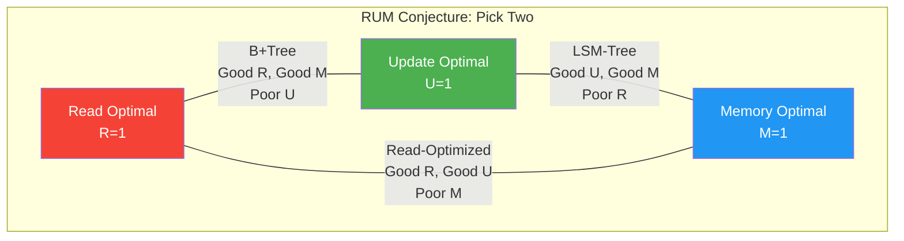

### Decision Tree for Your Database

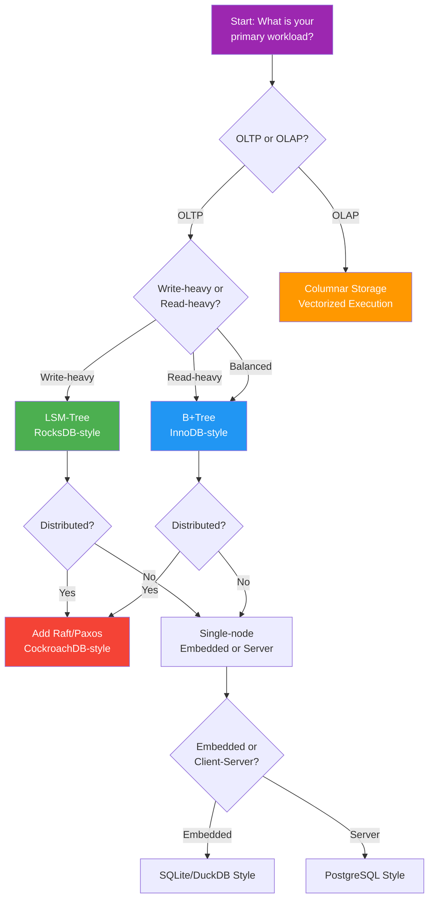

---

## 10. Component Interaction: The Full Picture

Every database, regardless of its specific choices, has the same fundamental layers. Here is how they interact:

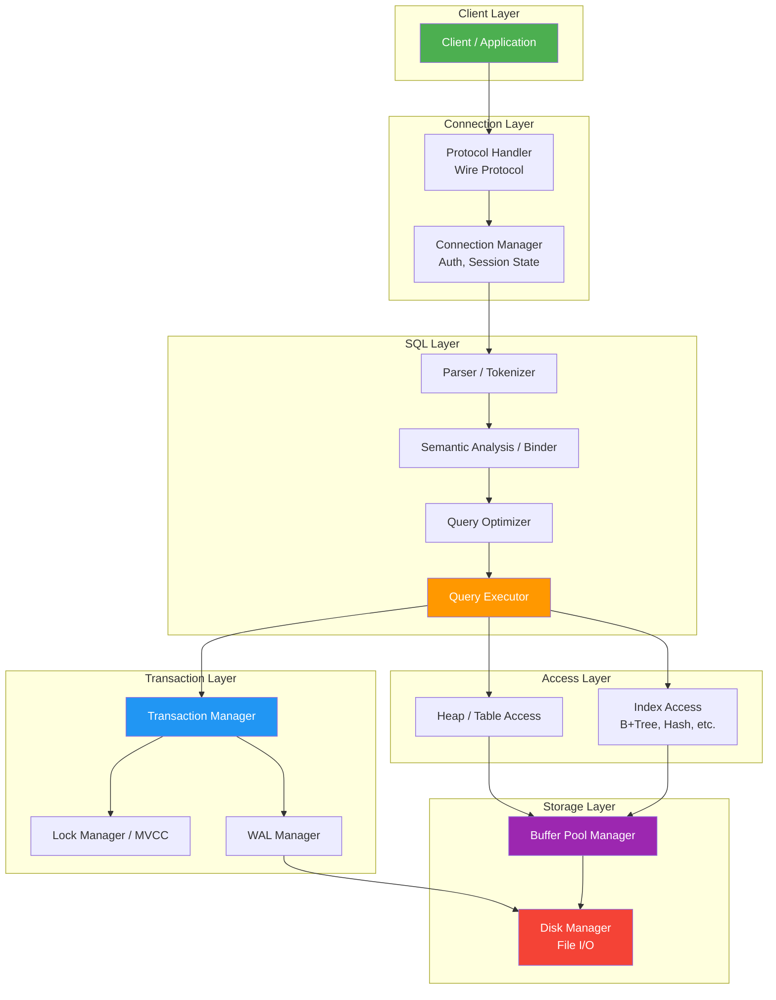

---

## Summary

| Database | Storage | Data Model | Process | Memory | Concurrency | Recovery |
|----------|---------|------------|---------|--------|-------------|----------|
| SQLite | B+Tree | Relational | Embedded | mmap/cache | File locks | Journal/WAL |
| PostgreSQL | Heap+B+Tree | Relational | Process-per-conn | Buffer pool | MVCC (SI) | WAL (ARIES) |
| MySQL/InnoDB | Clustered B+Tree | Relational | Thread-per-conn | Buffer pool | MVCC (RC/RR) | WAL + doublewrite |
| CockroachDB | LSM (Pebble) | SQL over KV | Goroutines | Go + block cache | MVCC (SSI) | Raft + WAL |
| DuckDB | Columnar | Relational | Embedded | mmap | MVCC | WAL |
| RocksDB | LSM | Key-Value | Library | Block cache | Lock-free (single writer) | WAL |

**The most important lesson:** There is no universally "best" architecture. Every choice is a trade-off. The key is to understand your workload, your constraints, and which trade-offs you can accept. The best database architects are not those who know one architecture deeply, but those who can reason about trade-offs and choose the right combination of decisions for each specific problem.
